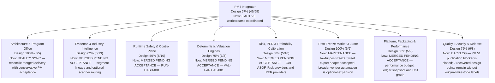

# PRISM Project Status

> Generated from `ops/project_portfolio.yaml`; do not edit this file directly.

- Blueprint: **v0.5.2 canonical workflow + LIVE_PRIMARY readiness**
- Design progress: **67% (46/69 accepted milestone points)**
- Current delivery: **0 ACTIVE / 0 READY / 0 BLOCKED / 0 BACKLOG / 10 MERGED PENDING ACCEPTANCE**
- Accepted validation baseline: `76b13159c8955ed6e337f4342a741fdceaa00fbe`
- Updated: **2026-08-25**

Progress is conservative: ACTIVE/READY/BLOCKED/BACKLOG/MERGED_PENDING_ACCEPTANCE work receives zero credit until every required acceptance check is VERIFIED or explicitly ADR-waived.

> Recovery note: Reconstructed from the archived PROJECT_STATUS.md dated 2026-08-25. The archived departmental design totals and accepted baseline points are preserved exactly; unknown historical milestone labels are not invented. New acceptance after recovery is recorded only with exact-SHA validation evidence.

## Execution horizon

- Now: —
- Next: —
- Later: —
- Pending acceptance: `CAL-ASOF-001`, `EVI-SEGMENT-LINEAGE-001`, `RISK-PROVIDERS-001`, `PER-PROVIDERS-001`, `EVI-SCAN-001`, `RUN-HASH-001`, `VAL-PARTIAL-001`, `PLT-PERF-BUDGET-001`, `PLT-LEDGER-001`, `PLT-UNIT-GRAPH-001`

## Organization

## Department status

| Department | Design progress | Current work |
|---|---:|---|
| Architecture & Program Office (`pm-integrator`) | **100% (5/5)** | REALITY SYNC — reconcile merged delivery with conservative PM acceptance |
| Evidence & Industry Intelligence (`evidence-industry-agent`) | **62% (8/13)** | MERGED PENDING ACCEPTANCE — segment lineage and optional scanner routing |
| Runtime Safety & Control Plane (`runtime-safety-agent`) | **50% (5/10)** | MERGED PENDING ACCEPTANCE — RUN-HASH-001 |
| Deterministic Valuation Engines (`valuation-engine-agent`) | **75% (6/8)** | MERGED PENDING ACCEPTANCE — VAL-PARTIAL-001 |
| Risk, PER & Probability Calibration (`calibration-risk-agent`) | **50% (5/10)** | MERGED PENDING ACCEPTANCE — CAL-ASOF, Risk providers and PER providers |
| Post-Freeze Market & State (`post-freeze-agent`) | **100% (6/6)** | MAINTENANCE — lawful post-freeze Street export adapter accepted; broader vendor automation is optional expansion |
| Platform, Packaging & Performance (`performance-platform-agent`) | **56% (5/9)** | MERGED PENDING ACCEPTANCE — performance budget, Ledger snapshot and Unit graph |
| Quality, Security & Release (`qa-release-agent`) | **75% (6/8)** | BACKLOG — PR 51 publication blocker is closed; 2 recovered design points remain without original milestone labels |

## Current execution queue

| Priority | Status | Work item | Owner | Current step | Dependencies |
|---|---|---|---|---|---|
| P1 | **MERGED_PENDING_ACCEPTANCE** | `CAL-ASOF-001` — Add a first-seen boundary to historical forecast revisions | `calibration-risk-agent` | PR #59 merged; awaiting exact-SHA validation evidence and PM acceptance. | — |
| P1 | **MERGED_PENDING_ACCEPTANCE** | `EVI-SEGMENT-LINEAGE-001` — Bind segment decomposition evidence to authoritative source lineage | `evidence-industry-agent` | PR #60 merged; awaiting exact-SHA validation evidence and PM acceptance. | `EVI-ACTIVE-001` |
| P1 | **MERGED_PENDING_ACCEPTANCE** | `PER-PROVIDERS-001` — Build normalized EPS and peer-residual provider packs | `calibration-risk-agent` | PR #62 merged; awaiting exact-SHA validation evidence and PM acceptance. | `RISK-PROVIDERS-001` |
| P1 | **MERGED_PENDING_ACCEPTANCE** | `PLT-PERF-BUDGET-001` — Convert recorded runtime baselines into stable CI performance budgets | `performance-platform-agent` | PR #66 merged; awaiting exact-SHA validation evidence and PM acceptance. | `PLT-CTX-COW-001` |
| P1 | **MERGED_PENDING_ACCEPTANCE** | `RISK-PROVIDERS-001` — Build reusable Beta, WACC, and Cost-of-Equity source providers | `calibration-risk-agent` | PR #61 merged; awaiting exact-SHA validation evidence and PM acceptance. | — |
| P1 | **MERGED_PENDING_ACCEPTANCE** | `RUN-HASH-001` — Close the evidence, assumption, Audit, and Freeze hash chain | `runtime-safety-agent` | PR #64 merged; awaiting exact-SHA validation evidence and PM acceptance. | — |
| P1 | **MERGED_PENDING_ACCEPTANCE** | `VAL-PARTIAL-001` — Implement PARTIAL_INTRINSIC and UNVALUED_NOT_ZERO end to end | `valuation-engine-agent` | PR #65 merged; awaiting exact-SHA validation evidence and PM acceptance. | — |
| P2 | **MERGED_PENDING_ACCEPTANCE** | `EVI-SCAN-001` — Separate optional scanner IDs from mixed active research units | `evidence-industry-agent` | PR #63 merged; awaiting exact-SHA validation evidence and PM acceptance. | — |
| P2 | **MERGED_PENDING_ACCEPTANCE** | `PLT-LEDGER-001` — Remove duplicate ledger serialization without weakening mutation detection | `performance-platform-agent` | PR #67 merged; awaiting exact-SHA validation evidence and PM acceptance. | `RUN-CTX-001` |
| P3 | **MERGED_PENDING_ACCEPTANCE** | `PLT-UNIT-GRAPH-001` — Index Unit Contract forward and reverse dependency traversal | `performance-platform-agent` | PR #68 merged; awaiting exact-SHA validation evidence and PM acceptance. | — |

## Objective readiness (derived, not manually scored)

- Canonical stages mapped: **33/33**
- `LIVE_READY` or `RUNTIME_READY`: **26/33**
- `PARTIAL_LIVE`: **7/33**
- Explicit runtime gaps: **0**
- Executable method bindings: **30/41** (11 explicit `NOT_IMPLEMENTED`)

These registry metrics measure typed runtime readiness, not full live source/provider coverage. The design-progress score above includes product, acceptance, source and release gaps.

## Accepted handoffs

| Handoff | To | Head | Validation evidence | Closes | Residual work |
|---|---|---|---|---|---|
| `H-RECOVERY-EVI-VERTICAL-20260825` | `pm-integrator + evidence-industry-agent` | `76b13159c8955ed6e337f4342a741fdceaa00fbe` | `GHA-VALUATION-TESTS-302` | `EVI-VERTICAL-001` | `EVI-SEGMENT-LINEAGE-001`, `EVI-SCAN-001` |
| `H-RECOVERY-PST-STREET-20260825` | `pm-integrator + post-freeze-agent` | `76b13159c8955ed6e337f4342a741fdceaa00fbe` | `GHA-VALUATION-TESTS-302` | `PST-STREET-001` | — |
| `H-RECOVERY-QA-PR51-20260825` | `pm-integrator + qa-release-agent` | `76b13159c8955ed6e337f4342a741fdceaa00fbe` | `GHA-VALUATION-TESTS-302` | `QA-PR51-001` | — |

## Update contract

1. Change delivery state only in `ops/project_portfolio.yaml`.
2. Keep one ACTIVE work item per owner and no overlapping ACTIVE write scopes.
3. Link implementation PRs with `github_pr`; merged PRs remain `MERGED_PENDING_ACCEPTANCE` until PM acceptance.
4. Record acceptance as VERIFIED only with exact-SHA validation evidence; use an ADR for any waiver.
5. Add the complete handoff before REVIEW/DONE; only the PM/Integrator closes a milestone.
6. Validate with `PYTHONPATH=src python scripts/validate_project_portfolio.py`, regenerate with `render_project_status.py --write`, then verify with `--check`.
