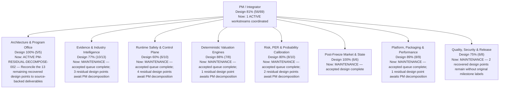

# PRISM Project Status

> Generated from `ops/project_portfolio.yaml`; do not edit this file directly.

- Blueprint: **v0.5.2 canonical workflow + LIVE_PRIMARY readiness**
- Design progress: **81% (56/69 accepted milestone points)**
- Current delivery: **1 ACTIVE / 0 READY / 0 BLOCKED / 0 BACKLOG / 0 MERGED PENDING ACCEPTANCE**
- Accepted validation baseline: `04b38ecc4c800e7f24799e8a70e6a4497e1bc6a7`
- Updated: **2026-08-25**

Progress is conservative: ACTIVE/READY/BLOCKED/BACKLOG/MERGED_PENDING_ACCEPTANCE work receives zero credit until every required acceptance check is VERIFIED or explicitly ADR-waived.

> Recovery note: Reconstructed from the archived PROJECT_STATUS.md dated 2026-08-25. The archived departmental design totals and accepted baseline points are preserved exactly; unknown historical milestone labels are not invented. New acceptance after recovery is recorded only with exact-SHA validation evidence.

## Execution horizon

- Now: `PM-RESIDUAL-DECOMPOSE-002`
- Next: —
- Later: —
- Pending acceptance: —

## Organization

## Department status

| Department | Design progress | Current work |
|---|---:|---|
| Architecture & Program Office (`pm-integrator`) | **100% (5/5)** | ACTIVE PM-RESIDUAL-DECOMPOSE-002 — Reconcile the 13 remaining recovered design points to source-backed deliverables |
| Evidence & Industry Intelligence (`evidence-industry-agent`) | **77% (10/13)** | MAINTENANCE — accepted queue complete; 3 residual design points await PM decomposition |
| Runtime Safety & Control Plane (`runtime-safety-agent`) | **60% (6/10)** | MAINTENANCE — accepted queue complete; 4 residual design points await PM decomposition |
| Deterministic Valuation Engines (`valuation-engine-agent`) | **88% (7/8)** | MAINTENANCE — accepted queue complete; 1 residual design point awaits PM decomposition |
| Risk, PER & Probability Calibration (`calibration-risk-agent`) | **80% (8/10)** | MAINTENANCE — accepted queue complete; 2 residual design points await PM decomposition |
| Post-Freeze Market & State (`post-freeze-agent`) | **100% (6/6)** | MAINTENANCE — accepted design complete |
| Platform, Packaging & Performance (`performance-platform-agent`) | **89% (8/9)** | MAINTENANCE — accepted queue complete; 1 residual design point awaits PM decomposition |
| Quality, Security & Release (`qa-release-agent`) | **75% (6/8)** | MAINTENANCE — 2 recovered design points remain without original milestone labels |

## Current execution queue

| Priority | Status | Work item | Owner | Current step | Dependencies |
|---|---|---|---|---|---|
| P1 | **ACTIVE** | `PM-RESIDUAL-DECOMPOSE-002` — Reconcile remaining recovered design points to source-backed deliverables | `pm-integrator` | Trace the remaining 13 design points back to repository design contracts and objective readiness gaps; do not invent historical milestone labels or award completion credit until each residual deliverable is explicit. | — |

## Objective readiness (derived, not manually scored)

- Canonical stages mapped: **33/33**
- `LIVE_READY` or `RUNTIME_READY`: **29/33**
- `PARTIAL_LIVE`: **4/33**
- Explicit runtime gaps: **0**
- Executable method bindings: **30/41** (11 explicit `NOT_IMPLEMENTED`)

These registry metrics measure typed runtime readiness, not full live source/provider coverage. The design-progress score above includes product, acceptance, source and release gaps.

## Accepted handoffs

| Handoff | To | Head | Validation evidence | Closes | Residual work |
|---|---|---|---|---|---|
| `H-RECOVERY-EVI-VERTICAL-20260825` | `pm-integrator + evidence-industry-agent` | `76b13159c8955ed6e337f4342a741fdceaa00fbe` | `GHA-VALUATION-TESTS-302` | `EVI-VERTICAL-001` | — |
| `H-RECOVERY-PST-STREET-20260825` | `pm-integrator + post-freeze-agent` | `76b13159c8955ed6e337f4342a741fdceaa00fbe` | `GHA-VALUATION-TESTS-302` | `PST-STREET-001` | — |
| `H-RECOVERY-QA-PR51-20260825` | `pm-integrator + qa-release-agent` | `76b13159c8955ed6e337f4342a741fdceaa00fbe` | `GHA-VALUATION-TESTS-302` | `QA-PR51-001` | — |
| `H-EVIDENCE-QUEUE-20260825` | `pm-integrator + evidence-industry-agent` | `04b38ecc4c800e7f24799e8a70e6a4497e1bc6a7` | `GHA-VALUATION-TESTS-347` | `EVI-SEGMENT-LINEAGE-001`, `EVI-SCAN-001` | — |
| `H-CALIBRATION-RISK-QUEUE-20260825` | `pm-integrator + calibration-risk-agent` | `04b38ecc4c800e7f24799e8a70e6a4497e1bc6a7` | `GHA-VALUATION-TESTS-347` | `CAL-ASOF-001`, `RISK-PROVIDERS-001`, `PER-PROVIDERS-001` | — |
| `H-RUNTIME-HASH-20260825` | `pm-integrator + runtime-safety-agent` | `04b38ecc4c800e7f24799e8a70e6a4497e1bc6a7` | `GHA-VALUATION-TESTS-347` | `RUN-HASH-001` | — |
| `H-VALUATION-PARTIAL-20260825` | `pm-integrator + valuation-engine-agent` | `04b38ecc4c800e7f24799e8a70e6a4497e1bc6a7` | `GHA-VALUATION-TESTS-347` | `VAL-PARTIAL-001` | — |
| `H-PLATFORM-QUEUE-20260825` | `pm-integrator + performance-platform-agent` | `04b38ecc4c800e7f24799e8a70e6a4497e1bc6a7` | `GHA-VALUATION-TESTS-347` | `PLT-PERF-BUDGET-001`, `PLT-LEDGER-001`, `PLT-UNIT-GRAPH-001` | — |

## Update contract

1. Change delivery state only in `ops/project_portfolio.yaml`.
2. Keep one ACTIVE work item per owner and no overlapping ACTIVE write scopes.
3. When a delivery PR is opened, record its number as `github_pr`; a merged linked PR may not remain ACTIVE/READY/BLOCKED/BACKLOG.
4. Record acceptance as VERIFIED only with exact-SHA validation evidence; use an ADR for any waiver.
5. Add the complete handoff before REVIEW/DONE; only the PM/Integrator closes a milestone.
6. Validate with `PYTHONPATH=src python scripts/validate_project_portfolio.py`, regenerate with `render_project_status.py --write`, then verify with `--check`.
