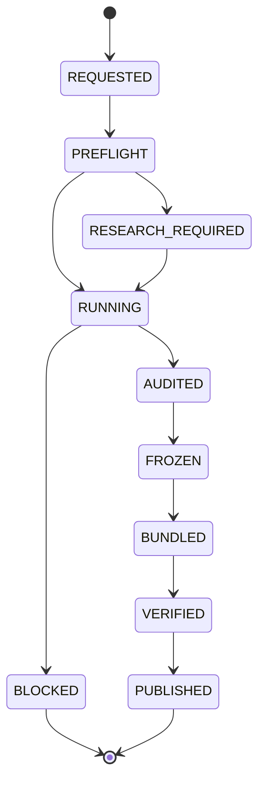

# Canonical run execution contract

Canonical valuation output is a transaction. A run may produce working files while it is being researched, but those files are not a report until the same run has completed the Control Plane trace, passed Audit, issued the intrinsic freeze token, and written the attestation and bundle receipts.

## Why the Sonix run looked successful

The Sonix PR exposed four independent failure modes:

- the workflow path filter named a non-existent documentation path, so ordinary PR edits did not select the workflow;
- the workflow only listened to pushes and manual dispatch, not `pull_request`;
- generated files were ignored by Git, and concurrent attempts to force-add them raced on the same branch;
- `continue-on-error` allowed a blocked runner to finish with a green workflow conclusion.

A successful workflow conclusion therefore proved only that the shell steps finished. It did not prove that Sonix had a canonical valuation.

## Production state machine

`RESEARCH_REQUIRED` and `BLOCKED` are terminal for that attempt. They cannot be re-labelled as a completed report. A retry creates a new run identity or reuses the exact prepared inputs; it never mutates an already published bundle.

## One generic workflow

`.github/workflows/canonical-run.yml` is the only canonical-run entrypoint. It accepts a prepared run directory, the exact source commit, and a dedicated execution branch. It then:

1. checks that the source commit and execution-branch head are the same full SHA;
2. creates the execution branch only if it does not exist, and rejects a moved branch;
3. runs `strict_live_runtime.run_prism` in deterministic replay mode;
4. validates the v2 bundle against the registry's ordered 33 stages;
5. publishes the bundle and latest pointer with one compare-and-swap Git commit.

The workflow fails closed. There is no per-company workflow, intermediate result push, or `continue-on-error` around canonical steps.

## Completion proof

`canonical-run-bundle/v2` binds these values to the same run:

- exact 33-stage `control_plane_trace.json` in registry order;
- completed, audit-passed `manifest.json`;
- freeze token valuation/audit lineage;
- LIVE_PRIMARY execution attestation and every stage receipt hash;
- sorted file receipts, canonical bundle-tree SHA-256, and versioned report SHA-256;
- `kr-live-latest-report/v2` pointer whose paths and hashes resolve to that bundle.

`scripts/validate_canonical_bundle.py` is the CI and operator gate. `scripts/publish_canonical_bundle.py` calls the same validator again immediately before writing the commit, so a caller cannot bypass verification by skipping the standalone check.

## Atomic publication

`valuation_engine.transactional_publisher.atomic_publish_files` builds a temporary Git index from the expected branch head, writes blobs, creates one commit, and updates the branch with the expected old SHA. With `--push`, the remote update uses an exact `--force-with-lease`; a concurrent writer causes an error and leaves the branch unchanged. The normal checkout index is never staged and no partial commit is visible.

The user-facing link must use the versioned report filename. The latest pointer is an automation lookup only.
