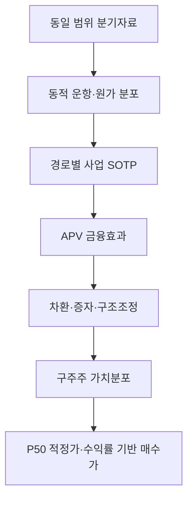
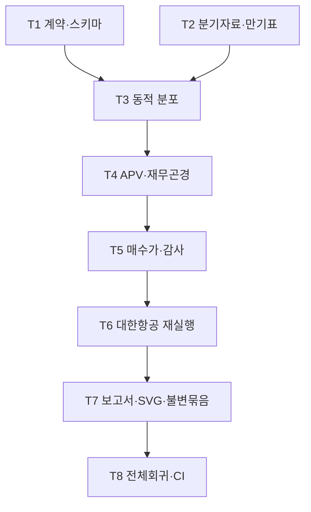

# 용량·가동률·단가형 고정비 사업의 범용 연속분포 APV·재무곤경 가치평가 설계

Status: implementation-ready design; runtime not yet promoted  
Reusable route: `capacity_yield_levered/driver_distributional_apv`

First production proof: 대한항공 003490 / PR #184
Base revision: `e9ed9f66967620e6e9ab28cfe49515ef37db5583`  
Supersedes as decision methodology: `korean_air_combined_margin_v1` nearest-anchor weighting and report-level limited-liability flooring

## 1. 결정

동일 경제구조 회사의 최종 투자판단은 더 이상 다음 식에서 만들지 않는다.

```text
Down / Base / Bull 점가치
× 가장 가까운 시나리오로 분류한 확률
× 시나리오별 max(주주 잔여가치, 0)
```

새 정본은 다음 순서다.



기존 3개 시나리오 DCF는 회귀 비교와 투자자 설명을 위해 남기되 새 실행의 확률 또는 목표가를 만들지 않는다. 기존 `continuous_financial_path_probability/v1`도 다른 실행의 호환성을 위해 삭제하지 않는다. 새 method/version은 회사명이나 업종명이 아니라 `capacity × utilization × unit price` 매출구조, 높은 고정비, 장기 실물자산·리스, 다중 만기 금융청구권이라는 경제구조로 exact route한다. 대한항공은 이 구조를 검증하는 첫 `LIVE_PRIMARY` 회사이지 공통 모델의 정의가 아니다.

## 2. 현재 결과의 폐기 사유

현재 불변 산출물의 시나리오별 부채 차감 후 주당가치는 Down -26,760.88원, Base 3,671.77원, Bull 36,672.64원이다. 확률은 각각 34.74%, 9.45%, 55.81%다.

현재 엔진은 모든 모의 경로를 다음과 같이 가장 가까운 시나리오 기준점에 배정한다.

```text
scenario(path) = argmin distance(path, scenario_anchor)
```

중간 기준점인 Base는 두 경계 사이의 유한한 영역만 갖지만 양끝의 Down과 Bull은 바깥 꼬리를 계속 보유한다. 예측분산이 기준점 간격보다 훨씬 커지면 Base 확률은 사업의 중심 가능성과 무관하게 작아진다. 따라서 9.45%는 보정된 '기준 시나리오 발생확률'이 아니다.

또한 보고서에서 시나리오별 음수 주주가치를 0원으로 바꾼 뒤 평균하면서 다음 차이가 발생했다.

| 계산 | 주당가치 |
|---|---:|
| 부호를 보존한 확률가중 잔여가치 | 11,516원 |
| 시나리오별 0원 하한 적용 후 | 20,813원 |
| 하한 적용으로 추가된 가치 | 9,297원 |

0원은 최종 주주 지급액의 법적 하한일 수 있으나, 부채 만기·변동성·시간·차환·구조조정·회수순서를 계산하지 않은 현재시점 DCF 점가치를 0으로 자를 근거는 아니다. 구조적 옵션가치의 핵심 입력이 자산가치, 부채청구액, 변동성 및 만기라는 점은 Merton 모형과 일치한다.

따라서 기존 보고서의 20,813원 목표가와 15,600원 매수가는 새 모델의 비교 기준이나 prior로 사용하지 않는다. 과거 산출물은 감사 이력으로 보존하되 새 report manifest의 `supersedes`에만 기록한다.

## 3. 범위와 비범위

### 이번 변경 범위

1. 대상 사업 또는 합성 가능한 전신 segment 자기 이력의 빈도·경제범위를 맞춘 동적 확률경로
2. 여객·화물과 회사가 실제 보유한 비항공 사업의 경로별 SOTP
3. 고정 WACC 대신 금융효과를 분리하는 APV 주 평가경로
4. 현금·차입금·리스 만기와 차환·증자·구조조정의 연도별 분기
5. 경로별 구주주 가치분포와 P50/P20~P80/P10
6. 요구수익률과 달성확률에서 역산하는 구체 매수가
7. 기존 DCF, Street, 현재가 격리, 불변 산출물 및 보고서 계약과의 연결

### 이번 변경 비범위

- 기존 OCI·고려아연·셀트리온 확률 산출물의 소급 재작성
- 현재가 또는 증권사 목표가를 확률·할인율·매수가 입력으로 사용
- 다른 회사의 영업실적을 대상 회사의 사건확률 표본으로 사용
- Merton 단일만기 모형을 다중 만기 회사의 주 평가모형으로 사용
- 기존 성공 산출물을 삭제하거나 같은 이름으로 덮어쓰기

### 3.1 범용 적용 경계

이 설계의 범용성은 업종 목록이 아니라 **관측 가능한 현금흐름 생성식과 청구권 구조**로 판정한다. 한 회사 전체가 아니라 사업부별로 다음 여섯 조건을 검사한다.

| 구조 적합성 게이트 | 통과 기준 | 탈락 또는 별도 모듈 사유 |
|---|---|---|
| 매출 생성식 | 물리적 capacity, utilization/traffic, unit price로 매출의 주된 부분을 설명 | 구독자수·광고·탐사성공·단일 특허 등 다른 driver가 핵심 |
| 비용 비선형성 | 고정비와 단위원가가 분리되고 낮은 가동률에서 마진이 비선형 악화 | 비용이 매출과 거의 완전 비례 |
| 자산·재투자 | 장기 실물자산의 유지·증설 CAPEX 또는 경제적 리스가 필수 | 자본투입이 작고 무형자산 옵션이 가치의 핵심 |
| 금융청구권 | 리스·차입 만기와 차환이 구주주 현금흐름에 중대 | 순현금이며 금융경로 영향이 비중요 |
| 관측 가능성 | 동일 경제범위의 driver·비용·금융일정이 시계열 원문으로 대사 가능 | 핵심 변수가 공시되지 않거나 범위가 계속 변함 |
| 구주주 waterfall | 부족 유동성 시 차환·매각·증자·구조조정 순서를 계약화 가능 | 회수·희석 순서를 합리적으로 특정할 수 없음 |

여섯 조건 중 핵심 매출 생성식이 실패하면 이 route를 선택할 수 없다. 나머지 항목은 `materiality` 판정과 증거를 남기며, 금융청구권이 중요하지 않으면 더 단순한 driver DCF로 하향 route한다. 업종코드는 후보 adapter를 찾는 힌트일 뿐 method 선택 근거가 아니다.

적용 가능한 예는 노선형 여객·화물 운송, 선복×운임형 해운, 가동거리×단가형 철도·육상운송, 객실×점유율×ADR형 호텔, 전력·처리용량×가동률×단가형 일부 인프라 운영이다. 그러나 같은 업종이라도 규제자산 보상식, 장기 take-or-pay 계약, 부동산 NAV, 원자재 매장량 옵션이 가치의 중심이면 해당 segment는 각각 규제자산·계약백로그·NAV·자원가치 evaluator로 분리한다.

범용 레이어와 회사 레이어의 경계는 다음과 같다.

| 범용 구조 코어 | 회사·업종 어댑터와 입력 |
|---|---|
| capacity × utilization × unit price 매출식과 고정비·단위원가 전달식 | ASK/RPK, 선복/TEU, 객실/점유율/ADR 등 원문 metric의 정본 단위 매핑 |
| 동적 driver 분포, OOS 보정, 상관 경로 생성 | 대상 회사 자기 이력, 계절성, structural break, 허용 외생변수 |
| 유지·증설 CAPEX와 리스 roll-forward | 기재·선박·객실·설비별 보유/리스, 인도·폐기·갱신 계획 |
| APV, 세금효과, 차환·증자·waterfall | 회사별 만기, 담보, 약정, 신용한도, 자산매각·자본조달 가능 범위 |
| P50·기대값·가치구간·곤경/희석 위험·entry policy | 주식수, 비지배지분, 우선주·전환증권, 투자기간·요구수익률 |
| 동일 감사·보고서·시장격리 계약 | 회사명, 통화, 회계기준, 원문 URL, 기준일, segment route |

`src/valuation_engine`의 범용 코드에는 대한항공·항공사·종목코드·ASK/RPK 같은 업종 전용 명칭, 고정 운항수치 또는 기존 목표가를 둘 수 없다. 새 회사는 `CapacityYieldCompanyProfile`, canonical metric mapping, driver panel, asset/lease schedule, financing schedule 및 SOTP segment declaration만 추가한다. 항공사 어댑터는 ASK/RPK/ATK/RTK를 공통 `capacity/utilization/unit_price`로 변환할 뿐이다. 공통 코드를 수정해야 해운 또는 호텔의 동형 fixture를 실행할 수 있다면 범용화 실패다.

## 4. 가치평가 방법

### 4.1 사업 SOTP

| 가치 블록 | 확률경로의 핵심 입력 | 평가 출력 |
|---|---|---|
| 여객 | ASK, RPK, 탑승률, 여객 yield, 유가, 환율, CASK ex-fuel, 기단·CAPEX·리스 | 무차입 FCFF 가치 |
| 화물 | ATK, RTK, 화물 yield, belly/freighter 공급, 유가·환율 | 무차입 FCFF 가치 |
| 항공우주·MRO | 확정수주, 전환시점, 매출총이익률, 운전자본·CAPEX | backlog DCF 가치 |
| 호텔·부동산 | 정상화 NOI, 자산가치, 자산별 부채 | NAV 또는 자산 DCF |
| 기타 서비스 | 확인된 매출기반, 정상화 마진, 재투자 | 정상화 서비스 DCF |
| 통합효과 | 확인된 통합비용, 시너지 종류·실현시점·실패조건 | 별도 증분가치 |

여객 영업이익률 하나가 화물 yield, 항공우주 성장, 호텔 NAV, 통합 시너지와 동시에 같은 방향으로 움직이지 못하게 한다. 각 증분가치는 별도의 `economic_path_id`를 갖는다.

### 4.2 APV

경로 `k`, 사업부 `s`의 무차입 사업가치는 다음으로 계산한다.

```text
V_unlevered[k,s] = PV(FCFF[k,s], asset_required_return[s])
```

연결 사업가치는 다음과 같다.

```text
Operating_APV[k]
  = sum(V_unlevered[k,s])
  + PV(usable_tax_shields[k])
  - PV(explicit_financing_costs[k])
  + non_operating_assets[k]
```

- 세금효과는 실제 과세소득이 발생하는 경로에서만 인정한다.
- 무차입 할인율은 사업의 시간가치와 체계적 위험만 가격화하고, 물리적 경로분포에 이미 들어간 영업·곤경 빈도를 다시 임의 가산하지 않는다.
- 세금효과는 그 실현위험에 맞는 별도 할인율을 사용하고, 부채스프레드에 포함된 distress와 명시적 distress branch를 중복 반영하지 않는다.
- 증자비용, 차환수수료, 자산급매 손실은 실제 해당 금융행동이 발생한 경로에만 넣는다.
- 재무곤경 비용을 APV에서 미리 차감한 뒤 distress branch에서 다시 차감하지 않는다.
- 기존 고정 WACC DCF는 cross-check로 유지한다. APV와 차이가 크면 평균하지 않고 세금·레버리지·말기가치·리스 처리 차이를 대사한다.

### 4.3 리스 처리

구조형 공통 실행은 경제적으로 중요한 리스를 금융청구권으로 취급한다. 다음 네 요소가 반드시 함께 움직여야 한다.

1. 영업성과는 lease-adjusted EBIT/EBITDAR로 대사한다.
2. 기존 리스 원금·이자·만기를 financing schedule에 넣는다.
3. 신규 기단 리스와 갱신에 필요한 경제적 재투자를 forecast에 넣는다.
4. EV-to-equity에서 같은 리스의 현금유출 또는 부채를 두 번 차감하지 않는다.

구현 전 `LeaseReconciliation`이 아래 항등식을 검증한다.

```text
opening lease liability
+ new lease additions
+ imputed interest
- principal payment
= closing lease liability
```

회계상 재분류만으로 구주주가치가 달라져서는 안 된다.

## 5. 동적 확률경로

### 5.1 입력자료 계약

`TargetDriverPanel`은 이 구조형 method를 선택한 모든 **경제적으로 연속된 사업부 또는 predecessor 사업**에 다음을 강제한다.

- 분기 단위, 최소 32개 비교가능 관측치
- 최소 12개 rolling-origin holdout
- 연결/별도, 인수·합병 전후 및 pro-forma 경제범위의 명시적 구분
- 최신 조건값도 분기 또는 계절조정된 동등 빈도
- 각 관측치의 `period_end`, `published_at`, `first_seen_at`, 원문 URL, 내용 hash
- 합병, 회계정책 변경, 사업범위 변경의 structural-break 선언

32개 분기와 12개 holdout은 학술적으로 유일한 숫자가 아니라 작은 표본의 과도한 승격을 막기 위한 versioned 운영 하한이다. 관측치 수가 이 기준을 넘더라도 예측성능·구간보정·범위 일관성을 통과하지 못하면 승인하지 않는다.

합병으로 현재 연결범위의 역사가 짧을 때는 연결 32개 분기를 가짜로 소급작성하지 않는다. 대신 다음 조건을 모두 충족하면 `COMPOSED_SEGMENT_POSTERIOR`로 승격할 수 있다.

1. 존속하는 각 중요 사업부 또는 predecessor 법인의 자기 이력이 위 관측·OOS gate를 각각 통과한다.
2. 합병일 현재의 연결 재무·부문 매출·영업이익·내부거래 제거·취득회계가 source-bound bridge로 대사된다.
3. 통합비용·시너지·사업매각·고객이탈 같은 거래 고유 사건은 영업 시계열에 섞지 않고 별도의 상호배타적 사건분포로 선언한다.
4. 사건분포의 확률은 출처가 있는 경영진 범위, 계약상 마일스톤, 유사한 **대상 회사 자신의** 과거 집행 이력 또는 versioned analyst prior 중 어느 것인지 표시한다.
5. analyst prior가 load-bearing이면 단일 확률벡터를 정답처럼 쓰지 않고, 출처와 경계가 있는 둘 이상의 확률벡터로 `ambiguity set`을 선언한다. 전체 집합의 기대가치 구간·최악 prior 요구수익률 매수가·prior 제거 결과를 함께 보고한다.

이 합성 route는 `CALIBRATED_SELF_HISTORY`라고 부르지 않는다. 사업부별 posterior는 보정 상태를 각각 보존하고 거래 사건은 `GOVERNED_EVENT_PRIOR`로 표시한다. 모든 중요 사업부 이력과 연결 bridge가 재현되고 prior 민감도까지 감사되면 기대가치 **구간**과 최악 prior 기준 요구수익률 매수가를 만들 수 있다. 그러나 이를 보정 확률가중 단일 목표가나 성공확률로 표시하지 않는다. 이는 자료가 없다는 일반 문구로 계산을 회피하거나, 존재하지 않는 과거 연결실적과 정밀한 확률을 발명하는 두 극단을 피한다.

현재 2019~2024년 6개 연간 관측치와 2026년 반기 조건값을 결합한 인증서는 새 분포형 가치평가의 입력자격을 자동 상실한다. 기존 인증서를 삭제하지 않고 `legacy_scenario_classification_only`로 보존한다.

### 5.2 확률변수

확률을 직접 적용할 공통 load-bearing driver block은 다음이다.

1. 영업: capacity growth, utilization/traffic, unit price
2. 비용: variable unit cost, committed fixed cost, 주요 외생 투입가격
3. 재투자: maintenance CAPEX, growth CAPEX, lease additions
4. 재무: marginal refinancing spread, available refinancing capacity
5. 비연속 사건: 통합·규제·공급차질 등 회사별로 증거가 있는 사건

대한항공 어댑터는 여객 ASK/RPK/load factor/yield, 화물 ATK/RTK/yield, 항공유·KRW/USD·비연료 CASK를 위 정본 변수에 매핑한다. 해운 어댑터라면 선복·수송량·운임·벙커유·용선료를, 호텔 어댑터라면 객실수·점유율·ADR·객실당 변동비·임차료를 매핑한다. 서로 다른 경제변수를 이름이 비슷하다는 이유로 하나의 분포에 합치지 않는다.

비교기업은 Beta·PER·가치 sanity check에만 사용하고 위 분포의 실현표본에는 넣지 않는다. 공통 거시변수와 산업 공적통계는 외생 설명변수로만 허용한다.

### 5.3 모형

기본 모형은 계절항과 shrinkage를 가진 동적 상태모형이다.

```text
z[t] = seasonal[q] + A z[t-1] + B x[t] + epsilon[t]
epsilon[t] ~ multivariate Student-t(df, covariance)
```

- `z`: 대상 회사·사업부의 변환된 load-bearing driver
- `x`: 유가·환율·공통 수요 등 원문이 있는 외생변수
- `A`: 시간적 지속성; 표본이 작을수록 대각·0 방향으로 shrinkage
- `covariance`: 같은 기간 driver의 상관구조
- Student-t: 정상분포보다 두꺼운 꼬리

각 미래기간을 독립적으로 뽑지 않고 이전 기간의 상태에서 재귀적으로 전개한다. parameter uncertainty도 별도 outer draw로 포함한다.

정상/충격 2상태 regime은 rolling CRPS가 단일상태 모형보다 개선되고 상태식별이 안정적일 때만 승격한다. COVID 관측치를 제거하지 않되, 성능이 검증되지 않은 복잡한 regime 모형을 강제하지 않는다.

### 5.4 보정과 승인

자기 이력 확률분포는 다음을 모두 통과해야 `valuation_distribution_authorized=true`가 된다. `COMPOSED_SEGMENT_POSTERIOR`는 각 segment가 아래 gate를 통과하고 위 transaction bridge·event-prior gate를 추가 통과해야 한다.

- 시간순 rolling-origin 검증
- 각 핵심 driver의 CRPS와 log score
- best seasonal-naive / historical-block-bootstrap 대비 양(+)의 CRPS skill
- 80%·90% 예측구간의 관측 포함률이 사전 고정된 이항 허용구간 내 존재
- PIT/reliability에서 명백한 중심편향 또는 꼬리누락 없음
- 잔차의 시간적 지속성과 동시상관이 모의경로에 재현됨
- seed 및 draw-count 변경 시 P50과 매수가의 안정성

표본 수 통과만으로 `CALIBRATED`를 부여하지 않는다. 성능이 benchmark를 이기지 못하면 개발자 산출물에 정확한 실패지표를 기록하고 최종 투자보고서 생성을 차단한다. '확률이 보정되지 않았다'는 일반 문장만 들어간 반쪽 보고서는 생성하지 않는다.

## 6. 재무곤경·구주주 회수 모형

### 6.1 연도별 가용유동성

```text
available_liquidity[t,k]
  = opening_cash[t,k]
  + operating_cash_flow[t,k]
  + committed_facilities[t,k]
  - interest[t,k]
  - debt_maturity[t,k]
  - lease_payment[t,k]
  - mandatory_capex[t,k]
  - minimum_operating_cash[t]
```

부족 시 실행순서는 공시·계약으로 가능한 행동만 사용한다.

```text
차환 → 비핵심 자산매각 → 신주·전환성 자본조달 → 구조조정
```

각 행동에는 한도, 가격/할인, 거래비용, 실행시점, 기존 주주 희석률과 근거 Evidence가 필요하다. 근거 없는 무제한 차환이나 무손실 자산매각은 금지한다.

### 6.2 경로별 구주주가치

유한책임의 `max(·, 0)`는 현재시점 DCF 점가치가 아니라 명시적 미래시점 `H`의 주주 지급액에만 적용한다. 기존 주주가 증자에 새 돈을 낸다고 자동 가정하지 않으며, 미참여 기준 희석과 양도 가능한 권리의 가치만 별도 계약으로 반영한다.

```text
if survives through H:
    terminal_old_equity_payoff[H,k]
      = max(enterprise_value[H,k] + cash[H,k] - senior_claims[H,k], 0)
        * old_shareholder_ownership_after_dilution[H,k]

if distress occurs at tau <= H:
    old_shareholder_recovery[tau,k]
      = max(distress_asset_proceeds[tau,k]
            - claim_waterfall[tau,k]
            - distress_cost[tau,k], 0)
        * old_shareholder_retention[tau,k]

old_shareholder_present_value[k]
  = PV(dividends_and_transferable_rights_to_old_holders[k])
    + PV(terminal_old_equity_payoff[k] or old_shareholder_recovery[k])
```

0원은 이 명시적 waterfall의 결과일 때만 허용한다. 하방 DCF 점가치를 보고서에서 사후적으로 0으로 바꾸지 않는다. 회수율은 0으로 고정하지 않고 담보·우선순위·자산매각가치·증자 또는 출자전환 조건에서 산출한다.

Merton 구조모형은 자산변동성과 부채청구권으로 얻은 주식 옵션가치가 위 결과와 크게 어긋나는지 보는 cross-check로만 사용한다. 대한항공의 다중 만기 차입금과 리스는 단일만기 모형으로 대체하지 않는다.

구조모형을 주 평가값으로 승격하려면 다음 네 조건을 모두 만족해야 한다.

| 입력 | 주 평가 허용 | 진단 전용 |
|---|---|---|
| 청구액 | 모형 만기일의 약정 상환액 | 현재 장부금액·현재가치 |
| 자산가치 | 시장 관측치에 공동 보정 | DCF 시나리오에서 역산 |
| 자산변동성 | 자산수익률에 보정 | Down/Base/Bull 폭을 변동성으로 대용 |
| 만기구조 | 실제 단일만기 또는 독립 검증된 등가만기 | 다중 만기 부채·리스를 한 금액과 한 만기로 합산 |

현재 장부청구액을 미래 strike로 넣으면 그 금액을 다시 무위험이자율로 할인하므로 부채가 이중으로 현재가치화된다. 따라서 네 조건 중 하나라도 실패한 구조모형 값은 보고서의 진단 민감도에만 남고 목표가·매수가·Intrinsic Freeze를 승인하지 못한다. 다중 만기 회사의 주 평가는 연도별 청구권과 현금흐름을 직접 통과시키는 APV·차환·희석·waterfall 경로가 담당한다.

## 7. 목표가·시나리오·매수가 정책

### 7.1 보고할 가치

`EquityValueDistribution`은 최소 다음을 포함한다.

| 출력 | 용도 |
|---|---|
| P50 | 중앙 적정가의 headline |
| Mean | 확률가중 평균의 보조지표 |
| P20~P80 | 주 평가범위 |
| P10/P90 | 스트레스/상방 꼬리 |
| `P(distress)` | 구조조정·지급불능 위험 |
| `P(dilution)` | 자본조달로 인한 희석 위험 |
| `E(old_share_retention | distress)` | 곤경 시 구주주 잔존율 |

Mean은 경제적으로 유효한 보조값이지만, 오른쪽 꼬리가 큰 고레버리지 주식에서 headline으로 쓰지 않는다. P50 역시 절대적 진실이 아니라 의사결정용 중앙값임을 표시한다.

### 7.2 시나리오 표시

시나리오는 확률을 생성하지 않고 분포를 설명한다.

- Down: 하위 20% 경로의 경제적 공통점, 대표값 P10
- Central: P20~P80 경로, 대표값 P50
- Bull: 상위 20% 경로의 경제적 공통점, 대표값 P90

20%/60%/20%는 '가치구간 비중'이며 사건확률로 표시하지 않는다. 별도 사건확률이 필요하면 상호배타적이고 전체를 포괄하는 명시적 조건을 먼저 정의한 뒤 모의경로가 조건을 충족한 빈도로 계산한다.

`Base`라는 이름을 유지할 경우 그 경로는 반드시 posterior median driver path에서 생성한다. 분석가가 별도로 지정한 Base anchor를 확률의 기준으로 사용하지 않는다.

### 7.3 구체 매수가

매수가는 임의 안전마진율이 아니라 투자기간과 요구수익률에서 역산한다. 다만 확률의 증거상태에 따라 산식과 표현을 분리한다.

#### 보정된 고해상도 경로분포

경로 `k`, 투자기간 `H=3`, 기본 요구수익률 `h=12%`에 대해:

```text
discounted_payoff[k]
  = (exit_share_value[k] + cumulative_dividends[k]) / (1 + h)^H

entry_price
  = Q25(discounted_payoff)
```

이는 보정된 모형 안에서 제시 매수가 이하의 투자자가 연 12% 이상을 달성할 확률을 약 75%로 정하는 정책이다. 충분한 draw 수와 seed·draw 안정성 검증이 전제된다. 3년·12%·Q25는 보편적 금융법칙이 아니라 이번 실행 전에 고정할 versioned 투자정책이며, 보고서는 10%·12%·15% 요구수익률 민감도를 함께 표시한다.

#### 보정되지 않은 소수 사건분기

Down/Central/Upside처럼 소수의 상호배타 사건과 analyst prior만 있을 때는 Q25가 확률의 작은 변화에도 지지 branch를 바꾼다. 예를 들어 Down 확률이 20%이면 Q25는 Central이고 30%이면 Down이므로, 그 값을 '75% 성공 매수가'로 사용할 수 없다.

이 경우 `P`를 출처와 범위가 명시된 둘 이상의 확률벡터로 구성한 ambiguity set, `V_i`를 각 사건의 명시적 미래 구주주 지급액으로 두고 다음을 사용한다.

```text
expected_payoff[p] = sum_i p_i * V_i

robust_entry_price
  = min_{p in P}(expected_payoff[p]) / (1 + h)^H
```

보고서는 확률벡터별 기대가치 범위와 최악 prior를 공개한다. 이 값은 모든 선언 prior에서 요구 기대수익률을 충족시키기 위한 상한이지, 연 12% 달성확률이 75%라는 주장이 아니다. 가중 Q25는 진단값으로만 계산하며, ambiguity set 안에서 Q25를 지지하는 branch가 달라지면 구체 Q25 숫자도 숨긴다. 단일 analyst prior만 있거나 사건별 지급액이 pathwise waterfall로 승인되지 않으면 robust entry도 만들지 않는다.

- 현재 주가는 매수가 산식의 입력이 아니다.
- 매수가와 현재가의 비교는 Intrinsic Freeze 이후에만 수행한다.
- `P(distress)`, P10 손실 및 희석확률을 함께 표시한다.
- 보정 경로분포의 Q25가 0 이하이거나, ambiguity set의 최악 기대지급액이 0 이하이거나, 기초 지급액 승인에 실패하면 매수가를 만들지 않고 전체 최종보고서 생성을 차단한다. 조건부 숫자를 최종 숫자로 승격하지 않는다.

## 8. 신규 데이터 계약

```python
@dataclass(frozen=True)
class CapacityYieldCompanyProfile:
    target_id: str
    adapter_id: str
    reporting_currency: str
    accounting_basis: str
    operating_segment_ids: tuple[str, ...]
    separately_routed_segment_ids: tuple[str, ...]
    metric_mapping_version: str

@dataclass(frozen=True)
class CapacityYieldMetricMapping:
    target_id: str
    segment_id: str
    capacity_metric_id: str
    utilization_metric_id: str
    unit_price_metric_id: str
    variable_unit_cost_metric_ids: tuple[str, ...]
    fixed_cost_metric_ids: tuple[str, ...]
    asset_and_reinvestment_metric_ids: tuple[str, ...]
    canonical_unit_map: tuple[tuple[str, str], ...]

@dataclass(frozen=True)
class TargetDriverPanel:
    target_id: str
    frequency: str
    perimeter: str
    observations: tuple[TargetDriverObservation, ...]
    structural_breaks: tuple[StructuralBreak, ...]
    source_hash: str

@dataclass(frozen=True)
class DynamicDriverPosterior:
    driver_ids: tuple[str, ...]
    seasonal_terms: tuple[tuple[str, Decimal], ...]
    transition_matrix: tuple[tuple[Decimal, ...], ...]
    innovation_covariance: tuple[tuple[Decimal, ...], ...]
    student_t_df: int
    parameter_draws_hash: str
    calibration_diagnostics: CalibrationDiagnostics

@dataclass(frozen=True)
class FinancingPathSpec:
    opening_cash: Decimal
    minimum_operating_cash: Decimal
    debt_and_lease_schedule: tuple[ClaimSchedule, ...]
    committed_facilities: tuple[Facility, ...]
    capital_actions: tuple[CapitalActionPolicy, ...]
    recovery_waterfall: RecoveryWaterfallPolicy

@dataclass(frozen=True)
class EquityValueDistribution:
    quantiles: tuple[tuple[Decimal, Decimal], ...]
    mean: Decimal
    distress_probability: Decimal
    dilution_probability: Decimal
    expected_old_share_retention_in_distress: Decimal
    draw_count: int
    seed_set: tuple[int, ...]
    input_hash: str
    distribution_hash: str

@dataclass(frozen=True)
class ProbabilityVector:
    vector_id: str
    weights: tuple[tuple[str, Decimal], ...]
    evidence_path_ids: tuple[str, ...]

@dataclass(frozen=True)
class AmbiguityExpectedValueResult:
    minimum_expected_value: Decimal
    maximum_expected_value: Decimal
    binding_minimum_vector_id: str
    binding_maximum_vector_id: str
    ambiguity_set_hash: str
    calibrated_probability_claim_authorized: bool

@dataclass(frozen=True)
class EntryPricePolicy:
    horizon_years: int
    required_annual_return: Decimal
    success_quantile: Decimal
    sensitivity_returns: tuple[Decimal, ...]
```

범용 객체는 회사명·종목코드별 조건문, 현재가, 증권사 목표가 또는 과거 실행의 목표가·매수가 필드를 갖지 않는다. `target_id`는 데이터 결합용 식별자일 뿐 계산공식을 선택하지 않는다.

## 9. 구현 경계와 파일 계획

기존 v1 확률경로를 직접 고쳐 다른 종목의 회귀를 깨뜨리지 않는다.

| 구분 | 파일 | 변경 |
|---|---|---|
| 정본 계약 | `SKILL.md`, `.agents/skills/valuation-analysis/SKILL.md`, 핵심 방법론 문서 | 분포형 가치·distress·entry gate 추가, 두 SKILL byte-identical 유지 |
| Unit Contract | `config/unit_contract_registry.yaml` | Scenario Engine 출력에 driver paths, DETERMINISTIC_VALUATION에 distributional APV, Audit에 distress/entry 검증 추가 |
| Method registry | `config/valuation_method_capability_registry.yaml` | `capacity_yield_levered/driver_distributional_apv` exact route 추가; 업종 adapter와 분리 |
| 동적 분포 | `src/valuation_engine/dynamic_driver_distribution.py` | 동일빈도 검증, 재귀상태 추정·모의, OOS proper-score 진단 |
| 구조형 영업경로 | `src/valuation_engine/capacity_yield_operating_paths.py` | canonical capacity·utilization·unit price, 고정비·단위원가, 자산·재투자 |
| 리스·재무곤경 | `src/valuation_engine/levered_financing_paths.py` | 업종 독립 리스 대사, 유동성, 차환·증자·waterfall |
| 경로별 가치 | `src/valuation_engine/distributional_apv.py` | segment APV/SOTP와 구주주가치분포 |
| 확률집합 | `src/valuation_engine/probability_ambiguity.py` | 출처 결합 확률벡터 검증, 부호 보존 기대가치 구간 |
| 매수가 | `src/valuation_engine/entry_price.py` | 보정분포 quantile 또는 ambiguity-set 최악 기대지급액 기반 pure function |
| Registry 연결 | `src/valuation_engine/evaluator_registry.py`, `generic_valuation_plan.py`, `valuation_execution.py` | 새 method/version exact binding; legacy fallback 금지 |
| Audit | `src/valuation_engine/generic_audit.py`, `audit_adapter.py` | anchor 미사용, 0-floor 금지, lease/waterfall/분포 안정성 검사 |
| Reporting | `investor_report.py`, `generic_reporting.py`, `visual_reporting.py` | P50·범위·위험·매수가 표시, 기존 문구 삭제 |
| 회사 입력 어댑터 | `runs/<company-id>/**`, `research/<company-id>/**` | structural eligibility, profile, canonical metric mapping, 분기 panel, debt/lease schedule, segment binding |
| 대한항공 최초 입력 | `runs/korean-air-003490/**`, `research/korean-air-20260913/**` | 공통 계약을 사용한 첫 production proof와 재생성 입력 |
| 최종 산출물 | 새 불변 report directory | 기존 manifest를 `supersedes`, 동일 실행의 보고서·SVG·감사 묶음 |

`evaluator_registry.py`는 보호영역이므로 구현 시작 전에 PR #184의 active claim에 해당 파일을 추가한다. 현재 작업자의 미추적 risk 조사파일은 이번 설계·구현의 write set에서 제외한다.

## 10. 수정 조항과 실행 DAG

### 원자 조항

| ID | 요구결과 | 시작 Unit | 관찰 가능한 합격조건 |
|---|---|---|---|
| C1 | nearest-anchor 확률 제거 | SCENARIO_ENGINE | 대한항공 가치분포가 시나리오 이름·anchor 이동에 불변 |
| C2 | 0원 하한의 사후 평균 제거 | DETERMINISTIC_VALUATION | distress waterfall 없이는 음수 점가치를 0으로 바꾸지 못함 |
| C3 | 분기 동일범위 자기이력 보정 | SCENARIO_ENGINE | 연간+반기 혼합 입력 거부, OOS 진단 통과 필요 |
| C4 | APV·리스·차환·희석 결합 | DETERMINISTIC_VALUATION | lease roll-forward와 claim waterfall 대사 |
| C5 | 구체 매수가를 수익률에서 역산 | INTRINSIC_FREEZE | 시장가격을 바꿔도 매수가 불변, quantile 수식 golden test |
| C6 | 투자자 보고서와 산출물 재생성 | FINAL_REPORT | 새 숫자·범위·위험이 동일 immutable run과 일치 |
| C7 | 같은 경제구조 회사에 재사용 | DOCTRINE_CONSTITUTION | 비항공 동형 fixture도 회사 입력만 추가하고 공통 계산·감사 코드를 수정하지 않음 |

### 순차 작업



T1과 T2만 write set이 겹치지 않아 함께 진행할 수 있다. 모델 이후 보고서라는 장벽은 유지한다. 실행 중 조항 하나가 실패하면 그 작업과 하위 작업만 무효화하고, base revision과 plan hash가 같은 독립 완료 작업만 재사용한다.

### 작업별 read/write set과 검증기

| Task | 조항 | 주요 read set | write set | 완료 검증기 |
|---|---|---|---|---|
| T1 계약·스키마 | C1~C5,C7 | 정본 방법론, Unit Contract, method registry | 두 `SKILL.md`, 정본 문서, `unit_contract_registry.yaml`, `valuation_method_capability_registry.yaml`, PR #184 claim | skill byte identity, registry validators, revision-plan validator |
| T2 분기자료·만기표 | C3,C4 | DART/IR 원문, 기존 run declarations | 새 driver panel·debt/lease schedule·provenance declaration | frequency/perimeter/source-link/lease-schedule validators |
| T3 동적 분포 | C1,C3 | T1 schema, T2 panel | `dynamic_driver_distribution.py`, 전용 tests | OOS score, coverage, recursive persistence, correlation tests |
| T4 APV·재무곤경 | C2,C4 | T1 schema, T2 financing inputs, T3 draws | `levered_financing_paths.py`, `distributional_apv.py`, registry binding, tests | APV, lease, liquidity, dilution, waterfall tests |
| T5 매수가·감사 | C2,C5 | T4 distribution | `entry_price.py`, audit adapters, tests | Q25 golden test, market isolation, no report-floor test |
| T6 대한항공 재실행 | C1~C6 | T2~T5 outputs, 기존 evidence/bridges | 새 run declarations와 immutable runtime outputs | 전체 33단계, Audit, Freeze, distribution-hash binding |
| T7 보고서·SVG | C6 | T6 frozen outputs, post-freeze Street/market | 새 versioned report bundle과 latest manifest | report verifier, source links, 두 SVG, supersedes link |
| T8 전체회귀·CI | C1~C6 | 최종 head | 코드 수정 없음 | full pytest, registries, portfolio integrity, PM sync, verified-report, LIVE_PRIMARY |

표의 `write set`은 경로군을 요약한 것이다. 실제 revision plan에서는 파일 단위로 펼치고, 같은 파일을 쓰는 작업은 한 owner에게 주거나 명시적으로 순서를 둔다.

## 11. 필수 회귀·적대 테스트

### 확률·시계열

- `test_korean_air_rejects_annual_history_with_halfyear_conditioning`
- `test_path_simulation_is_recursive_not_independent_by_year`
- `test_cross_driver_covariance_is_reproduced`
- `test_scenario_labels_and_anchors_do_not_change_equity_distribution`
- `test_distribution_requires_positive_oos_skill_and_coverage`
- `test_peer_company_outcomes_cannot_enter_target_driver_panel`
- `test_non_airline_structural_twin_uses_mapping_without_common_code_change`
- `test_unsupported_air_transport_business_fails_closed_or_routes_by_segment`
- `test_optional_passenger_or_cargo_module_is_not_fabricated_as_zero_value`

### APV·리스·재무곤경

- `test_lease_rollforward_balances`
- `test_lease_reclassification_alone_does_not_change_equity_value`
- `test_tax_shield_exists_only_with_taxable_income`
- `test_refinancing_limit_can_trigger_dilution_then_distress`
- `test_distress_recovery_can_be_zero_or_positive_from_waterfall`
- `test_report_layer_cannot_apply_scenario_zero_floor`
- `test_financing_cost_is_not_counted_in_apv_and_distress_twice`

### 목표가·매수가·격리

- `test_headline_value_is_p50_and_mean_is_secondary`
- `test_entry_price_equals_discounted_payoff_q25`
- `test_entry_price_is_invariant_to_current_market_price`
- `test_entry_price_withheld_when_distribution_not_authorized`
- `test_street_and_market_load_only_after_distribution_freeze`

### 완주

- 기존 OCI·셀트리온·고려아연 golden fixture 불변
- 대한항공 기존 3개 시나리오 DCF는 legacy cross-check로 재현
- 새 대한항공 실행의 probability/value/report/두 SVG가 동일 distribution hash 참조
- 서로 다른 업종·통화·공시 명칭을 가진 비항공 구조동형 frozen fixture가 공통 계산 코드 수정 없이 동일 route·감사를 통과
- 모든 활성 Evidence가 원문 HTTP(S) 링크를 보고서에 제공
- registry, portfolio integrity, PM project status sync, verified-report, LIVE_PRIMARY와 전체 pytest 통과

## 12. 승격 조건

다음이 모두 PASS일 때만 새 보고서를 최종 투자보고서로 승격한다.

1. 분기 driver panel의 범위·빈도·원문이 대사됨
2. OOS 확률분포 검증이 versioned gate를 통과함
3. 경로별 사업가치와 consolidated SOTP가 대사됨
4. 차입금·리스·현금·차환·희석·waterfall이 대사됨
5. APV와 기존 WACC DCF의 차이가 설명됨
6. 0원 하한의 report-time 적용이 없음
7. 보정 경로분포이면 P50·Mean·P20~P80·P(distress)·P(dilution)과 Q25 매수가가 동일 distribution hash에서 생성됨. governed prior이면 확률집합 기대가치 구간과, 승인된 미래 지급액이 있을 때만 최악 prior 요구수익률 매수가가 동일 hash에 결속됨
8. Audit 이후에만 Street와 현재가가 로드됨
9. 새 불변 manifest가 기존 보고서를 `supersedes`로 연결함
10. 필수 CI 전체가 최종 head에서 통과함
11. 비항공 동형 사업 검증에서 회사별 입력·metric mapping 외 공통 코드 변경이 없음

자기이력 OOS 보정이 실패하면 그 확률을 보정치로 배포하지 않는다. 다만 감사된 조건부 가치 경로와 source-bound 재무 bridge가 있으면, 명시적 `GOVERNED_EVENT_PRIOR` ambiguity set의 기대가치 구간을 별도 상태로 배포할 수 있다. 구체 매수가는 pathwise 미래 구주주 지급액까지 승인된 경우의 최악 prior 요구수익률 상한으로만 허용한다. 어떤 경우에도 단일 prior 평균이나 기존 20,813원·15,600원을 대신 표시하지 않는다.

## 13. 근거

- 연속위험은 소수의 임의 시나리오로 자를 때 경계가 주관적이고, 시나리오 확률은 전체 가능영역을 포괄할 때만 의미가 있다: [Aswath Damodaran, Probabilistic Approaches](https://pages.stern.nyu.edu/~adamodar/pdfiles/papers/probabilistic.pdf)
- distress를 단순 고할인율로만 처리하면 계속기업 가정이 남으므로 생존가치와 distress sale value를 분리해야 한다: [Aswath Damodaran, Distress in DCF Valuation](https://pages.stern.nyu.edu/~adamodar/New_Home_Page/valquestions/distresspaper.htm)
- APV는 사업가치와 금융효과를 분리한다: [Stewart Myers, Interactions of Corporate Financing and Investment Decisions](https://onlinelibrary.wiley.com/doi/10.1111/j.1540-6261.1974.tb00021.x)
- 주식의 옵션 성격은 자산가치뿐 아니라 부채청구액, 변동성 및 만기를 요구한다: [Robert Merton, On the Pricing of Corporate Debt](https://onlinelibrary.wiley.com/doi/10.1111/j.1540-6261.1974.tb03058.x)
- 이표와 복수 지급일을 가진 부채의 구조적 평가는 단일 strike가 아니라 복합옵션 구조를 요구한다: [Robert Geske, The Valuation of Corporate Liabilities as Compound Options](https://ideas.repec.org/a/cup/jfinqa/v12y1977i04p541-552_02.html)
- 하나의 정확한 prior를 정당화할 수 없을 때 여러 prior에 대한 최악 기대효용은 고전적 ambiguity 의사결정 기준이다: [Gilboa and Schmeidler, Maxmin Expected Utility with Non-Unique Prior](https://www.sciencedirect.com/science/article/pii/0304406889900189)
- 분포적으로 강건한 최적화는 명시적 ambiguity set 안의 최악 기대손실을 의사결정 기준으로 사용한다: [Esfahani and Kuhn, Data-driven Distributionally Robust Optimization](https://repository.tudelft.nl/file/File_3ac9d19f-a219-45b6-88ec-9b78a0d73c56)
- 리스를 부채로 재분류할 때 영업이익, 재투자, 할인율과 EV-to-equity 처리가 함께 일관돼야 한다: [Aswath Damodaran, Operating Leases](https://pages.stern.nyu.edu/~adamodar/New_Home_Page/valquestions/oplease.htm)
- 상태전환은 경기·충격 국면에 따라 자기회귀 모수가 달라지는 경우의 후보모형이다: [James Hamilton, A New Approach to the Economic Analysis of Nonstationary Time Series and the Business Cycle](https://www.ssc.wisc.edu/~bhansen/718/Hamilton1989.pdf)
- 확률예측은 적중률이 아니라 proper scoring rule로 전체 예측분포를 검증해야 한다: [Gneiting and Raftery, Strictly Proper Scoring Rules, Prediction, and Estimation](https://sites.stat.washington.edu/raftery/Research/PDF/Gneiting2007jasa.pdf)
