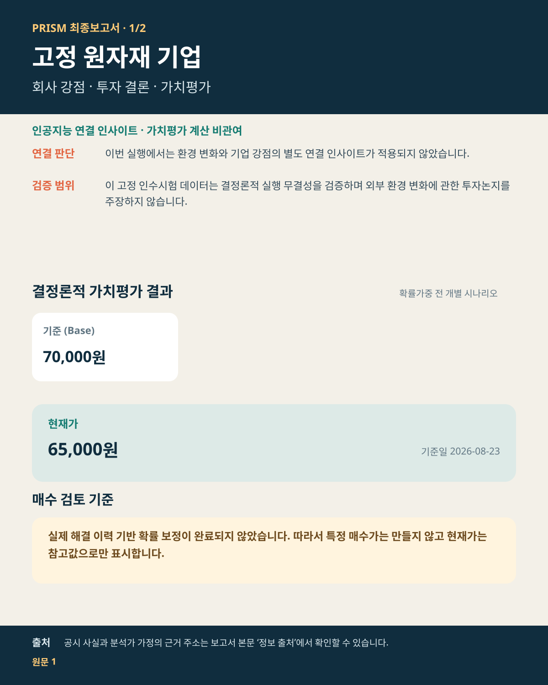
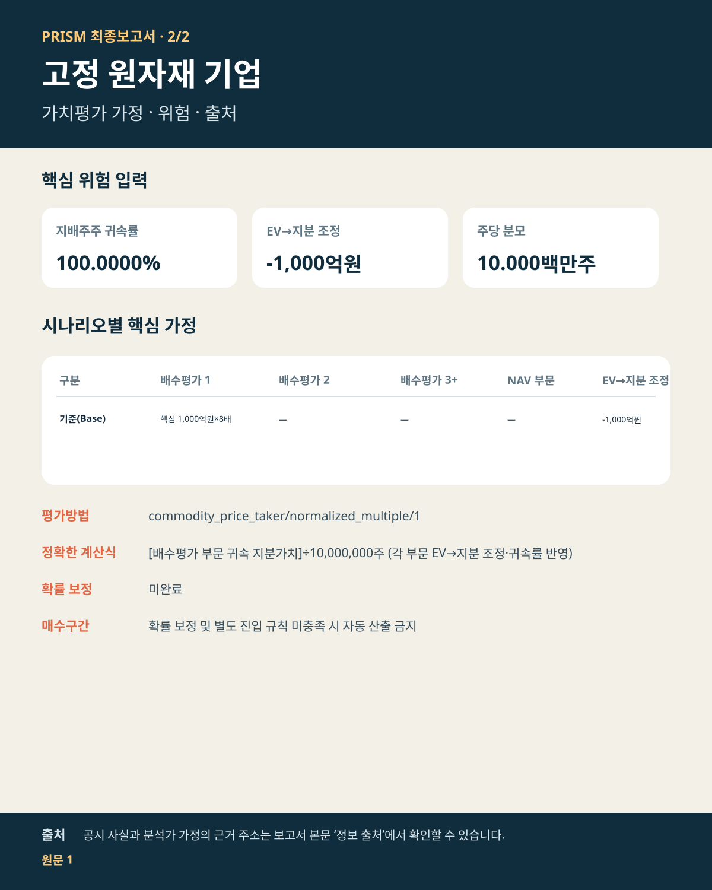

# 고정 원자재 기업 투자보고서

## 투자 요약

| 핵심 판단 항목 | 내용 |
| --- | --- |
| **투자판단** | 판단 유보 — 실제 해결 이력 기반 확률 보정과 별도 진입 규칙이 모두 갖춰지기 전까지 구체적인 매수가는 제시하지 않습니다. |
| **현재가** | 65,000원 (2026-08-23) |
| **기준 내재가치** | 주당 70,000원 |
| **가치평가 범위** | 주당 70,000~70,000원 |
| **시나리오 가능성** | 미산출 |
| **증권사 참고값** | 70,000원 (2건, 가치평가 확정 후 참고) |

### 한 문장 결론

고정된 1차 출처가 확률가중하지 않은 기준 시나리오 하나를 뒷받침합니다.

### 투자포인트

- **가치동인:** 고정된 1차 출처가 확률가중하지 않은 기준 시나리오 하나를 뒷받침합니다.
- **현재가 대비:** 기준 내재가치는 현재가보다 7.7% 높습니다. 하방 위험과 가정 실현 여부를 함께 점검해야 합니다.
- **남은 제약:** 실제 해결 이력 기반 확률 보정이 없어 시나리오 기대값과 구체 매수가를 사용하지 않습니다.

### 판단 변경 조건

- **상방 확인:** 기준·상방 가정의 핵심 동인이 공시 실적과 현금흐름으로 전환되면 판단 근거가 강화됩니다.
- **하방 훼손:** 핵심 가정이 미달하거나 하방 시나리오의 조건이 현실화되면 가치평가 신뢰도와 행동 여력이 낮아집니다.
- **행동 가능 조건:** 실제 해결 이력 기반 확률 보정과 별도 진입 규칙이 모두 갖춰지기 전까지 구체적인 매수가는 제시하지 않습니다.

## 가치평가
- **기준 시나리오:** 내재가치 주당 70,000원
- **확률가중 기대값:** 미산출 — 실제 해결 이력 기반 보정이 끝나지 않아 수치 가중을 보류했습니다.

## 핵심 가정과 위험
- **평가방법:** 정상화 이익배수법
- **위험 입력:** 선택된 평가방법에서 별도 베타·가중평균자본비용을 요구하지 않습니다.
- **확률 보정:** 미보정 · 수치 가중 보류
- **핵심 제약:** 실제 해결 전망의 누적 이력이 부족해 시나리오 확률과 기대값을 투자판단에 사용할 수 없습니다.

## 증권사·시장 비교
- **증권사 평균 목표가:** 70,000원 (2건)
- 증권사 평균 목표가는 기준 내재가치와 같습니다.

### 증권사별 목표가와 PRISM의 차이

| 증권사 | 목표가 | 적용 기준 | PRISM 기준가 대비 |
| --- | ---: | --- | ---: |
| 증권사 A | 65,000원 | 2027년 기준 · 현금흐름할인법 | -7.1% |
| 증권사 B | 75,000원 | 2027년 기준 · 주가수익비율법 | +7.1% |

### 왜 차이가 나는가

- **평가방법:** PRISM은 정상화 이익배수법을 사용하며, 증권사별 평가방법은 표와 같습니다. 현금흐름·이익·할인율·적용 배수의 기준이 다르면 목표가도 달라집니다.
- **기준시점:** 증권사 A: 2027년 현금흐름할인법 · 증권사 B: 2027년 주가수익비율법. 평가 기준과 기준연도가 다르므로 목표가를 PRISM 기준가와 동일한 숫자로 볼 수 없습니다.
- **증권사 간 차이:** 증권사 B 목표가는 증권사 A보다 10,000원 (15.4%) 높습니다. 두 보고서의 기준연도와 평가방법이 달라 목표가 차이를 단순 평균으로 해석하면 안 됩니다.
- **분해 한계:** 현재 확보된 증권사 자료에는 목표가·평가방법·기준연도는 있으나 모든 세부 이익 추정치가 구조화되어 있지 않아, 차이를 이익 전망과 적용 배수로 완전히 분해할 수는 없습니다.
- **해석:** 증권사 목표가는 각 보고서의 현금흐름·이익·할인율·배수 가정을 반영한 참고값입니다. PRISM 결과와의 차이 자체가 계산 오류를 뜻하지는 않습니다.
- **현재가:** 65,000원 (2026-08-23)
- **기준 대비 상승여력:** 5,000원 (7.7%)

## 인공지능 인사이트 — 환경 변화 × 기업 강점
- 적용범위: 인공지능은 외부 환경 변화와 기업 강점의 연결 가설·반증 조건만 제시하며 가치평가 계산이나 가정 확정에는 관여하지 않습니다.
- 상태: 해당 없음
- 사유: 이 고정 인수시험 데이터는 결정론적 실행 무결성을 검증하며 외부 환경 변화에 관한 투자논지를 주장하지 않습니다.

## 최종 요약 이미지

## 정보 출처 — 원문 바로 확인
- **고정 공시 시험자료 / 기업 식별정보 / 증권사: 증권사 A / 증권사: 증권사 B / 현재 시장가격** — 근거 8개: 기준 가격, 생산능력, 현금원가, 원가곡선상 위치, 재고, 생산량 외 2개 유형 (기준일 2026-06-30); 기업 식별 확인; 목표가 발표일 2026-08-01; 목표가 발표일 2026-08-05; 시장가격 기준일 2026-08-23 [원문 바로 열기](https://github.com/newwonwoo/valuation/blob/main/tests/test_full_live_primary_runtime.py)

이 원문에 연결된 근거 8개 보기

- `E:core:benchmark_price` · `E:core:capacity` · `E:core:cash_cost` · `E:core:cost_curve_position` · `E:core:inventory` · `E:core:production` · `E:core:realized_price` · `E:core:utilization`

- 전체 근거 식별자·지표·기준일 연결 내역은 별도 분석 기록에 보관됩니다.

## 분석 범위와 유의사항
- **평가범위:** 전체 기업 내재가치
- **계산 확인:** 자동 오류 점검 22개 통과 · 분석 원칙 27/27개 충족
- 회사 공시 사실, 분석가 가정, 인공지능 연결 인사이트를 구분해 표시했습니다.
- 증권사 목표가와 현재가는 가치평가를 마친 뒤 참고했으며, 앞서 계산한 가정을 바꾸는 데 사용하지 않았습니다.

---

작성 근거와 계산 과정 보기

## 분석 절차 요약

- 자동 오류 점검: 22/22개 통과
- 분석 절차 기록: 33/33개 완료

## 주요 작업 단계

### 1. 증거 수집·산업 라우팅 — 통과 (9/9)
- 결과: 증거 수집·산업 라우팅을 완료하고 근거 기록을 확정했습니다
- 잔여위험: 없음 · 다음 단계: 인사이트 도출·반증 검토

### 2. 인사이트 도출·반증 검토 — 통과 (5/5)
- 결과: 환경 변화와 기업 강점의 연결 인사이트 및 반증 검토를 완료했습니다
- 잔여위험: 없음 · 다음 단계: 가정·평가방법·위험

### 3. 가정·평가방법·위험 — 통과 (5/5)
- 결과: 가정·평가방법·베타·가중평균자본비용의 적용 여부를 확정했습니다
- 잔여위험: 없음 · 다음 단계: 가치평가·오류 점검·결과 확정

### 4. 가치평가·오류 점검·결과 확정 — 경고 (7/7)
- 결과: 가치평가와 오류 점검을 마치고 결과를 확정했습니다
- 잔여위험: 시나리오 확률 보정 점검: 실제 해결 이력 기반 확률 보정이 완료되지 않아 확률가중 기대값을 산출하지 않았습니다 · 다음 단계: 증권사·시장 비교·보고서 저장

### 5. 증권사·시장 비교·보고서 저장 — 통과 (7/7)
- 결과: 시장·증권사 비교 후 한국어 최종보고서와 요약 이미지 2장을 저장했습니다
- 잔여위험: 없음 · 다음 단계: 최종 결과보고서

## 세부 계산 기록

### 33단계 진행 상태
- **증거 수집·산업 라우팅:** 1 기업 식별=통과 · 2 기존 분석 상태 불러오기=통과 · 3 산업 지식 기준일 설정=통과 · 4 출처 최신성 사전점검=통과 · 5 사업부 분해=통과 · 6 산업 특성 분류=통과 · 7 필수 분석 모듈 확정=통과 · 8 1차 근거 수집=통과 · 9 근거 기록 확정=통과
- **인사이트 도출·반증 검토:** 10 환경 변화 인사이트 탐색=통과 · 11 상류 자금흐름 점검=해당 없음 · 12 주 분석가 가설 도출=통과 · 13 독립 반증 검토=통과 · 14 추가 조사 반복=해당 없음
- **가정·평가방법·위험:** 15 근거·가정 연결=통과 · 16 시나리오 구성=통과 · 17 가치평가 방법 확정=통과 · 18 계층형 베타 추정=해당 없음 · 19 가중평균자본비용 검증=해당 없음
- **가치평가·오류 점검·결과 확정:** 20 결정론적 가치평가=통과 · 21 계층형 적정 주가수익비율=해당 없음 · 22 현금흐름·주가수익비율 가정 정합성=통과 · 23 평가방법 간 이중계상 감사=통과 · 24 시나리오 확률 보정 점검=경고 · 25 최종 감사=통과 · 26 가치평가 결과 확정=통과
- **증권사·시장 비교·보고서 저장:** 27 증권사 자료 불러오기=통과 · 28 증권사 목표가 비교=통과 · 29 현재 시장가격 불러오기=통과 · 30 시장가격 비교=통과 · 31 투자논지 변화 점검=통과 · 32 분석 결과 저장=통과 · 33 최종보고서 생성=통과
- 단계별 사유와 출력값 식별자는 별도 분석 기록에 보존됩니다.

### 분석 모듈 점검
- 영향 측정 완료: 결정론적 가치평가
- 영향 미측정: 가정 컴파일러, 독립 반증 검토, 증권사 자료 검증, 근거 원장, 근거·가정 연결, 산업 특성 분류, 산업 지식, 지식 배치 검증 외 7개
- 비적용: 계층형 베타, 상류 자금흐름 점검, 가중평균자본비용 · 실패: 없음

### 실행 식별자와 해시

- 실행 식별자: `FULL-LIVE-1`
- 실행 모드: `live_primary`
- 작성 확인 해시: `468fbef83bc55264102ded0e8b4d3d6e2718233c403e48169d32060433b595d5`
- 증거 해시: `844702b379f405baffd8cea944854ac2c00a1b0e8141a693bfd75fd8934a786d`
- 가정 해시: `f9a111745f4945d119f02f1708f026ff7473c9c96a6055c454370634d2a0e818`
- 시나리오 해시: `363189a1674c763b0f3d2e60be59156f25e956d800342bf9f468dbf093c4538c`
- 가치평가 해시: `759890294b90fb9bda449cc6b539214a0795bb59ad27d1f46e37b42b8f99da06`
- 오류 점검 해시: `484915ff80ef965128618a753168b38ae268ebcc4f4656bfb8a9e84270a15d5a`
- 가치평가 확정 해시: `77990c6f5d8c2fd9b152a537b6ecf4cf6e5140640e00c9f817acad2bf0105ed1`
- 보조 결속정보: 생산능력 평가 `a3545801a2b8a62a817dc8625fd5baccc104aa9ed22e1476e89b8c440ce55462` · 생산능력 시나리오 `749eb5803378d1917242a7bbc628d9f735b5a3101a0593da19d5c3fa3a17ff24` · 생산능력 가치평가 `5e36a496bd37604aa33ffb0b4f80cd48eadf839b83218aaa9422a35649e297fe` · 생산능력 주가수익비율 `09d1f570a1c55c08e4639a4c59546ddac49c2704ed6ebdf185cba5cd4457d478` · 생산능력 정합성 `adfc3920a842875012b27720a55cf7324ede5d2ae4abf320d1c4484f3aafb1eb` · 생산능력 오류 점검 `5405620256db2ab82529b83171ef2e5f41bc1d1fd8d1785902318c52f5b0c353`
- 단계 기술 식별자: 1 `COMPANY_RESOLUTION`=pass · 2 `LOAD_COMPANY_STATE`=pass · 3 `LOAD_INDUSTRY_KNOWLEDGE_SNAPSHOT`=pass · 4 `SOURCE_FRESHNESS_PRECHECK`=pass · 5 `SEGMENT_DECOMPOSITION`=pass · 6 `INDUSTRY_DNA_ROUTE`=pass · 7 `MODULE_REQUIREMENT_PLAN`=pass · 8 `PRIMARY_EVIDENCE_COLLECTION`=pass · 9 `EVIDENCE_LEDGER`=pass · 10 `ROCKET_INSIGHT_SCAN`=pass · 11 `UPSTREAM_FUNDING_SCAN`=skipped_not_applicable · 12 `RESEARCHER_A`=pass · 13 `BLIND_RED_TEAM_B`=pass · 14 `RESEARCH_LOOP`=skipped_not_applicable · 15 `EVIDENCE_TO_ASSUMPTION_BRIDGE`=pass · 16 `SCENARIO_BUILD`=pass · 17 `VALUATION_METHOD_INTENT`=pass · 18 `HIERARCHICAL_BETA_ESTIMATION`=skipped_not_applicable · 19 `WACC_VALIDATION`=skipped_not_applicable · 20 `DETERMINISTIC_VALUATION`=pass · 21 `HIERARCHICAL_WARRANTED_PER`=skipped_not_applicable · 22 `DCF_PER_ASSUMPTION_CONSISTENCY_GATE`=pass · 23 `CROSS_METHOD_DOUBLE_COUNT_AUDIT`=pass · 24 `PROBABILITY_DISTRIBUTION_ANALYSIS`=warning · 25 `AUDIT_GATE`=pass · 26 `INTRINSIC_VALUE_FREEZE`=pass · 27 `STREET_REFERENCE_LOAD`=pass · 28 `STREET_GAP_ANALYZER`=pass · 29 `MARKET_PRICE_LOAD`=pass · 30 `MARKET_COMPARE`=pass · 31 `THESIS_DELTA`=pass · 32 `SAVE_STATE`=pass · 33 `FINAL_REPORT`=pass

