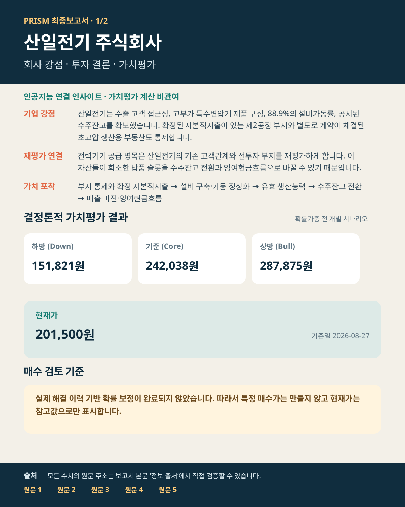
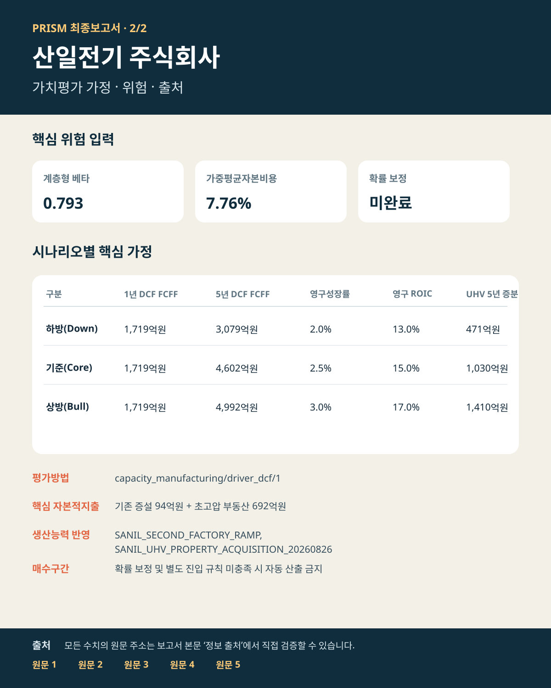

# 트럼프가 전력망을 국가안보로 묶었다 — 산일전기(062040)

## 투자 요약

### 위험 공급자 배제 → 검증된 공급망 → 5,026억원 생산 슬롯

| 핵심 판단 항목 | 내용 |
| --- | --- |
| **투자판단** | 매수 — 기준 목표가까지 상승여력 20.1%, 하방 시나리오 병행 관리 |
| **현재가** | 201,500원 (2026-08-27) |
| **기준 내재가치** | 242,038원 · 현재가 대비 +20.1% |
| **정책 반영 전→후** | 237,906원 → 242,038원 · 주당 +4,132원 |
| **가치평가 범위** | 하방 151,821원 · 기준 242,038원 · 상방 287,875원 |
| **시나리오 가능성** | 하방 30% · 기준 50% · 상방 20% · 미보정 분석가 사전확률, 기대값 미적용 |
| **증권사 참고값** | 262,500원 (4건, 가치평가 확정 후 참고) |
| **보고서 성격** | 8월 26일 공시와 8월 27일 시장·증권사 후속 해석을 분리 반영한 투자분석 |

### 한 문장 결론

트럼프 행정부가 전력망 장비를 국가안보 심사 대상으로 올렸고 산일전기는 2025년 매출의 75% 이상을 미국에서 확보했습니다. 이를 신규 부지 기존제품 슬롯의 기준 실현율 50%→60%로만 제한 반영해 내재가치는 237,906원에서 242,038원으로 +4,132원 상승했습니다.

### 트럼프 행정명령이 바꾼 것

- **확인된 사실:** 8월 26일 행정명령은 미국 대용량 전력망의 외국 공급 위험을 국가비상사태로 규정하고, 69kV 이상 계통의 변전소 변압기를 심사 범위에 포함했습니다. 위험 공급자 거래 제한·사전적격 공급자 체계와 120일 이내 세부 규칙 마련도 지시했습니다. [백악관 행정명령 원문](https://www.whitehouse.gov/presidential-actions/2026/08/declaring-a-national-emergency-to-secure-the-united-states-bulk-power-system/)
- **산일전기 연결:** 2025년 매출의 75% 이상이 미국에서 발생하고 글로벌 인버터 업체·미국 전력청에 대부분 직접 납품합니다. 이 기존 고객 접근성과 행정명령의 공급자 심사를 결합해 신규 부지 기존제품 슬롯의 기준 실현율만 50%에서 60%로 조정했습니다. [2025년 사업보고서](https://kind.krx.co.kr/external/2026/03/18/000706/20260318003527/11011.htm)
- **해석의 한계:** 모든 외국산 장비를 일괄 금지한 명령은 아니며 산일전기는 한국 생산 수출기업입니다. 미국산 조달 우선은 오히려 불리할 수 있어 WACC·마진·영구성장률은 건드리지 않았고, 향후 미국 에너지부 규칙이 산일전기를 배제하면 실현율을 50% 이하로 되돌립니다.

### 투자포인트

- **가치동인:** 신규 부지 유효 연매출 CAPA는 기존제품 2,936억원 + 초고압 2,090억원 = 5,026억원입니다.
- **가치평가:** 현금흐름할인법 기준 하방–상방 범위는 151,821–287,875원이며, 계층형 베타 0.793 · 가중평균자본비용 7.764%를 적용했습니다.
- **현금창출력:** 성숙기 기준은 매출 15,527억원 · 영업이익 6,201억원 · 잉여현금흐름 4,602억원, 전량가동 상방은 매출 16,702억원 · 잉여현금흐름 4,992억원입니다.
- **남은 제약:** 기준 DCF 기업가치의 84.9%가 영구가치에 있어 가동·마진 정상화 지연에 민감하며, 하방 30% · 기준 50% · 상방 20%는 실제 해결 이력으로 보정되지 않아 기대값에는 적용하지 않았습니다.

### 공시 → 제품 구성 → 영업이익 → 현금흐름 연결

- **현재 현금전환:** 2026년 상반기 영업현금흐름 901억원, 단순 잉여현금흐름 805억원으로 영업이익 대비 각각 76.7%, 68.5%입니다. 매출채권+재고−매입채무 증감은 -1.7억원으로 사실상 제자리입니다. [2026년 반기보고서](https://dart.fss.or.kr/dsaf001/main.do?rcpNo=20260814003544)
- **물리 CAPA 출발점:** 기존제품 명목 3,090억원에 95% 가동을 적용한 2,936억원과 초고압 2,090억원을 합쳐 5,026억원입니다. [부지 취득 공시](https://dart.fss.or.kr/dsaf001/main.do?rcpNo=20260826000660) · [LS증권 CAPA 참고자료](https://file.alphasquare.co.kr/media/pdfs/company-report/_%EC%82%B0%EC%9D%BC%EC%A0%84%EA%B8%B0_2Q25%20Review_250807%E2%98%86_%EC%84%B1%EC%A2%85%ED%99%94_1976_Online%20report%20_%206_10p_%EC%82%B0%EC%9D%BC%EC%A0%84%EA%B8%B0.pdf) · [회사 2분기 IR](https://www.sanil.co.kr/kr/sub/reference/ir.php?bid=1&idx=1002&mode=view&page=1&s_cate=&s_keyword=&s_type=)

| 신규공장 제품 | 유효 연매출 CAPA | 신규공장 믹스 |
| --- | ---: | ---: |
| 특수변압기 | 2,231억원 | 44.4% |
| 일반 전력망 변압기 | 616억원 | 12.3% |
| 기타 기존제품 | 88억원 | 1.8% |
| 154kV 초고압 | 2,090억원 | 41.6% |
| **합계** | **5,026억원** | **100.0%** |

| 연도·단계 | 기존품목 CAPA 인정 | 매출 | 영업이익 | 영업이익률 | 보수적 FCF | 정상화 FCF |
| --- | ---: | ---: | ---: | ---: | ---: | ---: |
| 2029년 램프업 | 50% | 15,144억원 | 5,950억원 | 39.3% | 4,338억원 | 4,511억원 |
| 2030년 전량가동 | 100% | 16,702억원 | 6,678억원 | 40.0% | 4,814억원 | 5,066억원 |

보수적 FCF는 세후영업이익 + 감가상각 1.0% − 유지투자 1.5% − 신규공장 증분매출의 운전자본 5%입니다. 정상화 FCF는 램프업 이후 추가 운전자본 투입이 멈춘 상태이며, 이 표는 회사 가이던스가 아니라 공시와 증권사 CAPA를 연결한 분석가 추론입니다.

### 판단 변경 조건

- **상방 확인:** 회사가 초고압 2,000억원 이상과 기존제품 약 3,000억원의 순증 CAPA, 생산·시험설비, 고객 인증 일정을 확인할 때.
- **하방 훼손:** 증설 지연·취소, 수주잔고 또는 신규수주 감소, 출하 전환 전 마진 둔화가 확인될 때.
- **행동 가능 조건:** 실제 해결 전망 이력이 누적되어 시나리오 확률을 보정하고 별도 진입 규칙이 승인될 때.

### 8월 27일 자료 반영

- **신규 공시 여부:** [회사 공시목록](https://www.sanil.co.kr/kr/sub/reference/announce.php) 기준 8월 27일 신규·정정 공시는 없습니다. 최신 원문은 8월 26일 [유형자산 양수결정](https://dart.fss.or.kr/dsaf001/main.do?rcpNo=20260826000660)입니다.
- **회사 확정 사실:** 안산 토지·건물 692.5억원, 자기자금 지급, 초고압 변압기 생산시설과 기존 제품 생산능력 확대 목적입니다.
- **아직 미공시:** 순증 생산능력, 생산·시험설비 총액, 고객 인증·수주, 상업 생산시점, 매출·마진·현금흐름 기여입니다.
- **증권사 해석:** [한국투자증권 8월 27일 보고서](https://securities.koreainvestment.com/main/research/research/StrategyDetail.jsp?id=158730&jkGubun=6)의 2028년 양산·2029년 추가 매출 2,000억원 이상·목표가 270,000원은 회사 확정치가 아니라 증권사 추정치입니다.
- **모델 처리:** 부지 취득은 수요 대응의 경제적 실질이 있어 DCF에 포함했습니다. 미국 매출 노출과 행정명령의 공급자 심사를 별도 Bridge로 묶어 기존제품 CAPA 실현율을 기준 50%→60%로 바꿨고, 전량은 상방으로 분리했습니다. 정책만으로 WACC·마진·영구성장률을 높이지 않았습니다.

## 가치평가

### 현금흐름 계산 연결

| 시나리오 | 5년차 기존사업 FCFF | 신규 부지 증분 | DCF·영구가치 사용 합계 |
| --- | ---: | ---: | ---: |
| 하방 | 2,608억원 | 471억원 | 3,079억원 |
| 기준 | 3,572억원 | 1,030억원 | 4,602억원 |
| 상방 | 3,582억원 | 1,410억원 | 4,992억원 |

- 신규 부지 증분 FCFF는 기존제품 확장과 초고압을 합친 뒤, 연간 증분매출에 대해서만 운전자본을 차감합니다.
- 현재 계산은 제2공장 2027년 이후 공시 잔여액 93.7억원, 초고압 부동산 692.5억원, 생산·시험설비 분석가 가정을 별도 현금유출로 차감합니다.

- **하방 시나리오:** 내재가치 주당 151,821원
- **기준 시나리오:** 내재가치 주당 242,038원
- **상방 시나리오:** 내재가치 주당 287,875원

### 시나리오 발생 가능성 — 미보정 분석가 사전확률

| 시나리오 | 상대점수 | 표시 확률 | 판단 근거 |
| --- | ---: | ---: | --- |
| 하방 | 3 | 30% | 현재 고마진 정상화와 수주잔고 전환 지연 위험을 반영한 하방 상대점수입니다. |
| 기준 | 5 | 50% | 수주잔고·가동 기반과 부지 통제·확정 자본적지출을 함께 반영한 기준 상대점수입니다. |
| 상방 | 2 | 20% | 빠른 초고압 설비 가동과 높은 마진 지속이 동시에 필요해 기준보다 낮게 둔 상방 상대점수입니다. |

- **산출식:** 각 시나리오의 명시적 상대점수를 전체 점수로 나눠 정규화하고, 표시는 5% 단위로 반올림했습니다.
- **사용 제한:** 분석가 사전확률이며 실제 해소 이력으로 보정되지 않았으므로 기대가치·매수판단에는 사용하지 않습니다.
- **기준일·기간:** 2026-08-27 · 5y
- **확률가중 기대값:** 미산출 — 실제 해결 이력 기반 보정이 끝나지 않아 수치 가중을 보류했습니다.

## 핵심 가정과 위험
- **근거 신뢰도:** 회사 실적·수주·생산능력·부지·자본적지출은 회사 공시·기업설명자료에 기반해 신뢰도가 높습니다.
- **분석가 추정:** 하방·기준·상방 기업잉여현금흐름은 회사 가이던스가 아니라 공시 사실에서 파생한 분석가 가정입니다.
- **생산능력 불확실성:** 초고압 부동산 계약은 부지 통제와 692.5억원 매매대금을 확정하지만 정확한 생산능력·설비투자비·양산시점은 미공시입니다. 기존제품 CAPA는 정책 연결 전 기준 50%에서 60%로 조정했고, 상방만 100%를 인정합니다.
- **누락 비용 위험:** 부가가치세·세금·수수료와 향후 건설비는 별도일 수 있습니다. 생산·시험설비는 기준 600억원의 분석가 가정을 반영했습니다.
- **지급시점 단순화:** 공시된 계약금 69.25억원·중도금 207.75억원·잔금 415.5억원을 현재 모델은 2년차 일괄 현금유출로 처리해, 지급일별 현재가치 계산은 후속 보완이 필요합니다.
- **평가방법:** 핵심동인 현금흐름할인법
- **위험 입력:** 계층형 베타 0.793 · 가중평균자본비용 7.764%
- **확률 보정:** 미보정 · 수치 가중 보류
- **하방 가정:** 1년차 DCF 사용 FCFF 1,719억원 (기존 1,719억원 + 증분 0억원) · 5년차 DCF 사용 FCFF 3,079억원 (기존 2,608억원 + 증분 471억원) · 영구성장률 2.0% · 영구 ROIC 13.0% (성장률 검산·재투자율 15.4%)
- **기준 가정:** 1년차 DCF 사용 FCFF 1,719억원 (기존 1,719억원 + 증분 0억원) · 5년차 DCF 사용 FCFF 4,602억원 (기존 3,572억원 + 증분 1,030억원) · 영구성장률 2.5% · 영구 ROIC 15.0% (성장률 검산·재투자율 16.7%)
- **상방 가정:** 1년차 DCF 사용 FCFF 1,719억원 (기존 1,719억원 + 증분 0억원) · 5년차 DCF 사용 FCFF 4,992억원 (기존 3,582억원 + 증분 1,410억원) · 영구성장률 3.0% · 영구 ROIC 17.0% (성장률 검산·재투자율 17.6%)
- **기준 시나리오 생산능력:** 제2공장 가동 정상화, 초고압 변압기 생산용 부동산 양수계약
- **핵심 제약:** 실제 해결 전망의 누적 이력이 부족해 시나리오 확률과 기대값을 투자판단에 사용할 수 없습니다.

### 사전에 기록한 사건 예측 — 보정 이력 적립용

| 사건 | 미보정 확률 | 해소기한 | 해소 기준 |
| --- | ---: | --- | --- |
| 2027-12-31까지 제2공장이 기존 기준 생산능력을 초과하는 상업 생산을 시작한다. | 70% | 2027-12-31 | 회사 공시 또는 공식 IR에서 추가 생산능력의 상업 가동과 출하가 확인되면 occurred, 취소·기한 미달이면 not_occurred로 해소한다. |
| 2027-02-19까지 공시된 초고압 생산용 부동산 취득 거래가 종결된다. | 85% | 2027-02-19 | 회사 정정·완료 공시로 소유권 이전 또는 거래 종결이 확인되면 occurred, 취소·기한 미달이면 not_occurred로 해소한다. |
- 위 예측은 분석 당시 값과 이후 변경 이력을 함께 저장하며, 사후 공시를 보고 과거 확률을 다시 쓰지 않습니다.

## 증권사·시장 비교
- **증권사 평균 목표가:** 262,500원 (4건)
- PRISM 기준 내재가치는 증권사 평균 목표가보다 7.8% 낮습니다.

### 증권사별 목표가와 PRISM의 차이

| 증권사 | 목표가 | 적용 기준 | PRISM 기준가 대비 |
| --- | ---: | --- | ---: |
| 미래에셋증권 | 250,000원 | 2028년 기준 · 주가수익비율 기반 목표가 | +3.3% |
| IBK투자증권 | 220,000원 | 2027년 기준 · 증권사 목표가 산정 방식 | -9.1% |
| 신한투자증권 | 310,000원 | 2027년 기준 · 예상 주가수익비율 35배 | +28.1% |
| 한국투자증권 | 270,000원 | 2027년 기준 · 2027E EPS × PER 29x | +11.6% |

### 왜 차이가 나는가

- **평가방법:** PRISM은 핵심동인 현금흐름할인법을 사용하며, 증권사별 평가방법은 표와 같습니다. 현금흐름·이익·할인율·적용 배수의 기준이 다르면 목표가도 달라집니다.
- **기준시점:** 미래에셋증권: 2028년 주가수익비율 기반 목표가 · IBK투자증권: 2027년 증권사 목표가 산정 방식 · 신한투자증권: 2027년 예상 주가수익비율 35배 · 한국투자증권: 2027년 2027E EPS × PER 29x. 평가 기준과 기준연도가 다르므로 목표가를 PRISM 기준가와 동일한 숫자로 볼 수 없습니다.
- **증권사 간 차이:** 신한투자증권 목표가는 IBK투자증권보다 90,000원 (40.9%) 높습니다. 두 보고서의 기준연도와 평가방법이 달라 목표가 차이를 단순 평균으로 해석하면 안 됩니다.
- **증설 처리:** PRISM은 공시된 자본적지출과 가동 정상화 경로를 현금흐름에 직접 반영하고, 정확한 추가 생산능력이 미공시된 부분은 확정 이익으로 앞당기지 않았습니다.
- **분해 한계:** 현재 확보된 증권사 자료에는 목표가·평가방법·기준연도는 있으나 모든 세부 이익 추정치가 구조화되어 있지 않아, 차이를 이익 전망과 적용 배수로 완전히 분해할 수는 없습니다.
- **해석:** 증권사 목표가는 각 보고서의 현금흐름·이익·할인율·배수 가정을 반영한 참고값입니다. PRISM 결과와의 차이 자체가 계산 오류를 뜻하지는 않습니다.
- **현재가:** 201,500원 (2026-08-27)
- **하방 대비 하락위험:** 49,679원 (24.7%)
- **기준 대비 상승여력:** 40,538원 (20.1%)
- **상방 대비 상승여력:** 86,375원 (42.9%)

## 인공지능 인사이트 — 환경 변화 × 기업 강점
- 적용범위: 인공지능은 외부 환경 변화와 기업 강점의 연결 가설·반증 조건만 제시하며 가치평가 계산이나 가정 확정에는 관여하지 않습니다.
- 상태: 적용
- 연결: 미국이 69kV 이상 전력망과 변전소 변압기를 국가안보 조달 대상으로 묶고 공급자 심사를 강화하면서, 납품 실적이 있는 생산 슬롯의 희소성이 커지고 있습니다. → 산일전기는 수출 고객 접근성, 고부가 특수변압기 제품 구성, 88.9%의 설비가동률, 공시된 수주잔고를 확보했습니다. 확정된 자본적지출이 있는 제2공장 부지와 별도로 계약이 체결된 초고압…
- 핵심 추론: 전력기기 공급 병목은 산일전기의 기존 고객관계와 선투자 부지를 재평가하게 합니다. 이 자산들이 희소한 납품 슬롯을 수주잔고 전환과 잉여현금흐름으로 바꿀 수 있기 때문입니다.
- 가치 포착: 부지 통제와 확정 자본적지출 → 설비 구축·가동 정상화 → 유효 생산능력 → 수주잔고 전환 → 매출·마진·잉여현금흐름
- 반증 조건: 회사가 증설을 취소하거나 기존 기준 생산능력에 이미 전부 포함됐다고 확인; 생산능력이 출하로 전환되기 전에 수주잔고 또는 신규수주 감소
- 다음 확인: 다음 분기 공시의 공장 정상화·자본적지출·가동률; 수주에서 매출로의 전환과 고객 집중도
- 핵심 근거: 수주, 수주잔고, 설비가동률, 증설 부지 통제 — 원문 링크는 `정보 출처 — 원문 바로 확인` 참조
- 인공지능 판단 신뢰도: 78%
- 세부 인사이트는 별도 분석 기록에 보관됩니다.

## 최종 요약 이미지

## 정보 출처 — 원문 바로 확인
- **현재 시장가격** — 시장가격 기준일 2026-08-27 [원문 바로 열기](https://alphasquare.co.kr/home/stock-summary?code=062040)
- **초고압 변압기 생산용 부동산 양수계약** — 근거 7개: 초고압 부동산 자산 비율, 기존 생산능력 포함 여부, 확정 증설 자본적지출, 초고압 부동산 계약금액, 증설 부지 통제, 증설 가동 시점 외 1개 유형 (기준일 2026-08-26) [원문 바로 열기](https://dart.fss.or.kr/dsaf001/main.do?rcpNo=20260826000660)

이 원문에 연결된 근거 7개 보기

- `E:SANIL:UHV:asset_ratio` · `E:SANIL:UHV:baseline_inclusion` · `E:SANIL:UHV:capex_committed` · `E:SANIL:UHV:contract_amount` · `E:SANIL:UHV:land_control` · `E:SANIL:UHV:ramp_boundary` · `E:SANIL:UHV:self_funded`

- **베타 입력값** — 베타 입력 출처 [원문 바로 열기](https://finance.naver.com/)
- **SANIL_UNDERWRITING_20260827_POLICY_TRANSMISSION** — 근거 63개: 가치평가 모형 입력값 (기준일 2026-08-27) [원문 바로 열기](https://github.com/newwonwoo/valuation/blob/main/config/sanil_live_snapshot.yaml)

이 원문에 연결된 근거 63개 보기

- `E:SANIL:model_bull_diluted_shares` · `E:SANIL:model_bull_ev_adjustment` · `E:SANIL:model_bull_expansion_capex` · `E:SANIL:model_bull_fcff_year_1` · `E:SANIL:model_bull_fcff_year_2` · `E:SANIL:model_bull_fcff_year_3` · `E:SANIL:model_bull_fcff_year_4` · `E:SANIL:model_bull_fcff_year_5` · `E:SANIL:model_bull_ownership` · `E:SANIL:model_bull_terminal_growth` · `E:SANIL:model_bull_terminal_roic` · `E:SANIL:model_bull_uhv_equipment_capex` · `E:SANIL:model_bull_uhv_property_capex` · `E:SANIL:model_bull_uhv_ramp_years` · `E:SANIL:model_bull_uhv_reference_fcff_year_1` · `E:SANIL:model_bull_uhv_reference_fcff_year_2` · `E:SANIL:model_bull_uhv_reference_fcff_year_3` · `E:SANIL:model_bull_uhv_reference_fcff_year_4` · `E:SANIL:model_bull_uhv_reference_fcff_year_5` · `E:SANIL:model_bull_uhv_reference_ramp_years` · `E:SANIL:model_bull_uhv_steady_state_fcff` · `E:SANIL:model_core_diluted_shares` · `E:SANIL:model_core_ev_adjustment` · `E:SANIL:model_core_expansion_capex` · `E:SANIL:model_core_fcff_year_1` · `E:SANIL:model_core_fcff_year_2` · `E:SANIL:model_core_fcff_year_3` · `E:SANIL:model_core_fcff_year_4` · `E:SANIL:model_core_fcff_year_5` · `E:SANIL:model_core_ownership` · `E:SANIL:model_core_terminal_growth` · `E:SANIL:model_core_terminal_roic` · `E:SANIL:model_core_uhv_equipment_capex` · `E:SANIL:model_core_uhv_property_capex` · `E:SANIL:model_core_uhv_ramp_years` · `E:SANIL:model_core_uhv_reference_fcff_year_1` · `E:SANIL:model_core_uhv_reference_fcff_year_2` · `E:SANIL:model_core_uhv_reference_fcff_year_3` · `E:SANIL:model_core_uhv_reference_fcff_year_4` · `E:SANIL:model_core_uhv_reference_fcff_year_5` · `E:SANIL:model_core_uhv_reference_ramp_years` · `E:SANIL:model_core_uhv_steady_state_fcff` · `E:SANIL:model_down_diluted_shares` · `E:SANIL:model_down_ev_adjustment` · `E:SANIL:model_down_expansion_capex` · `E:SANIL:model_down_fcff_year_1` · `E:SANIL:model_down_fcff_year_2` · `E:SANIL:model_down_fcff_year_3` · `E:SANIL:model_down_fcff_year_4` · `E:SANIL:model_down_fcff_year_5` · `E:SANIL:model_down_ownership` · `E:SANIL:model_down_terminal_growth` · `E:SANIL:model_down_terminal_roic` · `E:SANIL:model_down_uhv_equipment_capex` · `E:SANIL:model_down_uhv_property_capex` · `E:SANIL:model_down_uhv_ramp_years` · `E:SANIL:model_down_uhv_reference_fcff_year_1` · `E:SANIL:model_down_uhv_reference_fcff_year_2` · `E:SANIL:model_down_uhv_reference_fcff_year_3` · `E:SANIL:model_down_uhv_reference_fcff_year_4` · `E:SANIL:model_down_uhv_reference_fcff_year_5` · `E:SANIL:model_down_uhv_reference_ramp_years` · `E:SANIL:model_down_uhv_steady_state_fcff`

- **산일전기 위험 입력 출처 등록부 / 가중평균자본비용 입력값 / 베타 입력값** — 가중평균자본비용 입력 출처; 근거 E:SANIL:beta_selection_L1_BROAD_SECTOR · 베타 비교군 선정 근거 (기준일 2026-08-27); 근거 E:SANIL:beta_selection_L2_INDUSTRY · 베타 비교군 선정 근거 (기준일 2026-08-27); 근거 E:SANIL:beta_selection_L3_RISK_DRIVER_SUBINDUSTRY · 베타 비교군 선정 근거 (기준일 2026-08-27); 근거 E:SANIL:beta_selection_L4_ECONOMIC_TWINS · 베타 비교군 선정 근거 (기준일 2026-08-27); 베타 입력 출처 [원문 바로 열기](https://github.com/newwonwoo/valuation/blob/main/docs/SANIL_RISK_SOURCE_REGISTER.md)
- **산일전기 2025년 사업보고서 / 가중평균자본비용 입력값 / 기업 식별정보 / 베타 입력값** — 근거 28개: 평균판매가격, 수주잔고의 매출 전환, 수주·매출 비율, 수주 취소율, 수주 취소 조건, 현금 외 22개 유형 (기준일 2024-01-01, 2025-12-31); 가중평균자본비용 입력 출처; 기업 식별 확인; 베타 입력 출처 [원문 바로 열기](https://kind.krx.co.kr/external/2026/03/18/000706/20260318003527/11011.htm)

이 원문에 연결된 근거 28개 보기

- `E:SANIL:asp` · `E:SANIL:backlog_conversion` · `E:SANIL:book_to_bill` · `E:SANIL:cancellation_rate` · `E:SANIL:cancellation_terms` · `E:SANIL:cash` · `E:SANIL:contract_liabilities` · `E:SANIL:debt` · `E:SANIL:effective_capacity` · `E:SANIL:expansion_capacity_committed` · `E:SANIL:expansion_capex` · `E:SANIL:expansion_capex_committed` · `E:SANIL:expansion_equipment_commitment` · `E:SANIL:expansion_land_control` · `E:SANIL:expansion_site_area` · `E:SANIL:lead_time` · `E:SANIL:mix` · `E:SANIL:nameplate_capacity` · `E:SANIL:net_income` · `E:SANIL:operating_profit` · `E:SANIL:orders` · `E:SANIL:revenue` · `E:SANIL:revenue_recognition` · `E:SANIL:unit_cost` · `E:SANIL:us_direct_customer_access` · `E:SANIL:us_revenue_share_2025` · `E:SANIL:utilization` · `E:SANIL:yield`

- **증권사: 한국투자증권** — 목표가 발표일 2026-08-27 [원문 바로 열기](https://securities.koreainvestment.com/main/research/research/StrategyDetail.jsp?id=158730&jkGubun=6)
- **증권사 자료 탐색** — 가치평가 입력과 분리한 사실 탐색·교차확인 자료 [원문 바로 열기](https://securities.miraeasset.com/bbs/board/message/list.do?categoryId=1800&searchStartYear=2026&searchStartMonth=07&searchStartDay=16&searchEndYear=2026&searchEndMonth=07&searchEndDay=16)
- **증권사 자료 탐색 / 증권사: 미래에셋증권** — 가치평가 입력과 분리한 사실 탐색·교차확인 자료; 목표가 발표일 2026-08-07 [원문 바로 열기](https://securities.miraeasset.com/bbs/board/message/view.do?categoryId=1800&messageId=2341906)
- **산일전기 2026년 2분기 기업설명자료** — 근거 8개: 수주잔고, 기존 생산능력 포함 여부, 증설 취소 여부, 증설 가동 시점, 2026년 상반기 순이익, 진행 중 증설 부재 여부 외 2개 유형 (기준일 2026-06-30) [원문 바로 열기](https://www.sanil.co.kr/kr/sub/reference/ir.php?bid=1&idx=1002&mode=view&page=1&s_cate=&s_keyword=&s_type=)

이 원문에 연결된 근거 8개 보기

- `E:SANIL:backlog` · `E:SANIL:expansion_baseline_inclusion` · `E:SANIL:expansion_cancelled` · `E:SANIL:expansion_ramp_date` · `E:SANIL:net_income_h1_2026` · `E:SANIL:no_active_capacity_expansion` · `E:SANIL:operating_profit_h1_2026` · `E:SANIL:revenue_h1_2026`

- **US_EXECUTIVE_ORDER_14420_20260826** — 근거 E:SANIL:us_grid_security_order · us_grid_security_order (기준일 2026-08-26); 근거 E:SANIL:us_grid_transformer_scope_kv · us_grid_transformer_scope_kv (기준일 2026-08-26); 근거 E:SANIL:us_grid_vendor_prequalification · us_grid_vendor_prequalification (기준일 2026-08-26) [원문 바로 열기](https://www.whitehouse.gov/presidential-actions/2026/08/declaring-a-national-emergency-to-secure-the-united-states-bulk-power-system/)
- **증권사 자료 탐색 / 증권사: 신한투자증권** — 가치평가 입력과 분리한 사실 탐색·교차확인 자료; 목표가 발표일 2026-08-11 [원문 바로 열기](https://www.yna.co.kr/amp/view/AKR20260811028700008)
- **증권사 자료 탐색 / 증권사: IBK투자증권** — 가치평가 입력과 분리한 사실 탐색·교차확인 자료; 목표가 발표일 2026-08-10 [원문 바로 열기](https://www.yna.co.kr/view/AKR20260810017900008)
- 전체 근거 식별자·지표·기준일 연결 내역은 별도 분석 기록에 보관됩니다.

## 분석 범위와 유의사항
- **평가범위:** 전체 기업 내재가치
- **계산 확인:** 자동 오류 점검 31개 통과 · 분석 원칙 28/28개 충족
- 회사 공시 사실, 분석가 가정, 인공지능 연결 인사이트를 구분해 표시했습니다.
- 증권사 목표가와 현재가는 가치평가를 마친 뒤 참고했으며, 앞서 계산한 가정을 바꾸는 데 사용하지 않았습니다.

---

작성 근거와 계산 과정 보기

## 분석 절차 요약

- 자동 오류 점검: 25/25개 통과
- 분석 절차 기록: 33/33개 완료

## 주요 작업 단계

### 1. 증거 수집·산업 라우팅 — 통과 (9/9)
- 결과: 증거 수집·산업 라우팅을 완료하고 근거 기록을 확정했습니다
- 잔여위험: 없음 · 다음 단계: 인사이트 도출·반증 검토

### 2. 인사이트 도출·반증 검토 — 경고 (5/5)
- 결과: 환경 변화와 기업 강점의 연결 인사이트 및 반증 검토를 완료했습니다
- 잔여위험: 환경 변화 인사이트 탐색: 로켓슬라 인사이트 스캐너가 확인 필요 경고를 남겼습니다 · 다음 단계: 가정·평가방법·위험

### 3. 가정·평가방법·위험 — 통과 (5/5)
- 결과: 가정·평가방법·베타·가중평균자본비용의 적용 여부를 확정했습니다
- 잔여위험: 없음 · 다음 단계: 가치평가·오류 점검·결과 확정

### 4. 가치평가·오류 점검·결과 확정 — 경고 (7/7)
- 결과: 가치평가와 오류 점검을 마치고 결과를 확정했습니다
- 잔여위험: 시나리오 확률 보정 점검: 실제 해결 이력 기반 확률 보정이 완료되지 않아 확률가중 기대값을 산출하지 않았습니다 · 다음 단계: 증권사·시장 비교·보고서 저장

### 5. 증권사·시장 비교·보고서 저장 — 경고 (7/7)
- 결과: 시장·증권사 비교 후 한국어 최종보고서와 요약 이미지 2장을 저장했습니다
- 잔여위험: 시장 함의 기대치 역산: 현재 시장가격이 요구하는 영구성장률·현금흐름 수준이 확정된 가정과 달라 확인이 필요합니다 · 다음 단계: 최종 결과보고서

## 세부 계산 기록

### 33단계 진행 상태
- **증거 수집·산업 라우팅:** 1 기업 식별=통과 · 2 기존 분석 상태 불러오기=통과 · 3 산업 지식 기준일 설정=통과 · 4 출처 최신성 사전점검=통과 · 5 사업부 분해=통과 · 6 산업 특성 분류=통과 · 7 필수 분석 모듈 확정=통과 · 8 1차 근거 수집=통과 · 9 근거 기록 확정=통과
- **인사이트 도출·반증 검토:** 10 환경 변화 인사이트 탐색=경고 · 11 상류 자금흐름 점검=통과 · 12 주 분석가 가설 도출=통과 · 13 독립 반증 검토=통과 · 14 추가 조사 반복=해당 없음
- **가정·평가방법·위험:** 15 근거·가정 연결=통과 · 16 시나리오 구성=통과 · 17 가치평가 방법 확정=통과 · 18 계층형 베타 추정=통과 · 19 가중평균자본비용 검증=통과
- **가치평가·오류 점검·결과 확정:** 20 결정론적 가치평가=통과 · 21 계층형 적정 주가수익비율=해당 없음 · 22 현금흐름·주가수익비율 가정 정합성=통과 · 23 평가방법 간 이중계상 감사=통과 · 24 시나리오 확률 보정 점검=경고 · 25 최종 감사=통과 · 26 가치평가 결과 확정=통과
- **증권사·시장 비교·보고서 저장:** 27 증권사 자료 불러오기=통과 · 28 증권사 목표가 비교=통과 · 29 현재 시장가격 불러오기=통과 · 30 시장가격 비교=경고 · 31 투자논지 변화 점검=통과 · 32 분석 결과 저장=통과 · 33 최종보고서 생성=통과
- 단계별 사유와 출력값 식별자는 별도 분석 기록에 보존됩니다.

### 분석 모듈 점검
- 영향 측정 완료: 결정론적 가치평가
- 영향 미측정: 가정 컴파일러, 독립 반증 검토, 증권사 자료 검증, 근거 원장, 근거·가정 연결, 계층형 베타, 산업 특성 분류, 산업 지식 외 10개
- 비적용: 없음 · 실패: 없음

### 실행 식별자와 해시

- 실행 식별자: `SANIL-062040-20260827-POLICY`
- 실행 모드: `live_primary`
- 작성 확인 해시: `0398766495079a3024afce9a5aa5a4dd155e233e404d59bf211451412b65634c`
- 증거 해시: `4a9e4750e0d8b68668757c170360f289755773f85c0a0cf3bfd81e89ce73040c`
- 가정 해시: `5e3b6aa039bb198dbe2837bec5b0827522d8fee6a6d5732cc406c9b68936b7cf`
- 시나리오 해시: `bc60d594eefdb171fb842849a9b91fddff10f646e8128d832e3f208234acce83`
- 가치평가 해시: `fe72b6ab611fdc0f355b9fa1630baf1e9ad147f132f51ba10488d893dbe19115`
- 오류 점검 해시: `fd027803704fd5c40d17f8100dd3a93fa73097bed4e62c1336cb0bcc54470155`
- 가치평가 확정 해시: `0b5fb8273b7d26ee8cf7b09e718004c34f1f12131baea01c18f59c06645da06a`
- 보조 결속정보: 베타 `567700b4b5094f7aaa61cc030d0c8758ed146e9a38a3be4f4d56c5999f0a121e` · 가중평균자본비용 `2beebb32d08c7f6e354a0771edba24e0f108aea78e9ba175b0b59de16257325b` · 생산능력 평가 `7dc9a1ca1e6475fd1c713a30825e71357bbafcf3f534fd785e77a892aac11086` · 생산능력 반영 `cb10c66669a6f7518ce9efc2a9a98d57d6a5e50267ac1be39aed065f3aef7602` · 생산능력 시나리오 `9bfd09371780785e50f9676b67652812b8031ea8a38aad20604cf725ddf9ff6e` · 생산능력 가치평가 `e859e337bf35779237e5886c2a396229aac26484ac54da8f47a98388ec3344fe` · 생산능력 주가수익비율 `58a36a8e4cb4d0b0f051a366d80023b5a5b0e8ca73fdc1ed0ab543816ef81c17` · 생산능력 정합성 `36867fb34f3a888c9652f07193b96dddc10c860c93544d6a2384d64d04b57250` · 생산능력 오류 점검 `f4f1e8901431ca246994a048dec89b0b3086dab3e75804b2ab1e46827b321b6a` · 사전 증권사 조사자료 `0a1f7098de7649a87b5a6637d4f64cdfbe40fa913d1073065bf1f5b8eabaa098` · 증권사 자료 확인 `8562adc356ac42fdb115dc85525871bf3eb52012f722fe5d949dc7e8434339b3`
- 단계 기술 식별자: 1 `COMPANY_RESOLUTION`=pass · 2 `LOAD_COMPANY_STATE`=pass · 3 `LOAD_INDUSTRY_KNOWLEDGE_SNAPSHOT`=pass · 4 `SOURCE_FRESHNESS_PRECHECK`=pass · 5 `SEGMENT_DECOMPOSITION`=pass · 6 `INDUSTRY_DNA_ROUTE`=pass · 7 `MODULE_REQUIREMENT_PLAN`=pass · 8 `PRIMARY_EVIDENCE_COLLECTION`=pass · 9 `EVIDENCE_LEDGER`=pass · 10 `ROCKET_INSIGHT_SCAN`=warning · 11 `UPSTREAM_FUNDING_SCAN`=pass · 12 `RESEARCHER_A`=pass · 13 `BLIND_RED_TEAM_B`=pass · 14 `RESEARCH_LOOP`=skipped_not_applicable · 15 `EVIDENCE_TO_ASSUMPTION_BRIDGE`=pass · 16 `SCENARIO_BUILD`=pass · 17 `VALUATION_METHOD_INTENT`=pass · 18 `HIERARCHICAL_BETA_ESTIMATION`=pass · 19 `WACC_VALIDATION`=pass · 20 `DETERMINISTIC_VALUATION`=pass · 21 `HIERARCHICAL_WARRANTED_PER`=skipped_not_applicable · 22 `DCF_PER_ASSUMPTION_CONSISTENCY_GATE`=pass · 23 `CROSS_METHOD_DOUBLE_COUNT_AUDIT`=pass · 24 `PROBABILITY_DISTRIBUTION_ANALYSIS`=warning · 25 `AUDIT_GATE`=pass · 26 `INTRINSIC_VALUE_FREEZE`=pass · 27 `STREET_REFERENCE_LOAD`=pass · 28 `STREET_GAP_ANALYZER`=pass · 29 `MARKET_PRICE_LOAD`=pass · 30 `MARKET_COMPARE`=warning · 31 `THESIS_DELTA`=pass · 32 `SAVE_STATE`=pass · 33 `FINAL_REPORT`=pass

---
보고서 ID `SANIL_062040-20260827-TP242038-5B69158CFF23` · 기준 목표가 242,038원
