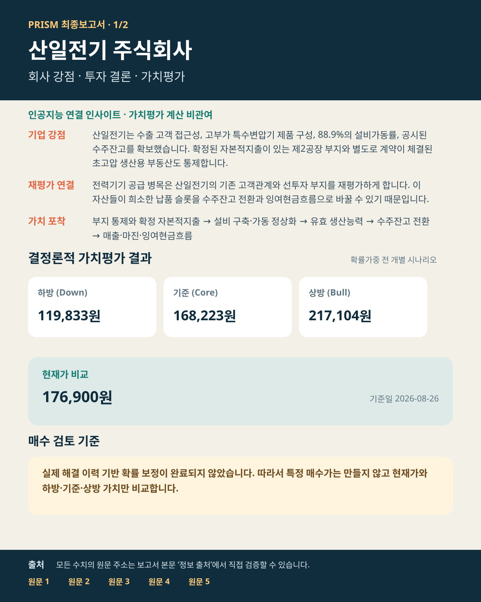
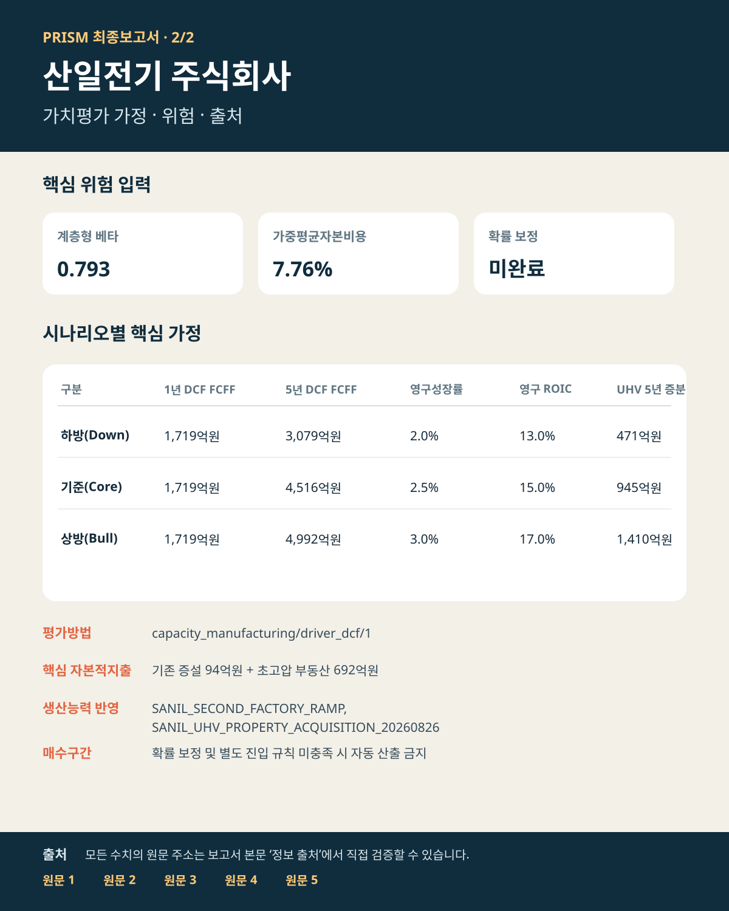

# 산일전기(062040) PRISM 실데이터 통제 실행 보고서

- 데이터 기준일: **2026-08-26**
- 검증 상태: **검증·고정 완료** (`VERIFIED_FROZEN`)
- 투자검토 상태: **출처 검증 기반 예비 분석**
- 현재가(내재가치 고정 후 로드): **176,900원**
- 증권사 참고 목표가(내재가치 고정 후 로드): **280,000원**
- 하방 / 기준 / 상방: **119,833원 / 168,223원 / 217,104원**
- 계층형 베타: **0.793**
- 가중평균자본비용: **7.764%**
- 기준 시나리오 반영 생산능력 프로젝트: **SANIL_SECOND_FACTORY_RAMP, SANIL_UHV_PROPERTY_ACQUISITION_20260826**

## PM 결론

산일전기는 수요 검증 단계를 넘어 생산능력과 가동 정상화가 가치의 핵심 병목이 된 회사입니다. 이번 실행은 기존 제2공장뿐 아니라 2026년 8월 26일 체결된 초고압 변압기 생산용 부동산 양수계약을 별도 기준 시나리오 프로젝트로 분리했습니다. 두 프로젝트의 생산능력·자본적지출·가동 정상화 경로를 시나리오와 현금흐름할인법이 실제 반영한 뒤 베타·가중평균자본비용·감사·내재가치 고정을 통과했습니다.

현재가는 확률가중 기대값이 아니라 개별 하방·기준·상방 시나리오와 비교해야 합니다. 실제 해결 이력으로 구성된 확률 보정 코호트가 아직 충분하지 않아 확률가중 기대값은 의도적으로 산출하지 않았습니다. 이 보고서의 기업 잉여현금흐름 경로는 회사 가이던스가 아니라 2025년 사업보고서와 2026년 2분기 기업설명자료를 기반으로 한 **PRISM 분석가 추정**입니다.

## 증거 신뢰도·분석가 추정 상태

- 회사 실적·수주·생산능력·부지·자본적지출: 회사 공시·기업설명자료 기반, **높은 증거 신뢰도**
- 베타 비교기업 관측: 동일 코스피 기준지수·동일 기간·주간 수익률 최소제곱회귀 기반이며 회귀 표준오차와 시계열 해시를 보존, **중간~높은 증거 신뢰도**
- 일간 최소제곱회귀는 비동시거래·빈도 민감도 진단값으로 별도 보존하며 주간 베타와 임의 평균하지 않습니다.
- 가중평균자본비용의 거시 입력과 국가위험 노출계수: 출처가 명시된 외부 시장자료 및 PRISM 판단값, **중간 신뢰도**
- 하방·기준·상방 기업 잉여현금흐름: 공시 사실에서 파생한 분석가 가정이며 회사 가이던스가 아닙니다.
- 초고압 부동산 계약은 부지 통제와 692.5억원 현금유출을 공식 확정하지만, 정확한 생산능력은 미공시이므로 증분 잉여현금흐름은 보수적 범위 추정입니다.

---

# PRISM 검증·통제 실행 보고서

- 실행 ID: `SANIL-062040-20260826`
- 실행 모드: `live_primary`
- 실행 상태: **검증·고정 완료 (`VERIFIED_FROZEN`)**
- 검증증명 해시: `577be60b139895a75cba5ba454504feac939d9c18d834ea85ebcf23bfffb2e6d`

## 실행 검증
- 점검 결과: **22/22 통과**
- 표준 단계: **33/33개 최종 추적 완료**

## 고정된 식별정보 사슬
- 증거: `b97bc8f5ed1722ae45ec174d1ba36c55b9bcc7f023ac375d27314651194b3be0`
- 가정: `6d58f3ab92c3784a4c25ae932051c20e5c444427220da2ed5b1a0b2ec8e718ed`
- 시나리오: `16bdd1d42c1cef90abae55d0fe1872fd729bdc49b86d873f968bc3ba55717694`
- 가치평가: `f3c586a7786ca8691ae343dd02a70d9d093b8c0853622634a48b7ca8d7c08492`
- 감사: `7526decadfa3282335509009aa9faec346655d84e13192756ab67c111542f1db`
- 내재가치 고정: `a1de2ff479af4f8b748d4e49fd9f87d0b9bebe7a27c89f1fe0c4d944daa38f10`
- 보조 결속정보: Beta `567700b4b5094f7aaa61cc030d0c8758ed146e9a38a3be4f4d56c5999f0a121e` · WACC `2beebb32d08c7f6e354a0771edba24e0f108aea78e9ba175b0b59de16257325b` · 생산능력 평가 `30990a2dd5985f766892ce206687c4aa4368e6a59dfef0da6f0f777939cb4543` · 생산능력 반영 `cc91fcc67ce9685c60520f028185caac90360ed900e1acaf0c0dc3cf60ea11b7` · 생산능력 시나리오 `28e27a5c5fd1659ccd718165d846e0ef53c67022a135fe1ac84e86c9123d7683` · 생산능력 가치평가 `7356323a77f47efb13c2dc00feb918515da43180f9096aaff252ea1402f72b2d` · 생산능력 주가수익비율 `2fde85da7644231967ea95f2d6af39a66cff72e96b70f0d3cb0dfedd3695c9e0` · 생산능력 정합성 `e6fffcfc4c0f4b7a442ac18e72d5eec96e201be11331abd7a6ebed9b793af6fb` · 생산능력 감사 `c57b0531cf5655cd0828cdd3a7288391b72a642a1d838678961d526711999bcd` · 내재가치 고정 전 증권사 자료 `ce7d809ba2f9e2a91a5fbb3604dbb80fbe7af2b2694f3195ce549cdef95991eb` · 증권사 자료 감사 `a7c344017374899fdbefb684ba0facfde4b5ed7a6caaa2ac29f330f6233ab9f6`

## 대형 게이트 완료 요약

### 1. 증거 수집·산업 라우팅 — 통과 (9/9)
- 결과: 증거 수집·산업 라우팅을 완료하고 불변 Evidence Ledger를 고정했습니다
- 잔여위험: 없음 · 다음 단계: `G2_INSIGHT_CHALLENGE`

### 2. 인사이트 도출·반증 검토 — 경고 (5/5)
- 결과: 환경 변화와 기업 강점의 연결 인사이트 및 반증 검토를 완료했습니다
- 잔여위험: ROCKET_INSIGHT_SCAN: 로켓슬라 인사이트 스캐너가 확인 필요 경고를 남겼습니다 · 다음 단계: `G3_ASSUMPTIONS_METHOD_RISK`

### 3. 가정·평가방법·위험 — 통과 (5/5)
- 결과: 가정·평가방법·베타·가중평균자본비용의 적용 여부를 확정했습니다
- 잔여위험: 없음 · 다음 단계: `G4_VALUATION_AUDIT_FREEZE`

### 4. 가치평가·감사·내재가치 고정 — 경고 (7/7)
- 결과: 결정론적 가치평가와 감사를 통과해 내재가치를 고정했습니다
- 잔여위험: PROBABILITY_DISTRIBUTION_ANALYSIS: 실제 해결 이력 기반 확률 보정이 완료되지 않아 확률가중 기대값을 산출하지 않았습니다 · 다음 단계: `G5_POST_FREEZE_PERSISTENCE`

### 5. 고정 후 비교·영구 저장 — 통과 (7/7)
- 결과: 시장·증권사 비교 후 한국어 최종보고서와 요약 이미지 2장을 불변 저장했습니다
- 잔여위험: 없음 · 다음 단계: `FINAL_RESULT_REPORT`

## 최종보고서 편집 계약
- 본문 목표: 3–4쪽
- 감사 부록 목표: 1–2쪽
- 전체 상한: 6쪽
- 이미지: 2장을 본문 3–4쪽 안에 포함합니다.
- 활자: 본문 ≥ 13pt, 주 제목 ≥ 22pt, 절 제목 ≥ 18pt. 조밀한 대형 표는 금지합니다.
- 필수: 모든 주장의 출처를 `정보 출처 — 원문 직접 검증`의 HTTP(S) 원문 링크에 연결합니다.
- 필수 산출물: 한국어 본문과 함께 투자결론·가치평가 요약 1장, 가치평가 가정·위험·출처 요약 1장을 생성합니다.
- 인공지능 관여 내용: 결정론적 결과와 분리된 독립 구역으로 표시하고 1,000자 이하로 제한합니다.

## 압축 감사 부록 — 33단계 추적
- **G1_EVIDENCE_ROUTING:** 1 `COMPANY_RESOLUTION`=통과 · 2 `LOAD_COMPANY_STATE`=통과 · 3 `LOAD_INDUSTRY_KNOWLEDGE_SNAPSHOT`=통과 · 4 `SOURCE_FRESHNESS_PRECHECK`=통과 · 5 `SEGMENT_DECOMPOSITION`=통과 · 6 `INDUSTRY_DNA_ROUTE`=통과 · 7 `MODULE_REQUIREMENT_PLAN`=통과 · 8 `PRIMARY_EVIDENCE_COLLECTION`=통과 · 9 `EVIDENCE_LEDGER`=통과
- **G2_INSIGHT_CHALLENGE:** 10 `ROCKET_INSIGHT_SCAN`=경고 · 11 `UPSTREAM_FUNDING_SCAN`=통과 · 12 `RESEARCHER_A`=통과 · 13 `BLIND_RED_TEAM_B`=통과 · 14 `RESEARCH_LOOP`=해당 없음
- **G3_ASSUMPTIONS_METHOD_RISK:** 15 `EVIDENCE_TO_ASSUMPTION_BRIDGE`=통과 · 16 `SCENARIO_BUILD`=통과 · 17 `VALUATION_METHOD_INTENT`=통과 · 18 `HIERARCHICAL_BETA_ESTIMATION`=통과 · 19 `WACC_VALIDATION`=통과
- **G4_VALUATION_AUDIT_FREEZE:** 20 `DETERMINISTIC_VALUATION`=통과 · 21 `HIERARCHICAL_WARRANTED_PER`=해당 없음 · 22 `DCF_PER_ASSUMPTION_CONSISTENCY_GATE`=통과 · 23 `CROSS_METHOD_DOUBLE_COUNT_AUDIT`=통과 · 24 `PROBABILITY_DISTRIBUTION_ANALYSIS`=경고 · 25 `AUDIT_GATE`=통과 · 26 `INTRINSIC_VALUE_FREEZE`=통과
- **G5_POST_FREEZE_PERSISTENCE:** 27 `STREET_REFERENCE_LOAD`=통과 · 28 `STREET_GAP_ANALYZER`=통과 · 29 `MARKET_PRICE_LOAD`=통과 · 30 `MARKET_COMPARE`=통과 · 31 `THESIS_DELTA`=통과 · 32 `SAVE_STATE`=통과 · 33 `FINAL_REPORT`=통과
- 단계별 정확한 사유와 출력 키는 불변 `control_plane_trace.json` 산출물에 보존됩니다.

## 영구 저장된 리서치 보고서

# 산일전기 주식회사 PRISM 리서치·가치평가 보고서

## 최종 요약 이미지

## 인공지능 인사이트 — 환경 변화 × 기업 강점
- 적용범위: 인공지능은 외부 환경 변화와 기업 강점의 연결 가설·반증 조건만 제시하며 가치평가 계산이나 가정 확정에는 관여하지 않습니다.
- 상태: 적용 (`APPLICABLE`)
- 연결: 전력망 교체, 재생에너지 계통연계, 데이터센터 전력 수요가 늘면서 검증된 변압기 납품 슬롯의 희소성이 커지고 있습니다. → 산일전기는 수출 고객 접근성, 고부가 특수변압기 제품 구성, 88.9%의 설비가동률, 공시된 수주잔고를 확보했습니다. 확정된 자본적지출이 있는 제2공장 부지와 별도로 계약이 체결된 초고압…
- 핵심 추론: 전력기기 공급 병목은 산일전기의 기존 고객관계와 선투자 부지를 재평가하게 합니다. 이 자산들이 희소한 납품 슬롯을 수주잔고 전환과 잉여현금흐름으로 바꿀 수 있기 때문입니다.
- 가치 포착: 부지 통제와 확정 자본적지출 → 설비 구축·가동 정상화 → 유효 생산능력 → 수주잔고 전환 → 매출·마진·잉여현금흐름
- 반증 조건: 회사가 증설을 취소하거나 기존 기준 생산능력에 이미 전부 포함됐다고 확인; 생산능력이 출하로 전환되기 전에 수주잔고 또는 신규수주 감소
- 다음 검증: 다음 분기 공시의 공장 정상화·자본적지출·가동률; 수주에서 매출로의 전환과 고객 집중도
- 근거 ID: E:SANIL:orders, E:SANIL:backlog, E:SANIL:utilization, E:SANIL:expansion_land_control — 원문 링크는 `정보 출처 — 원문 직접 검증` 참조
- 인공지능 판단 신뢰도: 78%
- 전체 형식화 인사이트는 불변 `context_strength_linkages.json`에 보존됩니다.

## 내재가치
- Down 내재가치: 주당 119,832.77 KRW
- Core 내재가치: 주당 168,223.31 KRW
- Bull 내재가치: 주당 217,104.3 KRW
- 확률가중 기대값: 미산출 — 시나리오 확률이 보정 완료 상태가 아니므로 수치 가중을 보류했습니다.

## 확률 보정 상태
- 보정 상태: `UNCALIBRATED` · 수치 가중: 보류
- 계보: 데이터셋 `없음` · 스냅샷 `없음`

## 증권사 목표가 비교
- 반영 리포트: 2건
- 평균 목표가: 280,000 KRW
- Down 대비: -160,167.23 (-57.2%)
- Core 대비: -111,776.69 (-39.9%)
- Bull 대비: -62,895.7 (-22.5%)

## 현재 시장가격 비교
- 현재가: 176,900 KRW (2026-08-26)
- Down 기대수익 간격: -57,067.23 (-32.3%)
- Core 기대수익 간격: -8,676.69 (-4.9%)
- Bull 기대수익 간격: 40,204.3 (+22.7%)

## 정보 출처 — 원문 직접 검증
- **SANIL_UHV_PROPERTY_ACQUISITION_20260826** — 근거 7개: uhv_property_asset_ratio, expansion_baseline_inclusion, expansion_capex_committed, uhv_property_contract_amount, expansion_land_control, expansion_ramp_date 외 1개 (기준일 2026-08-26) [원문 바로 열기](https://dart.fss.or.kr/dsaf001/main.do?rcpNo=20260826000660)
- **베타 입력값** — 베타 입력 출처 [원문 바로 열기](https://finance.naver.com/)
- **현재 시장가격** — 시장가격 기준일 2026-08-26 [원문 바로 열기](https://finance.naver.com/item/main.naver?code=062040)
- **SANIL_UNDERWRITING_20260826** — 근거 54개: model_bull_diluted_shares, model_bull_ev_adjustment, model_bull_expansion_capex, model_bull_fcff_year_1, model_bull_fcff_year_2, model_bull_fcff_year_3 외 48개 (기준일 2026-08-26) [원문 바로 열기](https://github.com/newwonwoo/valuation/blob/main/config/sanil_live_snapshot.yaml)
- **SANIL_RISK_SOURCE_REGISTER_20260825_REGRESSION / 가중평균자본비용 입력값 / 베타 입력값** — 가중평균자본비용 입력 출처; 근거 E:SANIL:beta_selection_L1_BROAD_SECTOR: beta_selection_L1_BROAD_SECTOR (기준일 2026-08-26); 근거 E:SANIL:beta_selection_L2_INDUSTRY: beta_selection_L2_INDUSTRY (기준일 2026-08-26); 근거 E:SANIL:beta_selection_L3_RISK_DRIVER_SUBINDUSTRY: beta_selection_L3_RISK_DRIVER_SUBINDUSTRY (기준일 2026-08-26); 근거 E:SANIL:beta_selection_L4_ECONOMIC_TWINS: beta_selection_L4_ECONOMIC_TWINS (기준일 2026-08-26); 베타 입력 출처 [원문 바로 열기](https://github.com/newwonwoo/valuation/blob/main/docs/SANIL_RISK_SOURCE_REGISTER.md)
- **SANIL_2025_ANNUAL_REPORT / 가중평균자본비용 입력값 / 기업 식별정보 / 베타 입력값** — 근거 26개: asp, backlog_conversion, book_to_bill, cancellation_rate, cancellation_terms, cash 외 20개 (기준일 2024-01-01, 2025-12-31); 가중평균자본비용 입력 출처; 기업 식별 확인; 베타 입력 출처 [원문 바로 열기](https://kind.krx.co.kr/external/2026/03/18/000706/20260318003527/11011.htm)
- **증권사 자료 탐색 / 증권사: Mirae Asset Securities** — 내재가치 고정 전 사실 탐색·교차검증 전용; 목표가 발표일 2026-08-07 [원문 바로 열기](https://securities.miraeasset.com/bbs/board/message/view.do?categoryId=1800&messageId=2341906)
- **SANIL_2026_Q2_IR** — 근거 8개: backlog, expansion_baseline_inclusion, expansion_cancelled, expansion_ramp_date, net_income_h1_2026, no_active_capacity_expansion 외 2개 (기준일 2026-06-30) [원문 바로 열기](https://www.sanil.co.kr/kr/sub/reference/ir.php?bid=1&idx=1002&mode=view&page=1&s_cate=&s_keyword=&s_type=)
- **증권사: Shinhan Securities** — 목표가 발표일 2026-08-11 [원문 바로 열기](https://www.yna.co.kr/amp/view/AKR20260811028700008)
- 전체 근거 ID·지표·기준일 매핑은 동일 실행의 불변 Evidence Ledger에 보존됩니다.

## 모듈 영향·조사 효율성
- 측정 완료: DETERMINISTIC_VALUATION · 미측정(NOT_MEASURABLE): ASSUMPTION_COMPILER, BLIND_RED_TEAM_B, BROKER_RESEARCH, EVIDENCE_LEDGER, EVIDENCE_TO_ASSUMPTION_BRIDGE, HIERARCHICAL_BETA_ENGINE, INDUSTRY_DNA_ROUTER, INDUSTRY_KNOWLEDGE 외 10개
- 비적용: 없음 · 실패: 없음
- 조사비용: 출처 조회 0회, 문서 검토 0건, 대규모 언어모델 호출 0회, 소요시간 0.0초
- 하향 검토 후보: 없음 · 미측정 모듈은 0 영향이 아니라 NOT_MEASURABLE로 유지합니다.

## 감사·준수 범위
- 감사: 통과 (29개 점검)
- 원칙 준수: 27/27개 최종 허용 상태

## 투자논지 변화
- 강화·신규: 증권사 자료의 사실 단서를 1차 출처 검증으로 전환하고, 전망치와 목표가는 내재가치 평가 전에 격리했습니다. 산일전기는 계약형 수주잔고와 생산능력 제조업으로 분류됩니다. 공시된 부지 통제형 제2공장 프로젝트는 생산능력 게이트에서 분류하고, 증분으로 확인되면 기준 시나리오의 생산능력·자본적지출·가동 정상화 경로에 하나로 반영해야 합니다.
- 약화·폐기: 없음

## 실행 무결성
- 평가범위: `FULL_INTRINSIC` · 내재가치 고정: `a1de2ff479af4f8b748d4e49fd9f87d0b9bebe7a27c89f1fe0c4d944daa38f10`
- 해시 사슬: 원장 `b97bc8f5ed1722ae45ec174d1ba36c55b9bcc7f023ac375d27314651194b3be0` · 가정 `6d58f3ab92c3784a4c25ae932051c20e5c444427220da2ed5b1a0b2ec8e718ed` · 가치평가 `f3c586a7786ca8691ae343dd02a70d9d093b8c0853622634a48b7ca8d7c08492` · 감사 `7526decadfa3282335509009aa9faec346655d84e13192756ab67c111542f1db`
- 확률 보정: 데이터셋 `미적용` · 스냅샷 `미적용`
