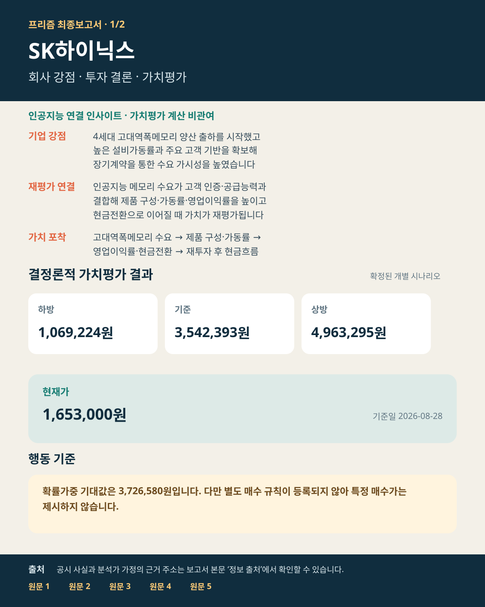
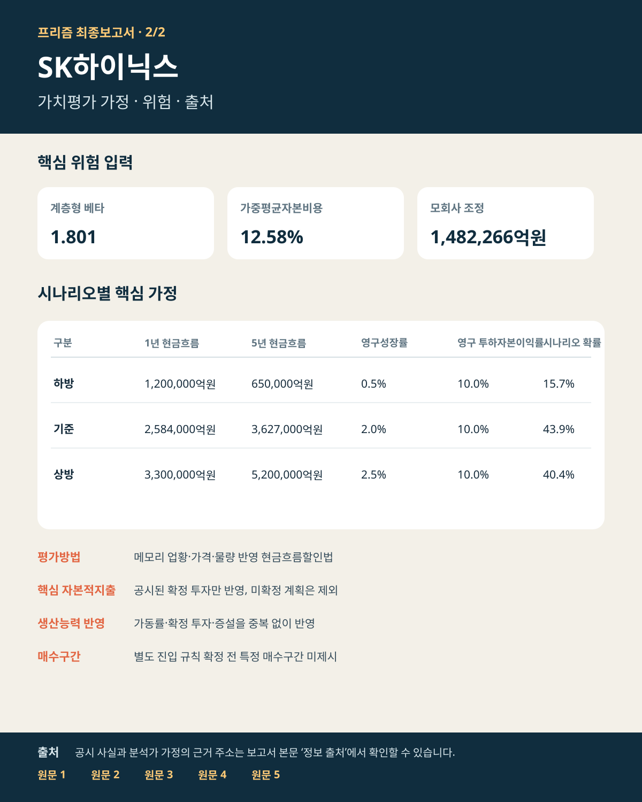

# SK하이닉스(000660) 투자보고서

## 투자 요약

| 핵심 판단 항목 | 내용 |
| --- | --- |
| **투자판단** | 판단 유보 — 확률가중 값은 참고할 수 있으나 별도 진입 규칙이 없어 구체적인 매수가는 제시하지 않습니다. |
| **현재가** | 1,653,000원 (2026-08-28) |
| **기준 내재가치** | 주당 3,542,393원 |
| **가치평가 범위** | 주당 1,069,224~4,963,295원 |
| **시나리오 가능성** | 하방 15.7% · 기준 43.9% · 상방 40.4% (보정 완료·수치 가중 적용) |
| **증권사 참고값** | 3,164,332원 (39건, 가치평가 확정 후 참고) |

### 한 문장 결론

4세대 고대역폭메모리 양산 출하, 높은 설비가동률, 주요 고객과의 장기계약이 인공지능 메모리 수요를 현금흐름으로 전환하는 핵심 축입니다. 기준 내재가치는 3,542,393원, 확률가중 기대값은 3,726,580원이며, 현재가에서는 메모리 업황 정상화·대규모 설비투자·현금전환 지속 여부를 함께 확인해야 합니다.

### 투자포인트

- **사업모델과 강점:** 고대역폭메모리·디램·기업용 저장장치를 인공지능·서버 고객에 공급하며, 4세대 고대역폭메모리 양산 출하와 주요 고객 접근성이 핵심 경쟁력입니다.
- **가치동인:** 매출 성장률·영업이익률·현금전환율·설비투자 비중의 연속 경로가 현금흐름과 내재가치를 좌우합니다.
- **가치평가:** 하방 1,069,224원 · 기준 3,542,393원 · 상방 4,963,295원, 확률가중 기대값 3,726,580원입니다.
- **핵심 위험:** 메모리 가격 정상화, 고대역폭메모리 수율·고객 인증, 대규모 설비투자의 현금흐름 부담, 높은 이익률의 정상화 속도를 함께 봐야 합니다.
- **행동 기준:** 별도 진입 규칙이 확정되지 않아 특정 매수가는 제시하지 않습니다.

### 판단 변경 조건

- **상방 확인:** 4세대 고대역폭메모리 출하 확대가 매출·영업이익률·영업현금흐름 개선으로 이어지고, 증설 이후에도 현금전환율이 유지될 때.
- **하방 훼손:** 고대역폭메모리 수율·고객 인증 차질, 메모리 가격 급락, 재고 증가, 설비투자 확대가 현금흐름을 앞지를 때.
- **행동 가능 조건:** 확률 보정 결과와 별도로 승인된 진입 규칙이 마련될 때.

## 가치평가
- **하방 시나리오:** 내재가치 주당 1,069,224원
- **기준 시나리오:** 내재가치 주당 3,542,393원
- **상방 시나리오:** 내재가치 주당 4,963,295원
- **확률가중 기대값:** 주당 3,726,580원

## 핵심 가정과 위험
- **평가방법:** 등록된 결정론적 가치평가법
- **위험 입력:** 계층형 베타 1.801 · 가중평균자본비용 12.581%
- **확률 보정:** 보정 완료 · 수치 가중 적용
- **하방 가정:** 공통 지배주주 귀속률 100.0000% · EV→지분 조정 879,579억원 · 모회사 조정 1,482,266억원 · 주당 분모 730.492백만주 · 1년차 현금흐름할인법 적용 기업잉여현금흐름 1,200,000억원 · 5년차 현금흐름할인법 적용 기업잉여현금흐름 650,000억원 · 영구성장률 0.5% · 영구 투하자본이익률 10.0% (성장률 검산·재투자율 5.0%)
- **기준 가정:** 공통 지배주주 귀속률 100.0000% · EV→지분 조정 879,579억원 · 모회사 조정 1,482,266억원 · 주당 분모 730.492백만주 · 1년차 현금흐름할인법 적용 기업잉여현금흐름 2,584,000억원 · 5년차 현금흐름할인법 적용 기업잉여현금흐름 3,627,000억원 · 영구성장률 2.0% · 영구 투하자본이익률 10.0% (성장률 검산·재투자율 20.0%)
- **상방 가정:** 공통 지배주주 귀속률 100.0000% · EV→지분 조정 879,579억원 · 모회사 조정 1,482,266억원 · 주당 분모 730.492백만주 · 1년차 현금흐름할인법 적용 기업잉여현금흐름 3,300,000억원 · 5년차 현금흐름할인법 적용 기업잉여현금흐름 5,200,000억원 · 영구성장률 2.5% · 영구 투하자본이익률 10.0% (성장률 검산·재투자율 25.0%)

## 증권사·시장 비교
- **증권사 평균 목표가:** 3,164,332원 (39건)
- 프리즘 기준 내재가치는 증권사 평균 목표가보다 11.9% 높습니다.

### 증권사별 목표가와 프리즘의 차이

| 증권사 | 목표가 | 적용 기준 | 프리즘 기준가 대비 |
| --- | ---: | --- | ---: |
| 에스앤피 글로벌 컨센서스(스톡애널리시스 집계) | 3,164,332원 | 2026년 기준 · 가치평가 확정 후 참고용 컨센서스 | -10.7% |

### 왜 차이가 나는가

- **평가방법:** 프리즘은 등록된 결정론적 가치평가법을 사용하며, 증권사별 평가방법은 표와 같습니다. 현금흐름·이익·할인율·적용 배수의 기준이 다르면 목표가도 달라집니다.
- **기준시점:** 에스앤피 글로벌 컨센서스(스톡애널리시스 집계): 2026년 가치평가 확정 후 참고용 컨센서스. 평가 기준과 기준연도가 다르므로 목표가를 프리즘 기준가와 동일한 숫자로 볼 수 없습니다.
- **분해 한계:** 현재 확보된 증권사 자료에는 목표가·평가방법·기준연도는 있으나 모든 세부 이익 추정치가 구조화되어 있지 않아, 차이를 이익 전망과 적용 배수로 완전히 분해할 수는 없습니다.
- **해석:** 증권사 목표가는 각 보고서의 현금흐름·이익·할인율·배수 가정을 반영한 참고값입니다. 프리즘 결과와의 차이 자체가 계산 오류를 뜻하지는 않습니다.
- **현재가:** 1,653,000원 (2026-08-28)
- **하방 대비 하락위험:** 583,776원 (35.3%)
- **기준 대비 상승여력:** 1,889,393원 (114.3%)
- **상방 대비 상승여력:** 3,310,295원 (200.3%)

## 인공지능 인사이트 — 환경 변화 × 기업 강점

- **환경 변화:** 인공지능 서버 확대로 고대역폭메모리 수요와 고성능 메모리 공급 능력의 희소성이 커지고 있습니다.
- **기업 강점:** SK하이닉스는 4세대 고대역폭메모리 양산 출하를 시작했고, 높은 설비가동률과 주요 고객과의 장기계약 기반을 보유하고 있습니다.
- **연결 논리:** 고객 인증과 공급 능력의 우위가 제품 구성·가격·가동률을 거쳐 영업이익과 현금전환으로 이어질 때 기존 경쟁력이 실제 기업가치로 재평가됩니다.
- **가치 포착 경로:** 고대역폭메모리 수요 → 제품 구성·가동률 → 영업이익률 → 현금전환 → 재투자 후 기업잉여현금흐름.
- **반증 조건:** 수율·인증 차질, 예상보다 빠른 메모리 가격 정상화, 재고 증가, 설비투자 부담이 현금흐름 개선보다 빨라지는 경우입니다.
- **다음 확인:** 고대역폭메모리 출하, 재고와 판매가격, 설비투자 집행, 영업현금흐름의 동반 개선 여부입니다.

## 최종 요약 이미지

## 정보 출처 — 원문 바로 확인

- **SK하이닉스 2026년 2분기 실적 발표:** 4세대 고대역폭메모리 양산 출하, 주요 고객 장기계약, 실적과 설비가동 관련 회사 발표 — [원문 바로 열기](https://news.skhynix.com/en/q2-2026-business-results/)
- **미국 증권거래위원회 공시:** 용인 반도체 클러스터 생산능력 투자 관련 이사회 승인 — [원문 바로 열기](https://www.sec.gov/Archives/edgar/data/2120882/000119312526311230/d121520d6k.htm)
- **미국 증권거래위원회 공시:** 재무상태·현금흐름·생산 관련 공시 — [원문 바로 열기](https://www.sec.gov/Archives/edgar/data/2120882/000119312526354777/d147827d6k.htm)
- **미국 증권거래위원회 공시:** 자사주 취득·주식수 관련 공시 — [원문 바로 열기](https://www.sec.gov/Archives/edgar/data/2120882/000119312526356141/d436722d6k.htm)
- **할인율 입력 근거:** 대한민국 정부 금리 자료 — [원문 바로 열기](https://english.mofe.go.kr/?boardCd=P0002&seq=2052)
- **시장위험 입력 근거:** 뉴욕대학교 다모다란 국가위험프리미엄 자료 — [원문 바로 열기](https://pages.stern.nyu.edu/~adamodar/New_Home_Page/datafile/ctrypremtable.htm)
- **현재 시장가격:** 인베스팅닷컴 2026년 8월 28일 종가 자료 — [원문 바로 열기](https://kr.investing.com/equities/sk-hynix-inc-historical-data)
- **증권사 컨센서스:** 스톡애널리시스 집계 자료 — [원문 바로 열기](https://stockanalysis.com/quote/krx/000660/forecast/)
- **베타 비교군:** 브로드컴 · 인텔 · 마벨 · 마이크론 통계 자료 — [브로드컴](https://stockanalysis.com/stocks/avgo/statistics/) · [인텔](https://stockanalysis.com/stocks/intc/statistics/) · [마벨](https://stockanalysis.com/stocks/mrvl/statistics/) · [마이크론](https://stockanalysis.com/stocks/mu/statistics/)

## 분석 범위와 유의사항
- **평가범위:** 전체 기업 내재가치
- **계산 확인:** 차단 점검 21/21개 통과 · 비차단 확인 필요 0건 · 분석 원칙 28/28개 충족
- 회사 공시 사실, 분석가 가정, 인공지능 연결 인사이트를 구분해 표시했습니다.
- 증권사 목표가와 현재가는 가치평가를 마친 뒤 참고했으며, 앞서 계산한 가정을 바꾸는 데 사용하지 않았습니다.

---

작성 근거와 계산 과정 보기

## 분석 절차 요약

- 자동 오류 점검: 23/23개 통과
- 분석 절차 기록: 33/33개 완료

## 주요 작업 단계

### 1. 증거 수집·산업 라우팅 — 통과 (9/9)
- 결과: 증거 수집·산업 라우팅을 완료하고 근거 기록을 확정했습니다
- 잔여위험: 없음 · 다음 단계: 인사이트 도출·반증 검토

### 2. 인사이트 도출·반증 검토 — 경고 (5/5)
- 결과: 환경 변화와 기업 강점의 연결 인사이트 및 반증 검토를 완료했습니다
- 잔여위험: 환경 변화 인사이트 탐색: 로켓슬라 인사이트 스캐너가 확인 필요 경고를 남겼습니다 · 다음 단계: 가정·평가방법·위험

### 3. 가정·평가방법·위험 — 통과 (5/5)
- 결과: 가정·평가방법·베타·가중평균자본비용의 적용 여부를 확정했습니다
- 잔여위험: 없음 · 다음 단계: 가치평가·오류 점검·결과 확정

### 4. 가치평가·오류 점검·결과 확정 — 통과 (7/7)
- 결과: 가치평가와 오류 점검을 마치고 결과를 확정했습니다
- 잔여위험: 없음 · 다음 단계: 증권사·시장 비교·보고서 저장

### 5. 증권사·시장 비교·보고서 저장 — 경고 (7/7)
- 결과: 시장·증권사 비교 후 한국어 최종보고서와 요약 이미지 2장을 저장했습니다
- 잔여위험: 시장 함의 기대치 역산: 동결 가치가 단일 현금흐름할인법 시나리오로 재구성되지 않아 영구성장률·현금흐름 함의값을 산출하지 않았습니다 · 다음 단계: 최종 결과보고서

## 세부 계산 기록

- 33개 분석 단계는 표준 순서로 모두 종료되었습니다.
- 세부 계산 해시, 단계 기술 식별자, 원장 식별자는 동봉된 검증 파일에 보관합니다.
- 사용자용 보고서에는 투자 판단에 필요한 한국어 결과와 원문 출처만 표시합니다.

---
보고서 ID `SKHYNIX_000660-20260828-TP3542393-C506E11E6740` · 기준 목표가 3,542,393원
