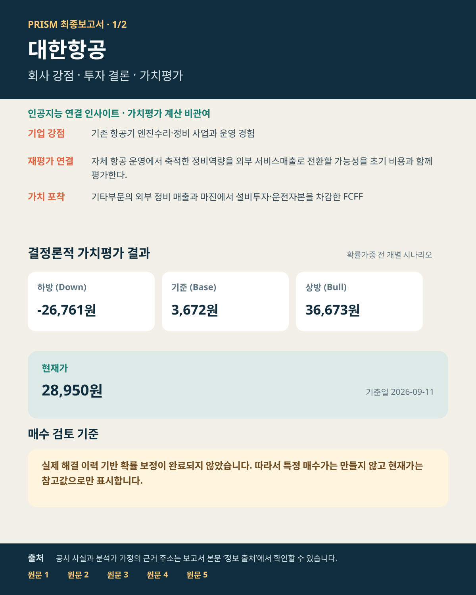
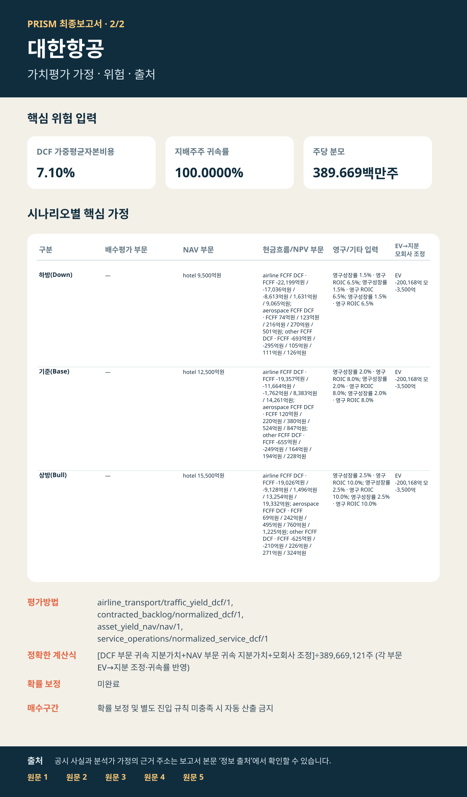

# 대한항공 투자보고서

## 투자 요약

| 핵심 판단 항목 | 내용 |
| --- | --- |
| **투자판단** | 비중축소 — 현재가가 주주 유한책임을 반영한 확률가중 목표가보다 높습니다. |
| **현재가** | 28,950원 (2026-09-11) |
| **기준 내재가치** | 주당 3,672원 |
| **가치평가 범위** | 주당 -26,761~36,673원 |
| **확률가중 목표가** | 20,813원 |
| **구체 매수가** | 15,600원 이하 (목표가 대비 25% 안전마진) |
| **시나리오 가능성** | 하방 35% · 기준 9% · 상방 56% (보정 완료) |
| **증권사 참고값** | 37,000원 (2건, 가치평가 확정 후 참고) |

### 한 문장 결론

연결 실제 손익을 출발점으로 항공 통합·항공우주 수주·엔진 외부서비스·호텔 자산을 구분합니다 · 수익 개선은 가설이며 대규모 투자와 초기 비용이 먼저 발생하는 현금흐름을 함께 반영합니다 · 이미 연결된 아시아나 매출이나 리스원금을 중복 반영하지 않습니다.

### 투자포인트

- **가치동인:** 연결 실제 손익을 출발점으로 항공 통합·항공우주 수주·엔진 외부서비스·호텔 자산을 구분합니다 · 수익 개선은 가설이며 대규모 투자와 초기 비용이 먼저 발생하는 현금흐름을 함께 반영합니다 · 이미 연결된 아시아나 매출이나 리스원금을 중복 반영하지 않습니다.
- **현재가 대비:** 기준 내재가치는 현재가보다 87.3% 낮습니다. 상방 시나리오의 실현 조건 확인이 필요합니다.
- **매수 규칙:** 주주 유한책임을 반영한 확률가중 목표가 20,813원에 25% 안전마진을 적용한 15,600원 이하에서만 신규 매수를 검토합니다.

### 판단 변경 조건

- **상방 확인:** 기준·상방 가정의 핵심 동인이 공시 실적과 현금흐름으로 전환되면 판단 근거가 강화됩니다.
- **하방 훼손:** 핵심 가정이 미달하거나 하방 시나리오의 조건이 현실화되면 가치평가 신뢰도와 행동 여력이 낮아집니다.
- **행동 가능 조건:** 주주 유한책임을 반영한 확률가중 목표가 20,813원에 25% 안전마진을 적용한 15,600원 이하에서만 신규 매수를 검토합니다.

## 가치평가
- **하방 시나리오:** 내재가치 주당 -26,761원
- **기준 시나리오:** 내재가치 주당 3,672원
- **상방 시나리오:** 내재가치 주당 36,673원
- **음수 시나리오 해석:** 위 음수 값은 사업가치에서 부채 등을 차감한 주당 자본 부족액입니다. 주식의 음수 거래가격을 뜻하지 않으며, 시장·증권사 가격 비교에는 유한책임에 따른 0원 하한을 적용합니다. 동결된 원래 계산값은 감사 기록에 보존합니다.
- **유한책임 반영 전 확률가중 잔여가치:** 주당 11,516원
- **주주 유한책임 반영 확률가중 목표가:** 주당 20,813원
- **구체 매수가:** 주당 15,600원 이하 (목표가 대비 25% 안전마진)

## 핵심 가정과 위험
- **평가방법:** 등록된 결정론적 가치평가법, 유형자산 순자산가치법
- **위험 입력:** 계층형 베타 1.032 · 가중평균자본비용 7.104%
- **확률 보정:** 보정 완료 · 수치 가중 적용
- **하방 가정:** hotel 유형자산 NAV 9,500억원 · 공통 지배주주 귀속률 100.0000% · EV→지분 조정 -200,168억원 · 모회사 조정 -3,500억원 · 주당 분모 389.669백만주 · 산식 [DCF 부문 귀속 지분가치+NAV 부문 귀속 지분가치+모회사 조정]÷389,669,121주 (각 부문 EV→지분 조정·귀속률 반영) · airline FCFF DCF · FCFF -22,199억원 / -17,036억원 / -8,613억원 / 1,631억원 / 9,065억원 · 영구성장률 1.5% · 영구 ROIC 6.5% · aerospace FCFF DCF · FCFF 74억원 / 123억원 / 216억원 / 270억원 / 501억원 · 영구성장률 1.5% · 영구 ROIC 6.5% · other FCFF DCF · FCFF -693억원 / -295억원 / 105억원 / 111억원 / 126억원 · 영구성장률 1.5% · 영구 ROIC 6.5%
- **기준 가정:** hotel 유형자산 NAV 12,500억원 · 공통 지배주주 귀속률 100.0000% · EV→지분 조정 -200,168억원 · 모회사 조정 -3,500억원 · 주당 분모 389.669백만주 · 산식 [DCF 부문 귀속 지분가치+NAV 부문 귀속 지분가치+모회사 조정]÷389,669,121주 (각 부문 EV→지분 조정·귀속률 반영) · airline FCFF DCF · FCFF -19,357억원 / -11,664억원 / -1,762억원 / 8,383억원 / 14,261억원 · 영구성장률 2.0% · 영구 ROIC 8.0% · aerospace FCFF DCF · FCFF 120억원 / 220억원 / 380억원 / 524억원 / 847억원 · 영구성장률 2.0% · 영구 ROIC 8.0% · other FCFF DCF · FCFF -655억원 / -249억원 / 164억원 / 194억원 / 228억원 · 영구성장률 2.0% · 영구 ROIC 8.0%
- **상방 가정:** hotel 유형자산 NAV 15,500억원 · 공통 지배주주 귀속률 100.0000% · EV→지분 조정 -200,168억원 · 모회사 조정 -3,500억원 · 주당 분모 389.669백만주 · 산식 [DCF 부문 귀속 지분가치+NAV 부문 귀속 지분가치+모회사 조정]÷389,669,121주 (각 부문 EV→지분 조정·귀속률 반영) · airline FCFF DCF · FCFF -19,026억원 / -9,128억원 / 1,496억원 / 13,254억원 / 19,332억원 · 영구성장률 2.5% · 영구 ROIC 10.0% · aerospace FCFF DCF · FCFF 69억원 / 242억원 / 495억원 / 760억원 / 1,225억원 · 영구성장률 2.5% · 영구 ROIC 10.0% · other FCFF DCF · FCFF -625억원 / -210억원 / 226억원 / 271억원 / 324억원 · 영구성장률 2.5% · 영구 ROIC 10.0%

## 증권사·시장 비교
- **증권사 평균 목표가:** 37,000원 (2건)
- PRISM 기준 내재가치는 증권사 평균 목표가보다 90.1% 낮습니다.

### 증권사별 목표가와 PRISM의 차이

| 증권사 | 목표가 | 적용 기준 | PRISM 기준가 대비 |
| --- | ---: | --- | ---: |
| 하나증권 | 41,000원 | NOT_DISCLOSED년 기준 · NOT_DISCLOSED | +1016.6% |
| LS증권 | 33,000원 | NOT_DISCLOSED년 기준 · NOT_DISCLOSED | +798.7% |

### 왜 차이가 나는가

- **평가방법:** PRISM은 등록된 결정론적 가치평가법, 등록된 결정론적 가치평가법, 유형자산 순자산가치법, 등록된 결정론적 가치평가법을 사용하며, 증권사별 평가방법은 표와 같습니다. 현금흐름·이익·할인율·적용 배수의 기준이 다르면 목표가도 달라집니다.
- **기준시점:** 하나증권: NOT_DISCLOSED년 NOT_DISCLOSED · LS증권: NOT_DISCLOSED년 NOT_DISCLOSED. 평가 기준과 기준연도가 다르므로 목표가를 PRISM 기준가와 동일한 숫자로 볼 수 없습니다.
- **증권사 간 차이:** 하나증권 목표가는 LS증권보다 8,000원 (24.2%) 높습니다. 두 보고서의 기준연도와 평가방법이 달라 목표가 차이를 단순 평균으로 해석하면 안 됩니다.
- **해석:** 증권사 목표가를 지지하려면 PRISM보다 낙관적인 미래 이익·현금흐름이 실현되거나 목표 배수가 유지되어야 합니다. 차이 자체가 계산 오류를 뜻하지는 않습니다.
- **현재가:** 28,950원 (2026-09-11)
- **하방 대비 하락위험:** 28,950원 (100.0%)
- **기준 대비 하락위험:** 25,278원 (87.3%)
- **상방 대비 상승여력:** 7,723원 (26.7%)

## 인공지능 인사이트 — 환경 변화 × 기업 강점
- 적용범위: 인공지능은 외부 환경 변화와 기업 강점의 연결 가설·반증 조건만 제시하며 가치평가 계산이나 가정 확정에는 관여하지 않습니다.
- 상태: 적용
- 연결: 항공기 운항과 장기 기단 투자에 따른 정비 수요 → 기존 항공기 엔진수리·정비 사업과 운영 경험
- 핵심 추론: 자체 항공 운영에서 축적한 정비역량을 외부 서비스매출로 전환할 가능성을 초기 비용과 함께 평가한다.
- 가치 포착: 기타부문의 외부 정비 매출과 마진에서 설비투자·운전자본을 차감한 FCFF
- 반증 조건: 외부 매출 없이 내부거래만 증가
- 다음 확인: 기타부문 외부매출과 유지투자; 정비 고객·제품 구성
- 핵심 근거: activity_mix, fleet_capex, other_fcff_year_1, other_fcff_year_5 — 원문 링크는 `정보 출처 — 원문 바로 확인` 참조
- 인공지능 판단 신뢰도: 50%
- 세부 인사이트는 별도 분석 기록에 보관됩니다.

## 최종 요약 이미지

## 정보 출처 — 원문 바로 확인
- **operator declared underwriting** — 근거 104개: activity_mix, aerospace_ev_adjustment, aerospace_fcff_year_1, aerospace_fcff_year_2, aerospace_fcff_year_3, aerospace_fcff_year_4 외 98개 유형 (기준일 2026-09-13) [원문 바로 열기](https://dart.fss.or.kr/dsaf001/main.do?rcpNo=20260814002803)

이 원문에 연결된 근거 104개 보기

- `UW:KR:DART:00113526:activity_mix` · `UW:KR:DART:00113526:aerospace_ev_adjustment` · `UW:KR:DART:00113526:aerospace_fcff_year_1` · `UW:KR:DART:00113526:aerospace_fcff_year_2` · `UW:KR:DART:00113526:aerospace_fcff_year_3` · `UW:KR:DART:00113526:aerospace_fcff_year_4` · `UW:KR:DART:00113526:aerospace_fcff_year_5` · `UW:KR:DART:00113526:aerospace_ownership` · `UW:KR:DART:00113526:aerospace_terminal_growth` · `UW:KR:DART:00113526:aerospace_terminal_roic` · `UW:KR:DART:00113526:affo` · `UW:KR:DART:00113526:airline_ev_adjustment` · `UW:KR:DART:00113526:airline_fcff_year_1` · `UW:KR:DART:00113526:airline_fcff_year_2` · `UW:KR:DART:00113526:airline_fcff_year_3` · `UW:KR:DART:00113526:airline_fcff_year_4` · `UW:KR:DART:00113526:airline_fcff_year_5` · `UW:KR:DART:00113526:airline_ownership` · `UW:KR:DART:00113526:airline_terminal_growth` · `UW:KR:DART:00113526:airline_terminal_roic` · `UW:KR:DART:00113526:asset_value` · `UW:KR:DART:00113526:backlog_conversion` · `UW:KR:DART:00113526:book_to_bill` · `UW:KR:DART:00113526:bull_aerospace_fcff_year_1` · `UW:KR:DART:00113526:bull_aerospace_fcff_year_2` · `UW:KR:DART:00113526:bull_aerospace_fcff_year_3` · `UW:KR:DART:00113526:bull_aerospace_fcff_year_4` · `UW:KR:DART:00113526:bull_aerospace_fcff_year_5` · `UW:KR:DART:00113526:bull_aerospace_terminal_growth` · `UW:KR:DART:00113526:bull_aerospace_terminal_roic` · `UW:KR:DART:00113526:bull_airline_fcff_year_1` · `UW:KR:DART:00113526:bull_airline_fcff_year_2` · `UW:KR:DART:00113526:bull_airline_fcff_year_3` · `UW:KR:DART:00113526:bull_airline_fcff_year_4` · `UW:KR:DART:00113526:bull_airline_fcff_year_5` · `UW:KR:DART:00113526:bull_airline_terminal_growth` · `UW:KR:DART:00113526:bull_airline_terminal_roic` · `UW:KR:DART:00113526:bull_hotel_gross_asset_value` · `UW:KR:DART:00113526:bull_other_fcff_year_1` · `UW:KR:DART:00113526:bull_other_fcff_year_2` · `UW:KR:DART:00113526:bull_other_fcff_year_3` · `UW:KR:DART:00113526:bull_other_fcff_year_4` · `UW:KR:DART:00113526:bull_other_fcff_year_5` · `UW:KR:DART:00113526:bull_other_terminal_growth` · `UW:KR:DART:00113526:bull_other_terminal_roic` · `UW:KR:DART:00113526:cancellation_rate` · `UW:KR:DART:00113526:cancellation_terms` · `UW:KR:DART:00113526:cap_rate` · `UW:KR:DART:00113526:contract_liabilities` · `UW:KR:DART:00113526:customer_concentration` · `UW:KR:DART:00113526:debt` · `UW:KR:DART:00113526:debt_maturities` · `UW:KR:DART:00113526:depreciation_amortization` · `UW:KR:DART:00113526:diluted_shares` · `UW:KR:DART:00113526:down_aerospace_fcff_year_1` · `UW:KR:DART:00113526:down_aerospace_fcff_year_2` · `UW:KR:DART:00113526:down_aerospace_fcff_year_3` · `UW:KR:DART:00113526:down_aerospace_fcff_year_4` · `UW:KR:DART:00113526:down_aerospace_fcff_year_5` · `UW:KR:DART:00113526:down_aerospace_terminal_growth` · `UW:KR:DART:00113526:down_aerospace_terminal_roic` · `UW:KR:DART:00113526:down_airline_fcff_year_1` · `UW:KR:DART:00113526:down_airline_fcff_year_2` · `UW:KR:DART:00113526:down_airline_fcff_year_3` · `UW:KR:DART:00113526:down_airline_fcff_year_4` · `UW:KR:DART:00113526:down_airline_fcff_year_5` · `UW:KR:DART:00113526:down_airline_terminal_growth` · `UW:KR:DART:00113526:down_airline_terminal_roic` · `UW:KR:DART:00113526:down_hotel_gross_asset_value` · `UW:KR:DART:00113526:down_other_fcff_year_1` · `UW:KR:DART:00113526:down_other_fcff_year_2` · `UW:KR:DART:00113526:down_other_fcff_year_3` · `UW:KR:DART:00113526:down_other_fcff_year_4` · `UW:KR:DART:00113526:down_other_fcff_year_5` · `UW:KR:DART:00113526:down_other_terminal_growth` · `UW:KR:DART:00113526:down_other_terminal_roic` · `UW:KR:DART:00113526:ffo` · `UW:KR:DART:00113526:fleet_capex` · `UW:KR:DART:00113526:hotel_gross_asset_value` · `UW:KR:DART:00113526:hotel_liabilities` · `UW:KR:DART:00113526:hotel_ownership` · `UW:KR:DART:00113526:lead_time` · `UW:KR:DART:00113526:lease_liabilities` · `UW:KR:DART:00113526:maintenance_capex` · `UW:KR:DART:00113526:maturities` · `UW:KR:DART:00113526:noi` · `UW:KR:DART:00113526:noi_or_ffo` · `UW:KR:DART:00113526:occupancy` · `UW:KR:DART:00113526:operating_income` · `UW:KR:DART:00113526:orders` · `UW:KR:DART:00113526:other_ev_adjustment` · `UW:KR:DART:00113526:other_fcff_year_1` · `UW:KR:DART:00113526:other_fcff_year_2` · `UW:KR:DART:00113526:other_fcff_year_3` · `UW:KR:DART:00113526:other_fcff_year_4` · `UW:KR:DART:00113526:other_fcff_year_5` · `UW:KR:DART:00113526:other_ownership` · `UW:KR:DART:00113526:other_terminal_growth` · `UW:KR:DART:00113526:other_terminal_roic` · `UW:KR:DART:00113526:parent_noncontrolling_interest_adjustment` · `UW:KR:DART:00113526:rent` · `UW:KR:DART:00113526:revenue_recognition` · `UW:KR:DART:00113526:service_revenue` · `UW:KR:DART:00113526:working_capital`

- **operator declared risk pack / 가중평균자본비용 입력값** — 가중평균자본비용 입력 출처; 근거 RISK:KR:DART:00113526:beta_selection_l1_broad_sector · 베타 비교군 선정 근거 (기준일 2026-09-13); 근거 RISK:KR:DART:00113526:beta_selection_l2_industry · 베타 비교군 선정 근거 (기준일 2026-09-13); 근거 RISK:KR:DART:00113526:beta_selection_l3_risk_driver_subindustry · 베타 비교군 선정 근거 (기준일 2026-09-13); 근거 RISK:KR:DART:00113526:beta_selection_l4_economic_twins · 베타 비교군 선정 근거 (기준일 2026-09-13) [원문 바로 열기](https://dart.fss.or.kr/dsaf001/main.do?rcpNo=20260910000442)
- **operator declared underwriting** — 근거 UW:KR:DART:00113526:diluted_shares · 희석주식수 (기준일 2026-09-13) [원문 바로 열기](https://dart.fss.or.kr/report/viewer.do?rcpNo=20260724000006&dcmNo=11493004&eleId=1&offset=620&length=3475&dtd=dart4.xsd)
- **operator declared underwriting** — 근거 UW:KR:DART:00113526:backlog · 수주잔고 (기준일 2026-09-13) [원문 바로 열기](https://dart.fss.or.kr/report/viewer.do?rcpNo=20260814002803&dcmNo=11534684&eleId=13&offset=297309&length=54959&dtd=dart4.xsd)
- **DART public financial statement HTML** — 근거 DART_HTML_0820b8f4fdde361a7a23 · total_equity (기준일 2026-06-30); 근거 DART_HTML_4825d112ccbb87103b60 · cash_and_cash_equivalents (기준일 2026-06-30); 근거 DART_HTML_4c68d0d69c8741bcf352 · total_assets (기준일 2026-06-30); 근거 DART_HTML_80e16db9ec94f69e80f1 · total_liabilities (기준일 2026-06-30) [원문 바로 열기](https://dart.fss.or.kr/report/viewer.do?rcpNo=20260814002803&dcmNo=11534684&eleId=20&offset=440701&length=48993&dtd=dart4.xsd)
- **DART public financial statement HTML** — 근거 DART_HTML_2472c8f81ee0694794e8 · net_income (기준일 2026-06-30); 근거 DART_HTML_2f6195eb49ee067e37d5 · operating_income (기준일 2026-06-30); 근거 DART_HTML_7420ef4d90086d5fb055 · revenue (기준일 2026-06-30) [원문 바로 열기](https://dart.fss.or.kr/report/viewer.do?rcpNo=20260814002803&dcmNo=11534684&eleId=21&offset=489694&length=44931&dtd=dart4.xsd)
- **가중평균자본비용 입력값 / 베타 입력값** — 가중평균자본비용 입력 출처; 베타 입력 출처 [원문 바로 열기](https://data.sec.gov/api/xbrl/companyfacts/CIK0000100517.json)
- **증권사: LS증권** — 목표가 발표일 2026-07-15 [원문 바로 열기](https://file.alphasquare.co.kr/media/pdfs/company-report/260715_KAL_2Q26_Review.pdf)
- **증권사: 하나증권** — 목표가 발표일 2026-07-14 [원문 바로 열기](https://file.hanaw.com/download/research/FileServer/WEB/industry/enterprise/2026/07/13/koreanair_260713.pdf)
- **가중평균자본비용 입력값 / 베타 입력값** — 가중평균자본비용 입력 출처; 베타 입력 출처 [원문 바로 열기](https://investor-relations.lufthansagroup.com/fileadmin/downloads/en/financial-reports/interims-reports/LH-QR-2026-2-e.pdf)
- **가중평균자본비용 입력값 / 베타 입력값** — 가중평균자본비용 입력 출처; 베타 입력 출처 [원문 바로 열기](https://ir.delta.com/news/news-details/2026/Delta-Air-Lines-Announces-June-Quarter-2026-Financial-Results/default.aspx)
- **operator declared underwriting** — 근거 7개: cargo_traffic, cargo_yield, fuel_cost, nonfuel_operating_cost, passenger_capacity, passenger_traffic 외 1개 유형 (기준일 2026-09-13) [원문 바로 열기](https://kr.img.news.koreanair.com/wp-content/uploads/2026/07/2026%EB%85%84-2%EB%B6%84%EA%B8%B0-%EC%9E%A0%EC%A0%95%EC%8B%A4%EC%A0%81-IR-%EC%9E%90%EB%A3%8C-1.pdf)

이 원문에 연결된 근거 7개 보기

- `UW:KR:DART:00113526:cargo_traffic` · `UW:KR:DART:00113526:cargo_yield` · `UW:KR:DART:00113526:fuel_cost` · `UW:KR:DART:00113526:nonfuel_operating_cost` · `UW:KR:DART:00113526:passenger_capacity` · `UW:KR:DART:00113526:passenger_traffic` · `UW:KR:DART:00113526:passenger_yield`

- **현재 시장가격** — 시장가격 기준일 2026-09-11 [원문 바로 열기](https://m.stock.naver.com/api/stock/003490/price)
- **가중평균자본비용 입력값** — 가중평균자본비용 입력 출처 [원문 바로 열기](https://m.stock.naver.com/front-api/marketIndex/prices?category=bond&reutersCode=KR10YT%3DRR&page=1)
- **기업 식별정보** — 기업 식별 확인 [원문 바로 열기](https://opendart.fss.or.kr/api/corpCode.xml)
- **가중평균자본비용 입력값 / 베타 입력값** — 가중평균자본비용 입력 출처; 베타 입력 출처 [원문 바로 열기](https://pages.stern.nyu.edu/~adamodar/New_Home_Page/datafile/ctryprem.html)
- **베타 입력값** — 베타 입력 출처 [원문 바로 열기](https://query1.finance.yahoo.com/v8/finance/chart/DAL?range=2y&interval=1d)
- **베타 입력값** — 베타 입력 출처 [원문 바로 열기](https://query1.finance.yahoo.com/v8/finance/chart/LHA.DE?range=2y&interval=1d)
- **베타 입력값** — 베타 입력 출처 [원문 바로 열기](https://query1.finance.yahoo.com/v8/finance/chart/UAL?range=2y&interval=1d)
- **베타 입력값** — 베타 입력 출처 [원문 바로 열기](https://query1.finance.yahoo.com/v8/finance/chart/UPS?range=2y&interval=1d)
- **가중평균자본비용 입력값** — 가중평균자본비용 입력 출처 [원문 바로 열기](https://www.koreanair.com/content/dam/koreanair/footer/about-us/inverstor-relations/ir-report/audita_20262Q.pdf)
- **operator declared underwriting** — 근거 15개: bull_other_fcff_year_1, bull_other_fcff_year_2, bull_other_fcff_year_3, bull_other_fcff_year_4, bull_other_fcff_year_5, down_other_fcff_year_1 외 9개 유형 (기준일 2026-09-13) [원문 바로 열기](https://www.lufthansa-technik.com/en/financials)

이 원문에 연결된 근거 15개 보기

- `UW:KR:DART:00113526:bull_other_fcff_year_1` · `UW:KR:DART:00113526:bull_other_fcff_year_2` · `UW:KR:DART:00113526:bull_other_fcff_year_3` · `UW:KR:DART:00113526:bull_other_fcff_year_4` · `UW:KR:DART:00113526:bull_other_fcff_year_5` · `UW:KR:DART:00113526:down_other_fcff_year_1` · `UW:KR:DART:00113526:down_other_fcff_year_2` · `UW:KR:DART:00113526:down_other_fcff_year_3` · `UW:KR:DART:00113526:down_other_fcff_year_4` · `UW:KR:DART:00113526:down_other_fcff_year_5` · `UW:KR:DART:00113526:other_fcff_year_1` · `UW:KR:DART:00113526:other_fcff_year_2` · `UW:KR:DART:00113526:other_fcff_year_3` · `UW:KR:DART:00113526:other_fcff_year_4` · `UW:KR:DART:00113526:other_fcff_year_5`

- **가중평균자본비용 입력값 / 베타 입력값** — 가중평균자본비용 입력 출처; 베타 입력 출처 [원문 바로 열기](https://www.sec.gov/Archives/edgar/data/1090727/000162828026053249/ups-20260630.htm)
- 전체 근거 식별자·지표·기준일 연결 내역은 별도 분석 기록에 보관됩니다.

## 분석 범위와 유의사항
- **평가범위:** 전체 기업 내재가치
- **계산 확인:** 차단 점검 21/21개 통과 · 비차단 확인 필요 3건 · 분석 원칙 28/28개 충족
- 회사 공시 사실, 분석가 가정, 인공지능 연결 인사이트를 구분해 표시했습니다.
- 증권사 목표가와 현재가는 가치평가를 마친 뒤 참고했으며, 앞서 계산한 가정을 바꾸는 데 사용하지 않았습니다.

---

작성 근거와 계산 과정 보기

## 분석 절차 요약

- 자동 오류 점검: 23/23개 통과
- 분석 절차 기록: 33/33개 완료

## 주요 작업 단계

### 1. 증거 수집·산업 라우팅 — 통과 (9/9)
- 결과: 증거 수집·산업 라우팅을 완료하고 근거 기록을 확정했습니다
- 잔여위험: 없음 · 다음 단계: 인사이트 도출·반증 검토

### 2. 인사이트 도출·반증 검토 — 경고 (5/5)
- 결과: 환경 변화와 기업 강점의 연결 인사이트 및 반증 검토를 완료했습니다
- 잔여위험: 환경 변화 인사이트 탐색: 로켓슬라 인사이트 스캐너가 확인 필요 경고를 남겼습니다 | 확인 필요 상태가 기록되었습니다. 상세 사유는 분석 기록을 확인하십시오 · 다음 단계: 가정·평가방법·위험

### 3. 가정·평가방법·위험 — 통과 (5/5)
- 결과: 가정·평가방법·베타·가중평균자본비용의 적용 여부를 확정했습니다
- 잔여위험: 없음 · 다음 단계: 가치평가·오류 점검·결과 확정

### 4. 가치평가·오류 점검·결과 확정 — 경고 (7/7)
- 결과: 가치평가와 오류 점검을 마치고 결과를 확정했습니다
- 잔여위험: 가정 타당성 점검: 근거 구성 또는 가치 민감도에서 확인 필요 항목이 기록되었습니다 · 다음 단계: 증권사·시장 비교·보고서 저장

### 5. 증권사·시장 비교·보고서 저장 — 경고 (7/7)
- 결과: 시장·증권사 비교 후 한국어 최종보고서와 요약 이미지 2장을 저장했습니다
- 잔여위험: 시장 함의 기대치 역산: 동결 가치가 단일 DCF 시나리오로 재구성되지 않아 영구성장률·현금흐름 함의값을 산출하지 않았습니다 · 다음 단계: 최종 결과보고서

## 세부 계산 기록

### 33단계 진행 상태
- **증거 수집·산업 라우팅:** 1 기업 식별=통과 · 2 기존 분석 상태 불러오기=통과 · 3 산업 지식 기준일 설정=통과 · 4 출처 최신성 사전점검=통과 · 5 사업부 분해=통과 · 6 산업 특성 분류=통과 · 7 필수 분석 모듈 확정=통과 · 8 1차 근거 수집=통과 · 9 근거 기록 확정=통과
- **인사이트 도출·반증 검토:** 10 환경 변화 인사이트 탐색=경고 · 11 상류 자금흐름 점검=경고 · 12 주 분석가 가설 도출=통과 · 13 독립 반증 검토=통과 · 14 추가 조사 반복=해당 없음
- **가정·평가방법·위험:** 15 근거·가정 연결=통과 · 16 시나리오 구성=통과 · 17 가치평가 방법 확정=통과 · 18 계층형 베타 추정=통과 · 19 가중평균자본비용 검증=통과
- **가치평가·오류 점검·결과 확정:** 20 결정론적 가치평가=통과 · 21 계층형 적정 주가수익비율=해당 없음 · 22 현금흐름·주가수익비율 가정 정합성=통과 · 23 평가방법 간 이중계상 감사=통과 · 24 시나리오 확률 보정 점검=통과 · 25 최종 감사=경고 · 26 가치평가 결과 확정=통과
- **증권사·시장 비교·보고서 저장:** 27 증권사 자료 불러오기=통과 · 28 증권사 목표가 비교=통과 · 29 현재 시장가격 불러오기=통과 · 30 시장가격 비교=경고 · 31 투자논지 변화 점검=통과 · 32 분석 결과 저장=통과 · 33 최종보고서 생성=통과
- 단계별 사유와 출력값 식별자는 별도 분석 기록에 보존됩니다.

### 분석 모듈 점검
- 영향 측정 완료: 결정론적 가치평가
- 영향 미측정: 가정 컴파일러, 독립 반증 검토, 증권사 자료 검증, 근거 원장, 근거·가정 연결, 계층형 베타, 산업 특성 분류, 산업 지식 외 10개
- 비적용: 없음 · 실패: 없음

### 근거 구성

- 가치 투입 근거 76건 — 분석가 추정 76건(100%)
- 수집 근거 123건 — 공시·실적 원문 7건(5.7%) · 분석가 추정 116건(94.3%)
- 공시·회사 공식계획 직접 인용 0.0% · 분석가 추정 100.0% · 평균 신뢰도 0.60
- 확인 필요: 가치 투입 근거 중 공시·회사 공식계획 직접 인용이 0.0%로 기준(20%)에 미달합니다
- 확인 필요: 가치 투입 근거의 100.0%가 분석가 추정입니다. 이 결과는 공시 사실의 정리가 아니라 추정 위에 세워진 모델입니다

### 가치 민감도

- Down: SOTP 구성요소 중 동결 DCF 커널로 독립 재현 가능한 부문이 없어 부문별 민감도를 산출하지 않았습니다
- Base 기준 3,672원 — aerospace 가중평균자본비용 ±0.5%p → +11.5%/-9.4% · aerospace 영구성장률 ±0.5%p → -7.9%/+9.6% · aerospace 전 기간 현금흐름 수준 ±10% → -9.5%/+9.5% · other 가중평균자본비용 ±0.5%p → +3.1%/-2.5% · other 영구성장률 ±0.5%p → -2.1%/+2.6% · other 전 기간 현금흐름 수준 ±10% → -2.0%/+2.0%
- Bull 기준 36,673원 — airline 가중평균자본비용 ±0.5%p → +32.0%/-25.6% · airline 영구성장률 ±0.5%p → -21.9%/+27.2% · airline 전 기간 현금흐름 수준 ±10% → -21.3%/+21.3% · aerospace 가중평균자본비용 ±0.5%p → +2.0%/-1.6% · aerospace 영구성장률 ±0.5%p → -1.4%/+1.7% · aerospace 전 기간 현금흐름 수준 ±10% → -1.5%/+1.5% · other 가중평균자본비용 ±0.5%p → +0.5%/-0.4% · other 영구성장률 ±0.5%p → -0.4%/+0.5% · other 전 기간 현금흐름 수준 ±10% → -0.3%/+0.3%
- 지배 변수 — Base/aerospace: 가중평균자본비용 최대 11.5% · Bull/airline: 가중평균자본비용 최대 32.0%
- 확인 필요: 소폭 변동만으로 가치가 크게 움직이는 변수가 있습니다: Bull/airline 가중평균자본비용 32.0% · Bull/airline 영구성장률 27.2% · Bull/airline 전 기간 현금흐름 수준 21.3%

### 실행 식별자와 해시

- 실행 식별자: `LIVE-KOREAN-AIR-1`
- 실행 모드: `live_primary`
- 작성 확인 해시: `86e0255aed36d39f7d6302d5c499464c40f90e2d675c7dd62da67d82dffaaebb`
- 증거 해시: `340b838a7d7090a7c26128b232ac8afedfff7c171dc856f1798de3c7b06400ba`
- 가정 해시: `4e505acfd5c2f583d4841dfe320f92c2a8c08550f0be3067ef933306cba9453b`
- 시나리오 해시: `7f83d95a55bd2104d3d12d2ccf88d6ab5f772db5bbe5556ba2b89535b9b2c47e`
- 가치평가 해시: `fa91fc4535385b9f2deb0c9e3160321c1d3829768429677445ce5a6bb358e8bb`
- 오류 점검 해시: `40b78a4babb0a5c63d8f5ab794600516c6ffe338ae2321150184b7062a4b9d3c`
- 가치평가 확정 해시: `e0551b01a6d19b634334a76df630a8b652e9f26acb3e7a9e4bb49b1818eb2247`
- 보조 결속정보: 베타 `ee1c50837f8cacf1f23715776359d66dc333b3751b0f63f3b698973876f3350d` · 가중평균자본비용 `6d17dbe58a182ed91e2fafd044e5ae870c30a46785793b2f1a5827762c22d068` · 생산능력 평가 `a3545801a2b8a62a817dc8625fd5baccc104aa9ed22e1476e89b8c440ce55462` · 생산능력 시나리오 `749eb5803378d1917242a7bbc628d9f735b5a3101a0593da19d5c3fa3a17ff24` · 생산능력 가치평가 `825d9a8b24d07b87dc9deaacaf4c320303027147497ea4e382a7f80d3ad33e83` · 생산능력 주가수익비율 `11062779b62ab54dbbf0a8d95a226ceeb57bfbd8be5fa1e541b68854326733f8` · 생산능력 정합성 `176414539158f8872616a61561cbaf38a948ad79d7db3ae8a89667b8291a1dc3` · 생산능력 오류 점검 `b554806f1f68b9ab41b08a3e90e369c6579c0b400662643a61d625ba87c5e860`
- 단계 기술 식별자: 1 `COMPANY_RESOLUTION`=pass · 2 `LOAD_COMPANY_STATE`=pass · 3 `LOAD_INDUSTRY_KNOWLEDGE_SNAPSHOT`=pass · 4 `SOURCE_FRESHNESS_PRECHECK`=pass · 5 `SEGMENT_DECOMPOSITION`=pass · 6 `INDUSTRY_DNA_ROUTE`=pass · 7 `MODULE_REQUIREMENT_PLAN`=pass · 8 `PRIMARY_EVIDENCE_COLLECTION`=pass · 9 `EVIDENCE_LEDGER`=pass · 10 `ROCKET_INSIGHT_SCAN`=warning · 11 `UPSTREAM_FUNDING_SCAN`=warning · 12 `RESEARCHER_A`=pass · 13 `BLIND_RED_TEAM_B`=pass · 14 `RESEARCH_LOOP`=skipped_not_applicable · 15 `EVIDENCE_TO_ASSUMPTION_BRIDGE`=pass · 16 `SCENARIO_BUILD`=pass · 17 `VALUATION_METHOD_INTENT`=pass · 18 `HIERARCHICAL_BETA_ESTIMATION`=pass · 19 `WACC_VALIDATION`=pass · 20 `DETERMINISTIC_VALUATION`=pass · 21 `HIERARCHICAL_WARRANTED_PER`=skipped_not_applicable · 22 `DCF_PER_ASSUMPTION_CONSISTENCY_GATE`=pass · 23 `CROSS_METHOD_DOUBLE_COUNT_AUDIT`=pass · 24 `PROBABILITY_DISTRIBUTION_ANALYSIS`=pass · 25 `AUDIT_GATE`=warning · 26 `INTRINSIC_VALUE_FREEZE`=pass · 27 `STREET_REFERENCE_LOAD`=pass · 28 `STREET_GAP_ANALYZER`=pass · 29 `MARKET_PRICE_LOAD`=pass · 30 `MARKET_COMPARE`=warning · 31 `THESIS_DELTA`=pass · 32 `SAVE_STATE`=pass · 33 `FINAL_REPORT`=pass

