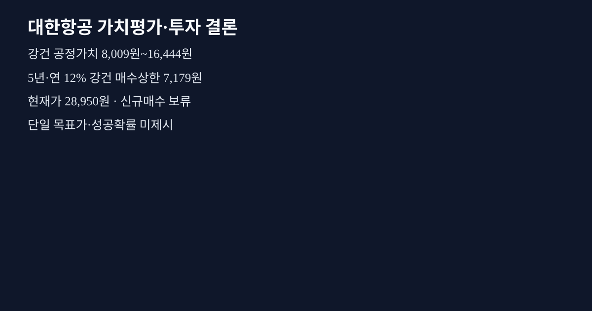
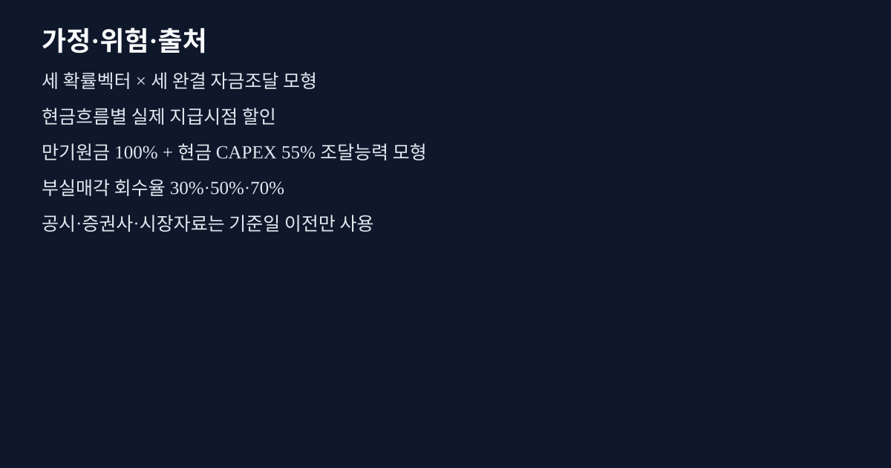

# 대한항공 투자보고서

## 투자 요약

| 핵심 판단 항목 | 내용 |
| --- | --- |
| **투자판단** | 신규매수 보류 — 현재가가 보수적 진입 상한을 웃돕니다. 보정된 성공확률이 없어 단일 목표가 대신 확률·지급모델 모호성 범위를 사용합니다. |
| **현재가** | 28,950 KRW (2026-09-11) |
| **기준 내재가치** | 12,226.28 KRW |
| **가치평가 범위** | 8,008.57~16,444 KRW (GOVERNED_PRIOR_EXPECTED_VALUE_RANGE) |
| **시나리오 가능성** | 보정 성공확률 없음 · 복수 사전확률 집합만 사용 |
| **진입가격** | 7,179 KRW 이하 |
| **증권사 참고값** | 평균 37,000 KRW · 범위 33,000~41,000 |

### 한 문장 결론

연결 실제 손익을 출발점으로 항공 통합·항공우주 수주·엔진 외부서비스·호텔 자산을 구분합니다. 수익 개선은 가설이며 대규모 투자와 초기 비용이 먼저 발생하는 현금흐름을 함께 반영합니다. 이미 연결된 아시아나 매출이나 리스원금을 중복 반영하지 않습니다.

### 투자포인트

- 영업 드라이버와 자금조달을 한 경로에서 연결해 부채·리스·증자·자산매각을 중복 계산하지 않습니다.
- 주주가 실제로 받는 시점별 현금흐름을 기준으로 진입가격을 계산합니다.
- 현재가와 증권사 목표가는 내재가치 동결 뒤에만 읽습니다.

### 판단 변경 조건

- 구조적 단절 이후의 실적·수요·단가·원가 데이터가 추가되면 분포와 보정 상태를 다시 검증합니다.
- 차입·리스 만기, 재조달 한도, 자산매각 조건, 희석 조건이 달라지면 지급경로와 진입가격을 다시 계산합니다.
- 보정되지 않은 사전확률은 성공확률이나 단일 목표가로 승격하지 않습니다.

## 가치평가

- 주평가법: capacity_yield_levered / driver_distributional_apv
- 내재가치 범위: 8,008.57~16,444 KRW
- 확률벡터×지급모델 조합 기대가치 최소: 8,008.57 KRW
- 확률벡터×지급모델 조합 기대가치 최대: 16,444 KRW
- 단일 확률가중 목표가: 미산출
- 보정 성공확률: 미산출
- 보수적 진입 상한: 7,179 KRW 이하 (허용된 전체 확률벡터×지급모델 조합 중 최소 기대현재가치)

## 핵심 가정과 위험

- 자산·영업 위험 베타: 0.6818416691122398
- 가중평균자본비용: 0.07104336745001877
- 비영업자산 매각은 매각대금과 제거 자산가치를 별도 대조해 잔존가치 이중계상을 막습니다.
- limited liability는 보고서 숫자에 사후 0원 하한을 씌우지 않고 명시적 주주 지급·곤경 회수경로에서만 적용합니다.

## 인공지능 인사이트 — 환경 변화 × 기업 강점

인공지능은 공시 근거에서 가정 후보와 반증 질문을 제안합니다. 가정 확정, 확률 계산, 가치평가 산식, 감사 통과와 동결은 결정론적 엔진이 수행합니다.

## 증권사·시장 비교

- 현재가 28,950 KRW: 동결 내재가치 범위 대비 -20,941.43~-12,506 KRW
- 증권사 목표가 평균 37,000 KRW, 중앙값 37,000, 범위 33,000~41,000 (2건)

## 최종 요약 이미지

## 정보 출처 — 원문 바로 확인
- **operator declared underwriting** — 근거 106개: activity_mix, aerospace_ev_adjustment, aerospace_fcff_year_1, aerospace_fcff_year_2, aerospace_fcff_year_3, aerospace_fcff_year_4 외 100개 유형 (기준일 2026-09-13) [원문 바로 열기](https://dart.fss.or.kr/dsaf001/main.do?rcpNo=20260814002803)

이 원문에 연결된 근거 106개 보기

- `UW:KR:DART:00113526:activity_mix` · `UW:KR:DART:00113526:aerospace_ev_adjustment` · `UW:KR:DART:00113526:aerospace_fcff_year_1` · `UW:KR:DART:00113526:aerospace_fcff_year_2` · `UW:KR:DART:00113526:aerospace_fcff_year_3` · `UW:KR:DART:00113526:aerospace_fcff_year_4` · `UW:KR:DART:00113526:aerospace_fcff_year_5` · `UW:KR:DART:00113526:aerospace_ownership` · `UW:KR:DART:00113526:aerospace_terminal_growth` · `UW:KR:DART:00113526:aerospace_terminal_roic` · `UW:KR:DART:00113526:affo` · `UW:KR:DART:00113526:airline_ev_adjustment` · `UW:KR:DART:00113526:airline_fcff_year_1` · `UW:KR:DART:00113526:airline_fcff_year_2` · `UW:KR:DART:00113526:airline_fcff_year_3` · `UW:KR:DART:00113526:airline_fcff_year_4` · `UW:KR:DART:00113526:airline_fcff_year_5` · `UW:KR:DART:00113526:airline_ownership` · `UW:KR:DART:00113526:airline_terminal_growth` · `UW:KR:DART:00113526:airline_terminal_roic` · `UW:KR:DART:00113526:asset_value` · `UW:KR:DART:00113526:backlog_conversion` · `UW:KR:DART:00113526:book_to_bill` · `UW:KR:DART:00113526:bull_aerospace_fcff_year_1` · `UW:KR:DART:00113526:bull_aerospace_fcff_year_2` · `UW:KR:DART:00113526:bull_aerospace_fcff_year_3` · `UW:KR:DART:00113526:bull_aerospace_fcff_year_4` · `UW:KR:DART:00113526:bull_aerospace_fcff_year_5` · `UW:KR:DART:00113526:bull_aerospace_terminal_growth` · `UW:KR:DART:00113526:bull_aerospace_terminal_roic` · `UW:KR:DART:00113526:bull_airline_fcff_year_1` · `UW:KR:DART:00113526:bull_airline_fcff_year_2` · `UW:KR:DART:00113526:bull_airline_fcff_year_3` · `UW:KR:DART:00113526:bull_airline_fcff_year_4` · `UW:KR:DART:00113526:bull_airline_fcff_year_5` · `UW:KR:DART:00113526:bull_airline_terminal_growth` · `UW:KR:DART:00113526:bull_airline_terminal_roic` · `UW:KR:DART:00113526:bull_hotel_gross_asset_value` · `UW:KR:DART:00113526:bull_other_fcff_year_1` · `UW:KR:DART:00113526:bull_other_fcff_year_2` · `UW:KR:DART:00113526:bull_other_fcff_year_3` · `UW:KR:DART:00113526:bull_other_fcff_year_4` · `UW:KR:DART:00113526:bull_other_fcff_year_5` · `UW:KR:DART:00113526:bull_other_terminal_growth` · `UW:KR:DART:00113526:bull_other_terminal_roic` · `UW:KR:DART:00113526:cancellation_rate` · `UW:KR:DART:00113526:cancellation_terms` · `UW:KR:DART:00113526:cap_rate` · `UW:KR:DART:00113526:committed_asset_capex` · `UW:KR:DART:00113526:contract_liabilities` · `UW:KR:DART:00113526:customer_concentration` · `UW:KR:DART:00113526:debt` · `UW:KR:DART:00113526:debt_maturities` · `UW:KR:DART:00113526:depreciation_amortization` · `UW:KR:DART:00113526:diluted_shares` · `UW:KR:DART:00113526:down_aerospace_fcff_year_1` · `UW:KR:DART:00113526:down_aerospace_fcff_year_2` · `UW:KR:DART:00113526:down_aerospace_fcff_year_3` · `UW:KR:DART:00113526:down_aerospace_fcff_year_4` · `UW:KR:DART:00113526:down_aerospace_fcff_year_5` · `UW:KR:DART:00113526:down_aerospace_terminal_growth` · `UW:KR:DART:00113526:down_aerospace_terminal_roic` · `UW:KR:DART:00113526:down_airline_fcff_year_1` · `UW:KR:DART:00113526:down_airline_fcff_year_2` · `UW:KR:DART:00113526:down_airline_fcff_year_3` · `UW:KR:DART:00113526:down_airline_fcff_year_4` · `UW:KR:DART:00113526:down_airline_fcff_year_5` · `UW:KR:DART:00113526:down_airline_terminal_growth` · `UW:KR:DART:00113526:down_airline_terminal_roic` · `UW:KR:DART:00113526:down_hotel_gross_asset_value` · `UW:KR:DART:00113526:down_other_fcff_year_1` · `UW:KR:DART:00113526:down_other_fcff_year_2` · `UW:KR:DART:00113526:down_other_fcff_year_3` · `UW:KR:DART:00113526:down_other_fcff_year_4` · `UW:KR:DART:00113526:down_other_fcff_year_5` · `UW:KR:DART:00113526:down_other_terminal_growth` · `UW:KR:DART:00113526:down_other_terminal_roic` · `UW:KR:DART:00113526:ffo` · `UW:KR:DART:00113526:fleet_capex` · `UW:KR:DART:00113526:hotel_gross_asset_value` · `UW:KR:DART:00113526:hotel_liabilities` · `UW:KR:DART:00113526:hotel_ownership` · `UW:KR:DART:00113526:lead_time` · `UW:KR:DART:00113526:lease_liabilities` · `UW:KR:DART:00113526:maintenance_capex` · `UW:KR:DART:00113526:maturities` · `UW:KR:DART:00113526:minimum_operating_liquidity` · `UW:KR:DART:00113526:noi` · `UW:KR:DART:00113526:noi_or_ffo` · `UW:KR:DART:00113526:occupancy` · `UW:KR:DART:00113526:operating_income` · `UW:KR:DART:00113526:orders` · `UW:KR:DART:00113526:other_ev_adjustment` · `UW:KR:DART:00113526:other_fcff_year_1` · `UW:KR:DART:00113526:other_fcff_year_2` · `UW:KR:DART:00113526:other_fcff_year_3` · `UW:KR:DART:00113526:other_fcff_year_4` · `UW:KR:DART:00113526:other_fcff_year_5` · `UW:KR:DART:00113526:other_ownership` · `UW:KR:DART:00113526:other_terminal_growth` · `UW:KR:DART:00113526:other_terminal_roic` · `UW:KR:DART:00113526:parent_noncontrolling_interest_adjustment` · `UW:KR:DART:00113526:rent` · `UW:KR:DART:00113526:revenue_recognition` · `UW:KR:DART:00113526:service_revenue` · `UW:KR:DART:00113526:working_capital`

- **operator declared risk pack / 가중평균자본비용 입력값** — 가중평균자본비용 입력 출처; 근거 RISK:KR:DART:00113526:beta_selection_l1_broad_sector · 베타 비교군 선정 근거 (기준일 2026-09-13); 근거 RISK:KR:DART:00113526:beta_selection_l2_industry · 베타 비교군 선정 근거 (기준일 2026-09-13); 근거 RISK:KR:DART:00113526:beta_selection_l3_risk_driver_subindustry · 베타 비교군 선정 근거 (기준일 2026-09-13); 근거 RISK:KR:DART:00113526:beta_selection_l4_economic_twins · 베타 비교군 선정 근거 (기준일 2026-09-13) [원문 바로 열기](https://dart.fss.or.kr/dsaf001/main.do?rcpNo=20260910000442)
- **operator declared underwriting** — 근거 UW:KR:DART:00113526:diluted_shares · 희석주식수 (기준일 2026-09-13) [원문 바로 열기](https://dart.fss.or.kr/report/viewer.do?rcpNo=20260724000006&dcmNo=11493004&eleId=1&offset=620&length=3475&dtd=dart4.xsd)
- **operator declared underwriting** — 근거 UW:KR:DART:00113526:backlog · 수주잔고 (기준일 2026-09-13) [원문 바로 열기](https://dart.fss.or.kr/report/viewer.do?rcpNo=20260814002803&dcmNo=11534684&eleId=13&offset=297309&length=54959&dtd=dart4.xsd)
- **DART public financial statement HTML** — 근거 DART_HTML_0820b8f4fdde361a7a23 · total_equity (기준일 2026-06-30); 근거 DART_HTML_4825d112ccbb87103b60 · cash_and_cash_equivalents (기준일 2026-06-30); 근거 DART_HTML_4c68d0d69c8741bcf352 · total_assets (기준일 2026-06-30); 근거 DART_HTML_80e16db9ec94f69e80f1 · total_liabilities (기준일 2026-06-30) [원문 바로 열기](https://dart.fss.or.kr/report/viewer.do?rcpNo=20260814002803&dcmNo=11534684&eleId=20&offset=440701&length=48993&dtd=dart4.xsd)
- **DART public financial statement HTML** — 근거 DART_HTML_2472c8f81ee0694794e8 · net_income (기준일 2026-06-30); 근거 DART_HTML_2f6195eb49ee067e37d5 · operating_income (기준일 2026-06-30); 근거 DART_HTML_7420ef4d90086d5fb055 · revenue (기준일 2026-06-30) [원문 바로 열기](https://dart.fss.or.kr/report/viewer.do?rcpNo=20260814002803&dcmNo=11534684&eleId=21&offset=489694&length=44931&dtd=dart4.xsd)
- **가중평균자본비용 입력값 / 베타 입력값** — 가중평균자본비용 입력 출처; 베타 입력 출처 [원문 바로 열기](https://data.sec.gov/api/xbrl/companyfacts/CIK0000100517.json)
- **증권사: LS증권** — 목표가 발표일 2026-07-15 [원문 바로 열기](https://file.alphasquare.co.kr/media/pdfs/company-report/260715_KAL_2Q26_Review.pdf)
- **증권사: 하나증권** — 목표가 발표일 2026-07-14 [원문 바로 열기](https://file.hanaw.com/download/research/FileServer/WEB/industry/enterprise/2026/07/13/koreanair_260713.pdf)
- **가중평균자본비용 입력값 / 베타 입력값** — 가중평균자본비용 입력 출처; 베타 입력 출처 [원문 바로 열기](https://investor-relations.lufthansagroup.com/fileadmin/downloads/en/financial-reports/interims-reports/LH-QR-2026-2-e.pdf)
- **가중평균자본비용 입력값 / 베타 입력값** — 가중평균자본비용 입력 출처; 베타 입력 출처 [원문 바로 열기](https://ir.delta.com/news/news-details/2026/Delta-Air-Lines-Announces-June-Quarter-2026-Financial-Results/default.aspx)
- **operator declared underwriting** — 근거 13개: cargo_traffic, cargo_yield, fuel_cost, nonfuel_operating_cost, nonvariable_operating_cost, passenger_capacity 외 7개 유형 (기준일 2026-09-13) [원문 바로 열기](https://kr.img.news.koreanair.com/wp-content/uploads/2026/07/2026%EB%85%84-2%EB%B6%84%EA%B8%B0-%EC%9E%A0%EC%A0%95%EC%8B%A4%EC%A0%81-IR-%EC%9E%90%EB%A3%8C-1.pdf)

이 원문에 연결된 근거 13개 보기

- `UW:KR:DART:00113526:cargo_traffic` · `UW:KR:DART:00113526:cargo_yield` · `UW:KR:DART:00113526:fuel_cost` · `UW:KR:DART:00113526:nonfuel_operating_cost` · `UW:KR:DART:00113526:nonvariable_operating_cost` · `UW:KR:DART:00113526:passenger_capacity` · `UW:KR:DART:00113526:passenger_traffic` · `UW:KR:DART:00113526:passenger_yield` · `UW:KR:DART:00113526:realized_unit_yield` · `UW:KR:DART:00113526:realized_volume` · `UW:KR:DART:00113526:service_capacity` · `UW:KR:DART:00113526:utilization_or_load` · `UW:KR:DART:00113526:variable_input_cost`

- **현재 시장가격** — 시장가격 기준일 2026-09-11 [원문 바로 열기](https://m.stock.naver.com/api/stock/003490/price)
- **가중평균자본비용 입력값** — 가중평균자본비용 입력 출처 [원문 바로 열기](https://m.stock.naver.com/front-api/marketIndex/prices?category=bond&reutersCode=KR10YT%3DRR&page=1)
- **기업 식별정보** — 기업 식별 확인 [원문 바로 열기](https://opendart.fss.or.kr/api/corpCode.xml)
- **가중평균자본비용 입력값 / 베타 입력값** — 가중평균자본비용 입력 출처; 베타 입력 출처 [원문 바로 열기](https://pages.stern.nyu.edu/~adamodar/New_Home_Page/datafile/ctryprem.html)
- **베타 입력값** — 베타 입력 출처 [원문 바로 열기](https://query1.finance.yahoo.com/v8/finance/chart/DAL?range=2y&interval=1d)
- **베타 입력값** — 베타 입력 출처 [원문 바로 열기](https://query1.finance.yahoo.com/v8/finance/chart/LHA.DE?range=2y&interval=1d)
- **베타 입력값** — 베타 입력 출처 [원문 바로 열기](https://query1.finance.yahoo.com/v8/finance/chart/UAL?range=2y&interval=1d)
- **베타 입력값** — 베타 입력 출처 [원문 바로 열기](https://query1.finance.yahoo.com/v8/finance/chart/UPS?range=2y&interval=1d)
- **가중평균자본비용 입력값** — 가중평균자본비용 입력 출처 [원문 바로 열기](https://www.koreanair.com/content/dam/koreanair/footer/about-us/inverstor-relations/ir-report/audita_20262Q.pdf)
- **operator declared underwriting** — 근거 15개: bull_other_fcff_year_1, bull_other_fcff_year_2, bull_other_fcff_year_3, bull_other_fcff_year_4, bull_other_fcff_year_5, down_other_fcff_year_1 외 9개 유형 (기준일 2026-09-13) [원문 바로 열기](https://www.lufthansa-technik.com/en/financials)

이 원문에 연결된 근거 15개 보기

- `UW:KR:DART:00113526:bull_other_fcff_year_1` · `UW:KR:DART:00113526:bull_other_fcff_year_2` · `UW:KR:DART:00113526:bull_other_fcff_year_3` · `UW:KR:DART:00113526:bull_other_fcff_year_4` · `UW:KR:DART:00113526:bull_other_fcff_year_5` · `UW:KR:DART:00113526:down_other_fcff_year_1` · `UW:KR:DART:00113526:down_other_fcff_year_2` · `UW:KR:DART:00113526:down_other_fcff_year_3` · `UW:KR:DART:00113526:down_other_fcff_year_4` · `UW:KR:DART:00113526:down_other_fcff_year_5` · `UW:KR:DART:00113526:other_fcff_year_1` · `UW:KR:DART:00113526:other_fcff_year_2` · `UW:KR:DART:00113526:other_fcff_year_3` · `UW:KR:DART:00113526:other_fcff_year_4` · `UW:KR:DART:00113526:other_fcff_year_5`

- **가중평균자본비용 입력값 / 베타 입력값** — 가중평균자본비용 입력 출처; 베타 입력 출처 [원문 바로 열기](https://www.sec.gov/Archives/edgar/data/1090727/000162828026053249/ups-20260630.htm)
- 전체 근거 식별자·지표·기준일 연결 내역은 별도 분석 기록에 보관됩니다.

## 감사 요약

- 차단 감사 16/16 통과
- 현재가·증권사 입력은 같은 실행의 intrinsic freeze 이후에만 접근했습니다.
- 내부 해시·receipt는 투자자 본문이 아니라 불변 감사 산출물에만 보존합니다.
