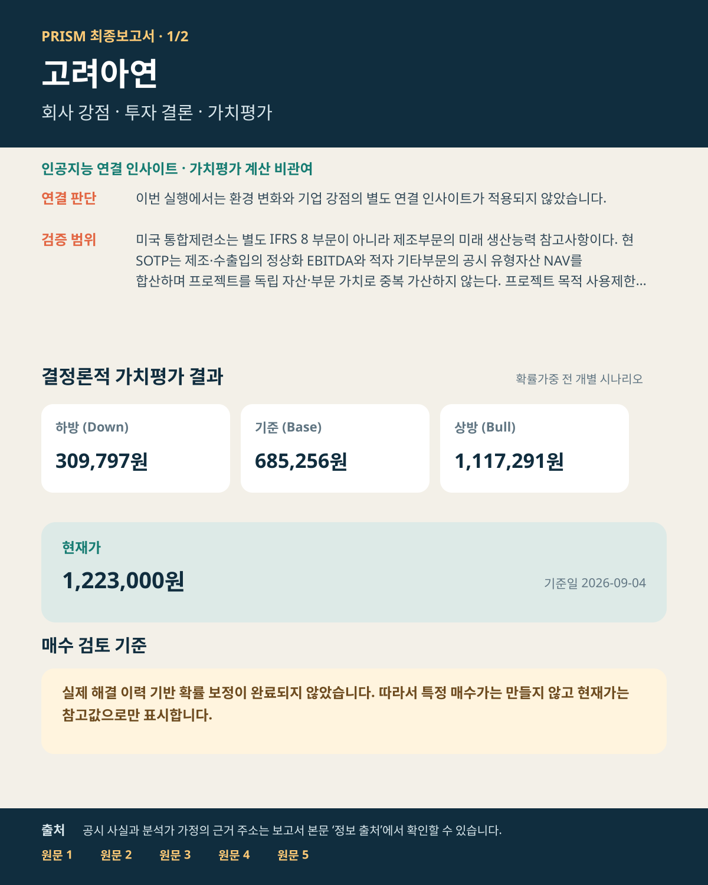
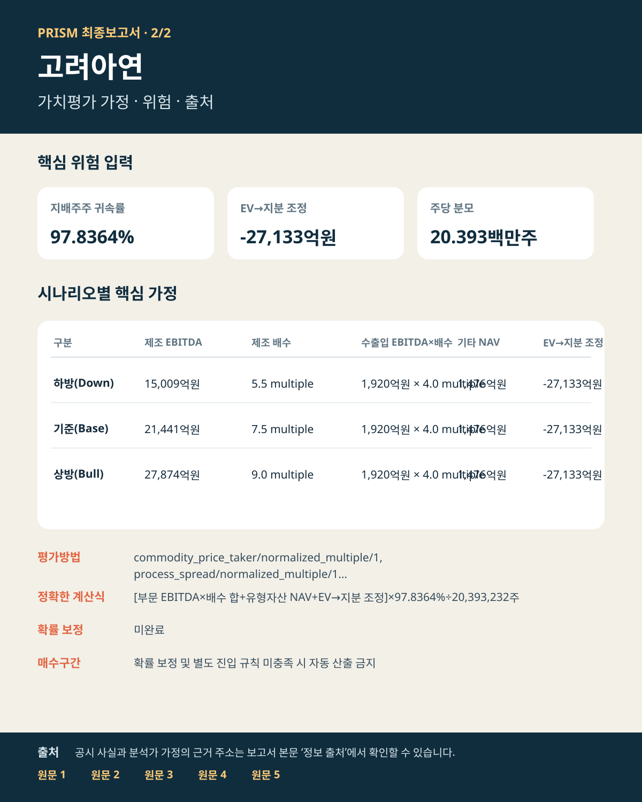

# 고려아연 투자보고서

## 투자 요약

| 핵심 판단 항목 | 내용 |
| --- | --- |
| **투자판단** | 판단 유보 — 실제 해결 이력 기반 확률 보정과 별도 진입 규칙이 모두 갖춰지기 전까지 구체적인 매수가는 제시하지 않습니다. |
| **현재가** | 1,223,000원 (2026-09-04) |
| **기준 내재가치** | 주당 685,256원 |
| **가치평가 범위** | 주당 309,797~1,117,291원 |
| **시나리오 가능성** | 미산출 |
| **증권사 참고값** | 미확보 |

### 한 문장 결론

공시된 IFRS 8 3부문의 경제구조와 순금융부채를 분리해 기존 영업의 정상화 수익력을 검증한다 · 확정 자금조달과 세후 현금수익률이 없는 미래 프로젝트는 기존 영업가치에 임의로 더하지 않는다.

### 투자포인트

- **가치동인:** 공시된 IFRS 8 3부문의 경제구조와 순금융부채를 분리해 기존 영업의 정상화 수익력을 검증한다 · 확정 자금조달과 세후 현금수익률이 없는 미래 프로젝트는 기존 영업가치에 임의로 더하지 않는다.
- **현재가 대비:** 기준 내재가치는 현재가보다 44.0% 낮습니다. 상방 시나리오의 실현 조건 확인이 필요합니다.
- **남은 제약:** 실제 해결 이력 기반 확률 보정이 없어 시나리오 기대값과 구체 매수가를 사용하지 않습니다.

### 판단 변경 조건

- **상방 확인:** 기준·상방 가정의 핵심 동인이 공시 실적과 현금흐름으로 전환되면 판단 근거가 강화됩니다.
- **하방 훼손:** 핵심 가정이 미달하거나 하방 시나리오의 조건이 현실화되면 가치평가 신뢰도와 행동 여력이 낮아집니다.
- **행동 가능 조건:** 실제 해결 이력 기반 확률 보정과 별도 진입 규칙이 모두 갖춰지기 전까지 구체적인 매수가는 제시하지 않습니다.

## 가치평가
- **하방 시나리오:** 내재가치 주당 309,797원
- **기준 시나리오:** 내재가치 주당 685,256원
- **상방 시나리오:** 내재가치 주당 1,117,291원
- **확률가중 기대값:** 미산출 — 실제 해결 이력 기반 보정이 끝나지 않아 수치 가중을 보류했습니다.

## 핵심 가정과 위험
- **평가방법:** 정상화 이익배수법, 유형자산 순자산가치법
- **위험 입력:** 선택된 평가방법에서 별도 베타·가중평균자본비용을 요구하지 않습니다.
- **확률 보정:** 미보정 · 수치 가중 보류
- **하방 가정:** 제조 EBITDA 15,009억원 × 5.5배 · 수출입 EBITDA 1,920억원 × 4.0배 · 기타 유형자산 NAV 1,476억원 · 공통 지배주주 귀속률 97.8364% · EV→지분 조정 -27,133억원 · 주당 분모 20.393백만주 · 산식 [부문 EBITDA×배수 합+유형자산 NAV+EV→지분 조정]×97.8364%÷20,393,232주
- **기준 가정:** 제조 EBITDA 21,441억원 × 7.5배 · 수출입 EBITDA 1,920억원 × 4.0배 · 기타 유형자산 NAV 1,476억원 · 공통 지배주주 귀속률 97.8364% · EV→지분 조정 -27,133억원 · 주당 분모 20.393백만주 · 산식 [부문 EBITDA×배수 합+유형자산 NAV+EV→지분 조정]×97.8364%÷20,393,232주
- **상방 가정:** 제조 EBITDA 27,874억원 × 9.0배 · 수출입 EBITDA 1,920억원 × 4.0배 · 기타 유형자산 NAV 1,476억원 · 공통 지배주주 귀속률 97.8364% · EV→지분 조정 -27,133억원 · 주당 분모 20.393백만주 · 산식 [부문 EBITDA×배수 합+유형자산 NAV+EV→지분 조정]×97.8364%÷20,393,232주
- **핵심 제약:** 실제 해결 전망의 누적 이력이 부족해 시나리오 확률과 기대값을 투자판단에 사용할 수 없습니다.

## 증권사·시장 비교
- **증권사 목표가:** 확보되지 않았습니다.
- **현재가:** 1,223,000원 (2026-09-04)
- **하방 대비 하락위험:** 913,203원 (74.7%)
- **기준 대비 하락위험:** 537,744원 (44.0%)
- **상방 대비 하락위험:** 105,709원 (8.6%)

## 인공지능 인사이트 — 환경 변화 × 기업 강점
- 적용범위: 인공지능은 외부 환경 변화와 기업 강점의 연결 가설·반증 조건만 제시하며 가치평가 계산이나 가정 확정에는 관여하지 않습니다.
- 상태: 해당 없음
- 사유: 미국 통합제련소는 별도 IFRS 8 부문이 아니라 제조부문의 미래 생산능력 참고사항이다. 현 SOTP는 제조·수출입의 정상화 EBITDA와 적자 기타부문의 공시 유형자산 NAV를 합산하며 프로젝트를 독립 자산·부문 가치로 중복 가산하지 않는다. 프로젝트 목적 사용제한 금융자산은 관련 총부채와 비대칭이 생기지 않도록 순금융부채 브리지에 반영하고, 프로젝트 서사는 REFERENCE_ONLY로 둔다.

## 최종 요약 이미지

## 정보 출처 — 원문 바로 확인
- **operator declared underwriting** — 근거 13개: asset_value, bull_manufacturing_normalized_ebitda, cap_rate, debt, down_manufacturing_normalized_ebitda, manufacturing_normalized_ebitda 외 7개 유형 (기준일 2026-09-04) [원문 바로 열기](https://dart.fss.or.kr/dsaf001/main.do?rcpNo=20260316000929)

이 원문에 연결된 근거 13개 보기

- `UW:KR:DART:00102858:asset_value` · `UW:KR:DART:00102858:bull_manufacturing_normalized_ebitda` · `UW:KR:DART:00102858:cap_rate` · `UW:KR:DART:00102858:debt` · `UW:KR:DART:00102858:down_manufacturing_normalized_ebitda` · `UW:KR:DART:00102858:manufacturing_normalized_ebitda` · `UW:KR:DART:00102858:maturities` · `UW:KR:DART:00102858:noi_or_ffo` · `UW:KR:DART:00102858:occupancy` · `UW:KR:DART:00102858:recycling_gross_asset_value` · `UW:KR:DART:00102858:recycling_liabilities` · `UW:KR:DART:00102858:rent` · `UW:KR:DART:00102858:trading_normalized_ebitda`

- **operator declared underwriting** — 근거 38개: 기준 가격, bull_manufacturing_normalized_ebitda, bull_manufacturing_normalized_multiple, 생산능력, 현금원가, 희석주식수 외 20개 유형 (기준일 2026-09-04) [원문 바로 열기](https://dart.fss.or.kr/dsaf001/main.do?rcpNo=20260814003958)

이 원문에 연결된 근거 38개 보기

- `UW:KR:DART:00102858:benchmark_price` · `UW:KR:DART:00102858:bull_manufacturing_normalized_ebitda` · `UW:KR:DART:00102858:bull_manufacturing_normalized_multiple` · `UW:KR:DART:00102858:capacity` · `UW:KR:DART:00102858:cash_cost` · `UW:KR:DART:00102858:diluted_shares` · `UW:KR:DART:00102858:down_manufacturing_normalized_ebitda` · `UW:KR:DART:00102858:down_manufacturing_normalized_multiple` · `UW:KR:DART:00102858:input_price:manufacturing` · `UW:KR:DART:00102858:input_price:recycling` · `UW:KR:DART:00102858:input_price:trading` · `UW:KR:DART:00102858:inventory:manufacturing` · `UW:KR:DART:00102858:inventory:recycling` · `UW:KR:DART:00102858:inventory:trading` · `UW:KR:DART:00102858:manufacturing_ev_adjustment` · `UW:KR:DART:00102858:manufacturing_normalized_ebitda` · `UW:KR:DART:00102858:manufacturing_normalized_multiple` · `UW:KR:DART:00102858:manufacturing_ownership` · `UW:KR:DART:00102858:output_price:manufacturing` · `UW:KR:DART:00102858:output_price:recycling` · `UW:KR:DART:00102858:output_price:trading` · `UW:KR:DART:00102858:plant_runs:manufacturing` · `UW:KR:DART:00102858:plant_runs:recycling` · `UW:KR:DART:00102858:plant_runs:trading` · `UW:KR:DART:00102858:product_yield:manufacturing` · `UW:KR:DART:00102858:product_yield:recycling` · `UW:KR:DART:00102858:product_yield:trading` · `UW:KR:DART:00102858:production` · `UW:KR:DART:00102858:realized_price` · `UW:KR:DART:00102858:recycling_ownership` · `UW:KR:DART:00102858:trading_ev_adjustment` · `UW:KR:DART:00102858:trading_normalized_ebitda` · `UW:KR:DART:00102858:trading_normalized_multiple` · `UW:KR:DART:00102858:trading_ownership` · `UW:KR:DART:00102858:turnaround:manufacturing` · `UW:KR:DART:00102858:turnaround:recycling` · `UW:KR:DART:00102858:turnaround:trading` · `UW:KR:DART:00102858:utilization`

- **현재 시장가격** — 시장가격 기준일 2026-09-04 [원문 바로 열기](https://data.krx.co.kr/contents/MDC/MDI/mdiLoader/index.cmd?menuId=MDC0201020103)
- **operator declared underwriting** — 근거 UW:KR:DART:00102858:manufacturing_ev_adjustment · manufacturing_ev_adjustment (기준일 2026-09-04); 근거 UW:KR:DART:00102858:manufacturing_normalized_multiple · manufacturing_normalized_multiple (기준일 2026-09-04) [원문 바로 열기](https://m.kisrating.com/fileDown.do?fileName=rs20260513-9.pdf&gubun=2&menuCd=R8)
- **기업 식별정보** — 기업 식별 확인 [원문 바로 열기](https://opendart.fss.or.kr/api/corpCode.xml)
- 전체 근거 식별자·지표·기준일 연결 내역은 별도 분석 기록에 보관됩니다.

## 분석 범위와 유의사항
- **평가범위:** 전체 기업 내재가치
- **계산 확인:** 차단 점검 21/21개 통과 · 비차단 확인 필요 3건 · 분석 원칙 28/28개 충족
- 회사 공시 사실, 분석가 가정, 인공지능 연결 인사이트를 구분해 표시했습니다.
- 증권사 목표가와 현재가는 가치평가를 마친 뒤 참고했으며, 앞서 계산한 가정을 바꾸는 데 사용하지 않았습니다.

---

작성 근거와 계산 과정 보기

## 분석 절차 요약

- 자동 오류 점검: 22/22개 통과
- 분석 절차 기록: 33/33개 완료

## 주요 작업 단계

### 1. 증거 수집·산업 라우팅 — 통과 (9/9)
- 결과: 증거 수집·산업 라우팅을 완료하고 근거 기록을 확정했습니다
- 잔여위험: 없음 · 다음 단계: 인사이트 도출·반증 검토

### 2. 인사이트 도출·반증 검토 — 경고 (5/5)
- 결과: 환경 변화와 기업 강점의 연결 인사이트 및 반증 검토를 완료했습니다
- 잔여위험: 환경 변화 인사이트 탐색: 로켓슬라 인사이트 스캐너가 확인 필요 경고를 남겼습니다 · 다음 단계: 가정·평가방법·위험

### 3. 가정·평가방법·위험 — 통과 (5/5)
- 결과: 가정·평가방법·베타·가중평균자본비용의 적용 여부를 확정했습니다
- 잔여위험: 없음 · 다음 단계: 가치평가·오류 점검·결과 확정

### 4. 가치평가·오류 점검·결과 확정 — 경고 (7/7)
- 결과: 가치평가와 오류 점검을 마치고 결과를 확정했습니다
- 잔여위험: 시나리오 확률 보정 점검: 실제 해결 이력 기반 확률 보정이 완료되지 않아 확률가중 기대값을 산출하지 않았습니다 | 가정 타당성 점검: 근거 구성 또는 가치 민감도에서 확인 필요 항목이 기록되었습니다 · 다음 단계: 증권사·시장 비교·보고서 저장

### 5. 증권사·시장 비교·보고서 저장 — 경고 (7/7)
- 결과: 시장·증권사 비교 후 한국어 최종보고서와 요약 이미지 2장을 저장했습니다
- 잔여위험: 시장 함의 기대치 역산: 현재 시장가격이 요구하는 영구성장률·현금흐름 수준이 확정된 가정과 달라 확인이 필요합니다 · 다음 단계: 최종 결과보고서

## 세부 계산 기록

### 33단계 진행 상태
- **증거 수집·산업 라우팅:** 1 기업 식별=통과 · 2 기존 분석 상태 불러오기=통과 · 3 산업 지식 기준일 설정=통과 · 4 출처 최신성 사전점검=통과 · 5 사업부 분해=통과 · 6 산업 특성 분류=통과 · 7 필수 분석 모듈 확정=통과 · 8 1차 근거 수집=통과 · 9 근거 기록 확정=통과
- **인사이트 도출·반증 검토:** 10 환경 변화 인사이트 탐색=경고 · 11 상류 자금흐름 점검=해당 없음 · 12 주 분석가 가설 도출=통과 · 13 독립 반증 검토=통과 · 14 추가 조사 반복=해당 없음
- **가정·평가방법·위험:** 15 근거·가정 연결=통과 · 16 시나리오 구성=통과 · 17 가치평가 방법 확정=통과 · 18 계층형 베타 추정=해당 없음 · 19 가중평균자본비용 검증=해당 없음
- **가치평가·오류 점검·결과 확정:** 20 결정론적 가치평가=통과 · 21 계층형 적정 주가수익비율=해당 없음 · 22 현금흐름·주가수익비율 가정 정합성=통과 · 23 평가방법 간 이중계상 감사=통과 · 24 시나리오 확률 보정 점검=경고 · 25 최종 감사=경고 · 26 가치평가 결과 확정=통과
- **증권사·시장 비교·보고서 저장:** 27 증권사 자료 불러오기=해당 없음 · 28 증권사 목표가 비교=해당 없음 · 29 현재 시장가격 불러오기=통과 · 30 시장가격 비교=경고 · 31 투자논지 변화 점검=통과 · 32 분석 결과 저장=통과 · 33 최종보고서 생성=통과
- 단계별 사유와 출력값 식별자는 별도 분석 기록에 보존됩니다.

### 분석 모듈 점검
- 영향 측정 완료: 결정론적 가치평가
- 영향 미측정: 가정 컴파일러, 독립 반증 검토, 증권사 자료 검증, 근거 원장, 근거·가정 연결, 산업 특성 분류, 산업 지식, 지식 배치 검증 외 7개
- 비적용: 계층형 베타, 상류 자금흐름 점검, 가중평균자본비용 · 실패: 없음

### 근거 구성

- 가치 투입 근거 16건 — 분석가 추정 16건(100%)
- 수집 근거 47건 — 분석가 추정 47건(100.0%)
- 공시·회사 공식계획 직접 인용 0.0% · 분석가 추정 100.0% · 평균 신뢰도 0.60
- 확인 필요: 가치 투입 근거 중 공시·회사 공식계획 직접 인용이 0.0%로 기준(20%)에 미달합니다
- 확인 필요: 가치 투입 근거의 100.0%가 분석가 추정입니다. 이 결과는 공시 사실의 정리가 아니라 추정 위에 세워진 모델입니다

### 가치 민감도

- Down: SOTP 구성요소 중 동결 DCF 커널로 독립 재현 가능한 부문이 없어 부문별 민감도를 산출하지 않았습니다
- Base: SOTP 구성요소 중 동결 DCF 커널로 독립 재현 가능한 부문이 없어 부문별 민감도를 산출하지 않았습니다
- Bull: SOTP 구성요소 중 동결 DCF 커널로 독립 재현 가능한 부문이 없어 부문별 민감도를 산출하지 않았습니다
- 확인 필요: 단일 DCF 기여분으로 재구성 가능한 시나리오가 없어 민감도를 산출하지 못했습니다

### 실행 식별자와 해시

- 실행 식별자: `LIVE-KOREAZINC-2`
- 실행 모드: `live_primary`
- 작성 확인 해시: `a5d0b5e39ba1ebc1e8c6bdc94ac74b6bfcf922e3926e926a1122cac13757ce33`
- 증거 해시: `14d709cc5654de3b958fdda8b35e6e29c3ef24405c7a05dbfb9ab8624a7df7c0`
- 가정 해시: `68d7b9343ff235a41a3a27d413476151af9e99c49d0c23e0aaf83ea7c5fead2e`
- 시나리오 해시: `489d1da0a98a971214580b06a27c95eb50a9caf0d87c64c58bead1d73f7664a2`
- 가치평가 해시: `10cdcf520c20578b3b3fc9aab9537d0f38212960b54fcd4f655cfac77394c93a`
- 오류 점검 해시: `f0d27558c3aa06aa43c09276838e3b781c6d6408bfc4c9dc3f001b253a4e1a28`
- 가치평가 확정 해시: `30f49ee18878c8e7ae549e5fb64b51d7a9dc530ef06a8c659380de16bdc07964`
- 보조 결속정보: 생산능력 평가 `a3545801a2b8a62a817dc8625fd5baccc104aa9ed22e1476e89b8c440ce55462` · 생산능력 시나리오 `749eb5803378d1917242a7bbc628d9f735b5a3101a0593da19d5c3fa3a17ff24` · 생산능력 가치평가 `0b141718c737c861801f5c23ace124b849ae74ddb03f1692f98683e377f5efe4` · 생산능력 주가수익비율 `61fa53df5c7607adaaa93761217e335ca65a42518582d082f624e68885f01ea4` · 생산능력 정합성 `59ae187678977d0c15b167a0c56fec6d7d7af639221b586c1739381653c225c7` · 생산능력 오류 점검 `32b91d3537dfc449a53813de719045ed5a653cd0d8f8e882ebdbadcf4a8fc805`
- 단계 기술 식별자: 1 `COMPANY_RESOLUTION`=pass · 2 `LOAD_COMPANY_STATE`=pass · 3 `LOAD_INDUSTRY_KNOWLEDGE_SNAPSHOT`=pass · 4 `SOURCE_FRESHNESS_PRECHECK`=pass · 5 `SEGMENT_DECOMPOSITION`=pass · 6 `INDUSTRY_DNA_ROUTE`=pass · 7 `MODULE_REQUIREMENT_PLAN`=pass · 8 `PRIMARY_EVIDENCE_COLLECTION`=pass · 9 `EVIDENCE_LEDGER`=pass · 10 `ROCKET_INSIGHT_SCAN`=warning · 11 `UPSTREAM_FUNDING_SCAN`=skipped_not_applicable · 12 `RESEARCHER_A`=pass · 13 `BLIND_RED_TEAM_B`=pass · 14 `RESEARCH_LOOP`=skipped_not_applicable · 15 `EVIDENCE_TO_ASSUMPTION_BRIDGE`=pass · 16 `SCENARIO_BUILD`=pass · 17 `VALUATION_METHOD_INTENT`=pass · 18 `HIERARCHICAL_BETA_ESTIMATION`=skipped_not_applicable · 19 `WACC_VALIDATION`=skipped_not_applicable · 20 `DETERMINISTIC_VALUATION`=pass · 21 `HIERARCHICAL_WARRANTED_PER`=skipped_not_applicable · 22 `DCF_PER_ASSUMPTION_CONSISTENCY_GATE`=pass · 23 `CROSS_METHOD_DOUBLE_COUNT_AUDIT`=pass · 24 `PROBABILITY_DISTRIBUTION_ANALYSIS`=warning · 25 `AUDIT_GATE`=warning · 26 `INTRINSIC_VALUE_FREEZE`=pass · 27 `STREET_REFERENCE_LOAD`=skipped_not_applicable · 28 `STREET_GAP_ANALYZER`=skipped_not_applicable · 29 `MARKET_PRICE_LOAD`=pass · 30 `MARKET_COMPARE`=warning · 31 `THESIS_DELTA`=pass · 32 `SAVE_STATE`=pass · 33 `FINAL_REPORT`=pass

